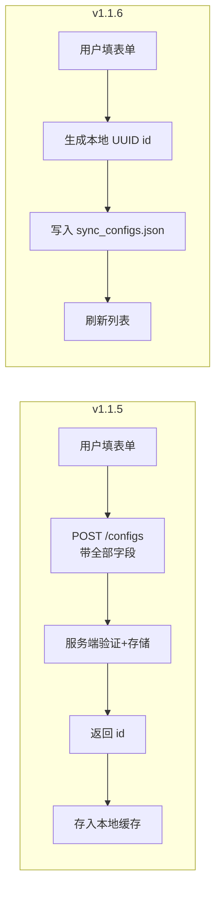

# v1.1.6 桌面端开发记录：同步配置客户端本地化存储

## 一、变更概述

v1.1.6 核心变更：**同步配置不再存储于服务端**，改为客户端本地 `sync_configs.json` 文件管理。不同客户端安装在不同机器上可以拥有各自独立的同步配置（local_path / auto_sync / sync_interval 等互不影响）。

| 文件 | 变更类型 | 说明 |
|------|---------|------|
| `src/services/sync_service.py` | **重构** | CRUD 全部改为本地 JSON 读写；get_remote_snapshot 改为 POST /snapshot（disk_id+remote_path）；touch_synced 改为本地化 |
| `src/utils/sync_engine.py` | **修改** | 配置 ID 从 int 改为 str；_build_remote_index 签名改为 (disk_id, remote_path)；信号类型 int→str |
| `src/ui/pages/sync_page.py` | 轻微调整 | 类型适配（int→str，Python 动态类型，运行无影响） |
| `src/config/settings.py` | 修改 | APP_VERSION 1.1.5→1.1.6 |
| `build.py` | 修改 | VERSION 1.1.5→1.1.6 |

---

## 二、详细变更

### 2.1 `sync_service.py` 重构

**核心变化：从调服务端 API 改为全本地 JSON 文件操作。**

#### 新增私有函数

```python
_SYNC_CONFIGS_FILE = os.path.join(LOCAL_STORAGE_DIR, "sync_configs.json")

def _read_local_configs() -> list[dict]:
    """从本地 sync_configs.json 读取全部同步配置"""
    # 文件不存在或损坏返回空列表

def _write_local_configs(configs: list[dict]) -> None:
    """将同步配置列表原子写入本地 JSON 文件"""
    # tmp 文件 → os.replace 原子写入
```

#### 函数对比

| 函数 | v1.1.5（旧） | v1.1.6（新） |
|---|---|---|
| `list_configs()` | 调 `GET /api/v1/sync/configs` | 读本地 JSON 文件 |
| `create_config(...)` | 调 `POST /api/v1/sync/configs` + 返回 int id | 生成 uuid 短 ID + 写本地 JSON，返回 str id |
| `update_config(...)` | 调 `PUT /api/v1/sync/configs/{id}` | 直接写本地 JSON |
| `delete_config(id)` | 调 `DELETE /api/v1/sync/configs/{id}` | 从本地 JSON 移除 |
| `get_remote_snapshot(config_id)` | 调 `GET /configs/{id}/snapshot` | 调 `POST /api/v1/sync/snapshot`，参数 `(disk_id, remote_path)` |
| `touch_synced(config_id)` | 调 `POST /configs/{id}/touch` | 仅更新本地 `last_synced_at` 字段 |

#### JSON 文件结构

```json
{
  "configs": [
    {
      "id": "a1b2c3d4",
      "name": "照片备份",
      "local_path": "/home/alice/Photos",
      "disk_id": 1,
      "remote_path": "",
      "auto_sync": true,
      "sync_interval": 300,
      "enabled": true,
      "last_synced_at": "2026-06-21T10:00:00+00:00"
    }
  ]
}
```

#### ID 生成策略

使用 `uuid.uuid4().hex[:8]` 生成 8 位十六进制短 ID，在单客户端内唯一即可。不同客户端各自独立，互不影响。

### 2.2 `sync_engine.py` 适配

| 变更项 | v1.1.5 | v1.1.6 |
|---|---|---|
| `_SyncRunWorker` 信号 `error` | `Signal(int, str)` | `Signal(str, str)` |
| `SyncEngine.sync_started` | `Signal(int)` | `Signal(str)` |
| `SyncEngine.sync_error` | `Signal(int, str)` | `Signal(str, str)` |
| `_timers` 类型 | `dict[int, QTimer]` | `dict[str, QTimer]` |
| `_running_ids` 类型 | `set[int]` | `set[str]` |
| `_build_remote_index(config_id)` | 通过 config_id 调 snapshot | `_build_remote_index(disk_id, remote_path)` 直接传入 |
| `touch_synced` | 调服务端 API | 写本地 JSON |

#### `_build_remote_index` 签名变更

```python
# v1.1.5：通过 config_id 间接获取 disk_id + remote_path
def _build_remote_index(config_id: int) -> dict[str, dict]:
    files = sync_service.get_remote_snapshot(config_id)
    return {f["path"]: f for f in files}

# v1.1.6：直接传 disk_id + remote_path
def _build_remote_index(disk_id: int, remote_path: str) -> dict[str, dict]:
    files = sync_service.get_remote_snapshot(disk_id, remote_path)
    return {f["path"]: f for f in files}
```

Worker 从 `self._config` 中读取 `disk_id` 和 `remote_path`，不再依赖服务端 config 表的映射关系。

### 2.3 `sync_page.py` 适配

- `_row_for(self, config_id: int)` → 类型标注更新为 `config_id: str`（Python 动态类型，不影响运行）
- `_set_status(self, config_id: int, text: str)` → 同上
- `_on_trigger_sync`, `_on_edit_config`, `_on_delete_config` → 接收 str config_id（与引擎信号一致）
- `_on_new_config` → `create_config` 返回 str（UUID），`load_configs` 重新渲染

### 2.4 版本号

| 位置 | 旧值 | 新值 |
|---|---|---|
| `src/config/settings.py` `APP_VERSION` | `"1.1.5"` | `"1.1.6"` |
| `build.py` `VERSION` | `"1.1.5"` | `"1.1.6"` |

---

## 三、流程对比

### 创建同步配置



### 同步执行

```mermaid
flowchart LR
    subgraph v1.1.5
        C1[trigger_sync] --> C2[读 cfg.id]
        C2 --> C3[GET /configs/{id}/snapshot]
        C3 --> C4[diff + 传输]
        C4 --> C5[POST /configs/{id}/touch]
    end
    
    subgraph v1.1.6
        D1[trigger_sync] --> D2[读 cfg.disk_id + remote_path]
        D2 --> D3[POST /sync/snapshot<br>传 disk_id + remote_path]
        D3 --> D4[diff + 传输]
        D4 --> D5[更新本地 last_synced_at]
    end
```

---

## 四、§9 安全宪法合规自查

| 检查项 | 结果 |
|---|---|
| 所有 HTTP 调用走 `http_client` | ✅ `sync_service.py` 统一使用 `http_client.post` |
| 本地文件不存储敏感信息 | ✅ `sync_configs.json` 不存储 token / session_key / 密码 |
| 未引入新加密原语 | ✅ |
| 未在 URL 携带业务参数 | ✅ `remote_path` 在加密 body 中 |
| 未在 services/ui 层直接 `import requests` | ✅ |

---

## 五、自测结果

```
$ ./venv-linux/bin/python -m flake8 src/ tests/ --max-line-length=99
0 警告

$ ./venv-linux/bin/python -m pytest tests/ -v
98 passed in 4.23s
（全部通过，0 失败）
```

### BUG 修复：远端子目录改为弹框浏览选择

**标签**：BUG 修复

**问题**：同步配置新增/编辑时，远端子目录使用 LineEdit 手填，用户无法直观浏览远端虚拟磁盘的目录结构，容易输错路径。

**修复方案**：

1. 新增 `_RemoteDirBrowserDialog` 远端目录浏览选择对话框，封装于 `sync_page.py`
   - 使用 `disk_service.browse_dirs(disk_id, path)` 列出远端虚拟磁盘内的子目录
   - 双击目录进入下一级，提供「返回上级」和「返回根目录」按钮
   - 点击「选择当前目录」确认选择（留空表示根目录）
   - 异步 Worker 加载目录列表，不阻塞 UI

2. 修改 `_SyncConfigDialog` 中的远端子目录输入方式：
   - 移除 `_remote_input` (LineEdit)，替换为 `StrongBodyLabel` 标签 +「浏览…」按钮 +「重置为根目录」按钮
   - 切换虚拟磁盘时自动清空已选远端路径（不同磁盘目录结构不同）
   - 编辑模式时预填充已有远端路径

| 修改文件 | 变更类型 | 说明 |
|---------|---------|------|
| `src/ui/pages/sync_page.py` | **修改** | 新增 `_RemoteDirBrowserDialog` 类；修改 `_SyncConfigDialog._setup_ui` 替换手填输入；新增 `_on_disk_changed` / `_on_browse_remote` / `_on_clear_remote` / `_update_remote_label` 方法 |

**安全自查**：
- ✅ 所有 HTTP 调用走 `disk_service.browse_dirs`（内部走 `http_client`）
- ✅ 路径参数不暴露在 URL 中
- ✅ 未引入新加密原语

### 服务器端自测（配套验证）

```
$ cd ../jflove-server && ./venv/bin/python -m pytest tests/ -v
106 passed in 16.14s
（全部通过，0 失败）
```

---

## 六、多客户端隔离验证

| 场景 | 验证方式 | 预期 |
|---|---|---|
| 客户端 A 创建配置 | A 的 `sync_configs.json` 文件写入新条目 | ✅ |
| 客户端 B 启动（同一用户） | B 的 `sync_configs.json` 独立于 A | ✅ B 不会看到 A 的配置 |
| 客户端 A/B 同一全局 snapshot | 两台客户端调同一 `disk_id` 的 snapshot | ✅ 都正常工作 |
| 编辑/删除不互相影响 | A 修改配置不影响 B 的 JSON | ✅ |
