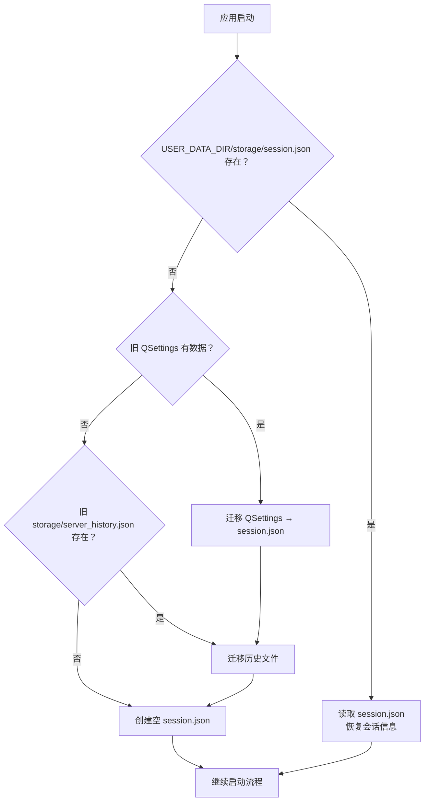

# v1.1.5 设计文档：桌面端持久化存储修复

## 一、问题概述

用户反馈 v1.1.4 桌面端存在以下问题：

1. **服务端地址历史不保存**：连接服务端后关闭程序再打开，历史地址丢失
2. **登录 token 不保存**：每次启动都需要重新登录
3. **在 C 盘用户目录下找不到配置文件**

## 二、根因分析

### 根因 1：`LOCAL_STORAGE_DIR` 指向 PyInstaller 临时目录

[`jflove-desktop/src/config/settings.py`](jflove-desktop/src/config/settings.py:28-34) 中：

```python
if hasattr(sys, "_MEIPASS"):
    BASE_DIR = Path(sys._MEIPASS)  # PyInstaller onefile 临时解压目录
else:
    BASE_DIR = Path(__file__).resolve().parent.parent.parent  # 开发目录

LOG_DIR = str(BASE_DIR / "logs")
LOCAL_STORAGE_DIR = str(BASE_DIR / "storage")
```

当程序以 PyInstaller `--onefile` 模式构建后，`sys._MEIPASS` 指向操作系统临时解压目录（如 Windows 的 `%TEMP%/_MEIxxxxx/`），该目录在程序退出后被系统清理。因此写入到 `storage/server_history.json` 和 `logs/` 的数据**在下一次启动时全部丢失**。

验证：当前 `jflove-desktop/storage/server_history.json` 在开发模式下能正常读写，但用户使用的是 PyInstaller 打包后的单文件版本，因此数据无法持久化。

### 根因 2：QSettings 存储在 Windows 注册表

[`auth_service.py`](jflove-desktop/src/services/auth_service.py:56-65) 使用 `QSettings(APP_ORG, APP_NAME)` 存储 token、server_url、username、role 等会话信息。

在 Windows 平台上，`QSettings` 默认使用 `QSettings.IniFormat`，数据存储于 `HKEY_CURRENT_USER\Software\JFLove\JFLove` 的注册表中——用户无法在文件系统中找到这些文件，且注册表位置不直观。

### 根因 3：`main.py` 读取 server_url 键名不一致

[`main.py`](jflove-desktop/src/main.py:136-137) 读取：

```python
settings = QSettings(APP_ORG, APP_NAME)
saved_url = settings.value("server_url", DEFAULT_SERVER_URL)
```

而 [`auth_service.py`](jflove-desktop/src/services/auth_service.py:26) 保存的键名是：

```python
_KEY_SERVER_URL = "session/server_url"
```

键名 `"server_url"` ≠ `"session/server_url"`，导致 `main.py` **永远读不到保存的地址**，每次都使用兜底值 `DEFAULT_SERVER_URL`（`http://localhost:8989`）。

### 根因 4：`BASE_DIR` 在多处复用

[`settings.py`](jflove-desktop/src/config/settings.py:35-39) 中 `IMAGES_DIR`、`ICON_PNG_PATH`、`ICON_ICO_PATH` 也使用 `BASE_DIR`——这些是只读资源，打包到 PyInstaller 临时目录是可接受的（它们随程序一起分发）。只有 `LOG_DIR` 和 `LOCAL_STORAGE_DIR` 需要写入持久化数据，因此应该分开处理。

## 三、修复方案

### 3.1 架构决策：全部使用文件存储

**将 QSettings 存储的会话信息（token / server_url / username / role / user_id / expires_at / local_max_seconds）+ server_history 统一迁移到用户数据目录的 JSON 文件**。

决策理由：
- 统一存储机制，用户可直观地找到文件
- 跨平台兼容（Windows/Linux/macOS 均可）
- 不依赖 Qt QSettings 的底层实现差异
- 日志目录也随之迁移到用户数据目录，避免打包后日志丢失

### 3.2 用户数据目录定义

| 平台 | 路径 | 示例 |
|------|------|------|
| Windows | `%APPDATA%/JFLove/` | `C:\Users\<用户名>\AppData\Roaming\JFLove\` |
| Linux | `~/.local/share/JFLove/` | `/home/<用户名>/.local/share/JFLove/` |
| macOS | `~/Library/Application Support/JFLove/` | `/Users/<用户名>/Library/Application Support/JFLove/` |

实现方式：使用标准 Python 方法获取平台对应的用户数据目录，不依赖 Qt。

```
USER_DATA_DIR
├── storage/
│   ├── server_history.json    # 服务端地址历史
│   └── session.json           # 会话持久化（token、server_url、username 等）
├── logs/
│   ├── app.log
│   └── error.log
```

### 3.3 影响范围

| 文件 | 变更类型 | 说明 |
|------|---------|------|
| `src/config/settings.py` | 修改 | 新增 `USER_DATA_DIR`；修改 `LOCAL_STORAGE_DIR`/`LOG_DIR` 指向用户数据目录；保留 `IMAGES_DIR` 等只读路径指向 `BASE_DIR` |
| `src/services/auth_service.py` | **重构** | 用 JSON 文件存储替代 QSettings 存储；新增 `_session_file_path`、`_read_session_file`、`_write_session_file` |
| `src/utils/session.py` | 修改 | 新增 `to_dict()` / `from_dict()` 序列化方法 |
| `src/main.py` | 修改 | 移除 `main()` 中通过 QSettings 读取 server_url 的逻辑，改为从 session.json 读取 |
| `src/ui/pages/settings_page.py` | 修改 | 移除 `QSettings` 引用（原用于读取 server_url，现全部走 session.json） |
| `src/services/server_history_service.py` | 修改 | 文件路径使用 `LOCAL_STORAGE_DIR` 不变（路径指向已改为用户目录） |
| 测试 | 修改 | 适配新的存储路径 |

### 3.4 数据迁移

首次启动新版本时，自动执行一次性迁移：

**迁移源** → **迁移目标**

1. QSettings 键 `session/server_url` / `session/token` / `session/username` / `session/role` / `session/user_id` / `session/expires_at` / `session/local_max_seconds` → `USER_DATA_DIR/storage/session.json`
2. 旧路径 `storage/server_history.json`（开发目录下）→ `USER_DATA_DIR/storage/server_history.json`

迁移策略：
- 文件级别迁移：若目标文件**已存在**，跳过迁移（不覆盖）
- 若 QSettings 和旧文件都不存在，视为全新安装，创建空状态
- 日志不迁移

## 四、详细设计

### 4.1 `settings.py` 修改

```python
# ── 用户数据目录（持久化数据存放位置） ──────────────
def _get_user_data_dir() -> str:
    """
    获取平台对应的用户数据目录。
    
    Windows: %APPDATA%/JFLove
    Linux:   ~/.local/share/JFLove
    macOS:   ~/Library/Application Support/JFLove
    """
    import platform
    system = platform.system()
    if system == "Windows":
        base = os.environ.get("APPDATA", os.path.expanduser("~"))
        return os.path.join(base, APP_NAME)
    elif system == "Darwin":
        return os.path.join(os.path.expanduser("~"), "Library", "Application Support", APP_NAME)
    else:
        # Linux / 其他 Unix-like
        xdg = os.environ.get("XDG_DATA_HOME", os.path.join(os.path.expanduser("~"), ".local", "share"))
        return os.path.join(xdg, APP_NAME)

USER_DATA_DIR = _get_user_data_dir()

# ── 日志与存储目录（使用用户数据目录，保持持久化） ──
LOG_DIR = os.path.join(USER_DATA_DIR, "logs")
LOCAL_STORAGE_DIR = os.path.join(USER_DATA_DIR, "storage")

# ── 资源目录（只读，使用 BASE_DIR，打包后指向 _MEIPASS） ──
# IMAGES_DIR / ICON_PNG_PATH / ICON_ICO_PATH 保持不变
```

### 4.2 `session.py` 修改

```python
# 新增序列化方法
class SessionManager:
    def to_dict(self) -> dict:
        """将会话状态导出为可序列化的字典（用于持久化）。"""
        return {
            "server_url": self.server_url,
            "token": self.token,
            "username": self.username,
            "role": self.role,
            "user_id": self.user_id,
            "token_expires_at": self.token_expires_at,
            "local_session_max_seconds": self.local_session_max_seconds,
        }

    def from_dict(self, data: dict) -> None:
        """从字典恢复会话状态（不会覆盖 session_key / session_id）。"""
        self.server_url = data.get("server_url", "")
        self.token = data.get("token", "")
        self.username = data.get("username", "")
        self.role = data.get("role", "")
        self.user_id = data.get("user_id")
        self.token_expires_at = float(data.get("token_expires_at", 0))
        self.local_session_max_seconds = int(data.get("local_session_max_seconds", LOCAL_SESSION_TTL_DEFAULT))
```

### 4.3 `auth_service.py` 重构

核心变更：用 `read/write_session_json()` 替代 `QSettings` 的 `setValue/value`。

```python
_SESSION_FILE = os.path.join(LOCAL_STORAGE_DIR, "session.json")

def _read_session_file() -> dict:
    """从 session.json 读取持久化数据，文件不存在或损坏返回空字典。"""
    if not os.path.exists(_SESSION_FILE):
        return {}
    try:
        with open(_SESSION_FILE, "r", encoding="utf-8") as f:
            data = json.load(f)
        return data if isinstance(data, dict) else {}
    except Exception:
        return {}

def _write_session_file(data: dict) -> None:
    """将字典写入 session.json（原子写入）。"""
    os.makedirs(os.path.dirname(_SESSION_FILE), exist_ok=True)
    tmp = _SESSION_FILE + ".tmp"
    with open(tmp, "w", encoding="utf-8") as f:
        json.dump(data, f, ensure_ascii=False, indent=2)
    os.replace(tmp, _SESSION_FILE)
```

所有涉及 `QSettings` 的地方改为：
- `_save_session()` → `_write_session_file(session_manager.to_dict())`
- `_clear_saved_session()` → 写入空字典（保留 `local_max_seconds` 字段）
- `try_restore_session()` → `_read_session_file()` + `session_manager.from_dict(data)`
- `save_local_session_max_seconds()` → 读取 → 更新 → 写入
- `load_local_session_max_seconds()` → 读取

### 4.4 数据迁移

```python
def _migrate_from_old_locations() -> None:
    """
    首次启动时执行一次性的数据迁移。
    
    迁移源：
      1. QSettings（注册表）：session 信息
      2. 旧 storage/ 目录：server_history.json
    
    迁移目标：USER_DATA_DIR/storage/
    规则：目标文件已存在则跳过（不覆盖已有数据）
    """
```

### 4.5 流程图



## 五、影响范围与兼容性

### 5.1 向后兼容

- 已登录用户：首次启动会自动从 QSettings 迁移 token 和 server_url，无感知
- 未登录用户：QSettings 中的 server_url 会被迁移，否则使用兜底 `http://localhost:8989`
- 历史地址：自动从旧 `storage/server_history.json` 迁移

### 5.2 §9 安全宪法合规自查

| 检查项 | 结果 |
|--------|------|
| token 是否仍通过加密 body 传递 | ✅ 未改动 http_client |
| 是否新增明文存储敏感字段 | ✅ session.json 存储字段与之前 QSettings 一致（token / server_url / username / role / user_id / expires_at） |
| 是否泄露 session_key 或密码 | ❌ session.json **不存储** session_key、密码 |
| 是否覆盖已有的加密原语 | ✅ 未引入任何新加密原语 |

### 5.3 文件结构变化

```
用户数据目录 (Windows: %APPDATA%/JFLove/)
├── storage/
│   ├── session.json            # ← 新增，替代 QSettings
│   └── server_history.json     # ← 路径变化（自动迁移）
├── logs/
│   ├── app.log                 # ← 路径变化
│   └── error.log               # ← 路径变化
```

## 六、测试要点

| 测试项 | 描述 |
|--------|------|
| TC-1 | 首次安装启动 → session.json 为空列表 → 正常进入登录页 |
| TC-2 | 连接服务端成功 → server_history.json 写入 → 重启加载 |
| TC-3 | 登录成功 → session.json 写入 token → 重启免登录恢复 |
| TC-4 | token 过期 → session.json 中 token 被清除 → 免登录失败回到登录页 |
| TC-5 | 数据迁移：旧 QSettings 有值 + 新旧会话文件不存在 → 迁移数据到新路径 |
| TC-6 | 数据迁移：目标文件已存在 → 跳过，不覆盖 |
| TC-7 | 退出登录 → session.json 中 token 被清除 |
| TC-8 | 登录有效期选择 → local_max_seconds 持久化 → 下次启动记忆 |
| TC-9 | 服务端地址设置页重新连接 → 地址写入历史 |

## 七、版本号

版本号更新：`settings.py` 中 `APP_VERSION = "1.1.5"`
