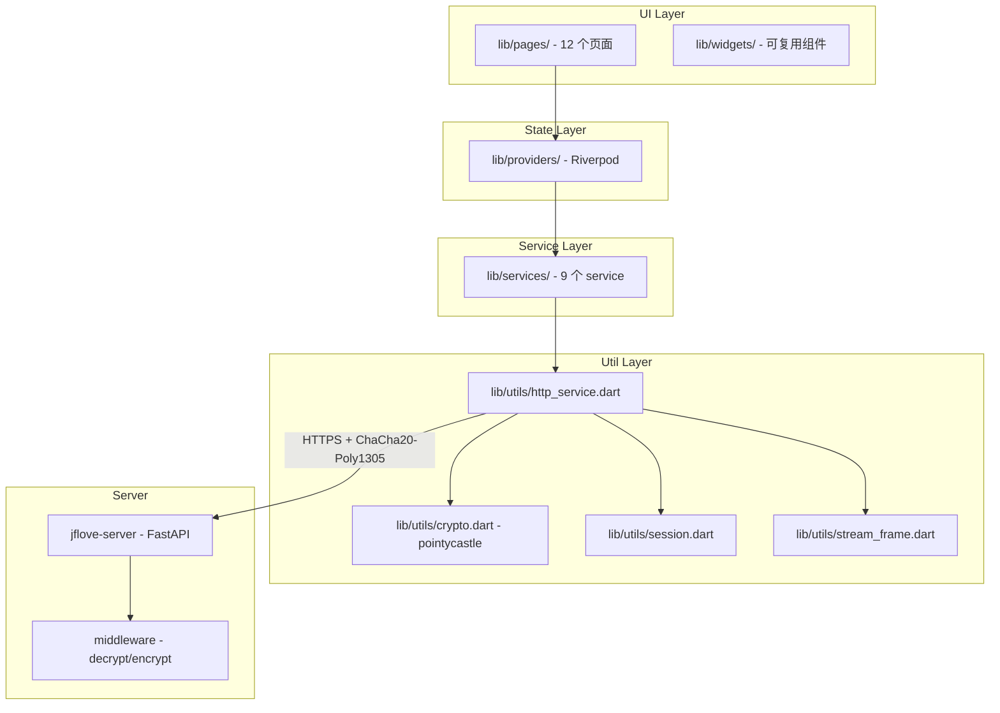

# JFLove v1.2.0 设计文档

> 需求文档：[`文档记录/需求文档/v1.2.0.md`](../需求文档/v1.2.0.md)

---

## 1. 系统架构



移动端完全复用桌面端的 HTTP 通信架构：密钥交换→session_key 派生→请求加密→响应解密，仅将 Python `cryptography` 替换为 Dart `pointycastle`，加密协议保持一致。

---

## 2. 路由设计（go_router）

### 2.1 完整路由表

| 路径 | 页面 | 鉴权 | 说明 |
|------|------|------|------|
| `/login` | LoginPage | 无 | 服务器地址输入、密钥交换、登录/注册（管理员初始化） |
| `/` | HomePage | 需登录 | 首页仪表盘（快捷入口 + 用户信息 + 传输任务浮窗） |
| `/files` | FileListPage | 需登录 | 虚拟磁盘列表 |
| `/files/:diskId` | DiskBrowserPage | 需登录 | 磁盘内文件浏览（路径参数 `diskId` 为整数） |
| `/files/preview` | FilePreviewPage | 需登录 | 全屏文件预览（图片/视频/音频/文本/Markdown/SVG） |
| `/notes` | NoteListPage | 需登录 | 笔记列表 + 搜索 |
| `/notes/:noteId` | NoteEditPage | 需登录 | 笔记编辑/预览（路径参数 `noteId` 为文件名） |
| `/sync` | SyncPage | 需登录 | 同步配置列表与管理 |
| `/sync/config/new` | SyncConfigEditPage | 需登录 | 新建/编辑同步配置 |
| `/settings` | SettingsPage | 需登录 | 设置（安全状态/服务器/笔记目录/账号/关于/管理入口） |
| `/admin/users` | AdminUsersPage | 需 admin | 用户管理 |
| `/admin/disks` | AdminDisksPage | 需 admin | 磁盘管理 |
| `/admin/permissions` | AdminPermissionsPage | 需 admin | 权限配置 |
| `/transfer` | TransferPage | 需登录 | 传输任务列表（从首页浮窗或文件页进入） |

### 2.2 路由守卫

```dart
GoRouter(
  initialLocation: '/login',
  redirect: (context, state) {
    final session = ref.read(sessionManagerProvider);
    final isLoggedIn = session.isLoggedIn;
    final isLoginRoute = state.matchedLocation == '/login';

    // 未登录 → 强制跳转登录页
    if (!isLoggedIn && !isLoginRoute) return '/login';
    // 已登录 → 访问登录页则跳转首页
    if (isLoggedIn && isLoginRoute) return '/';

    // Admin 路由守卫
    if (state.matchedLocation.startsWith('/admin') && !session.isAdmin) return '/';

    return null;
  },
  routes: [...]
)
```

### 2.3 与桌面端导航对标

| 桌面端侧边栏 | 移动端路由 | 移动端 Tab |
|-------------|-----------|-----------|
| 文档管理 | `/files` → `/files/:diskId` | Tab 2「文件」 |
| 笔记管理 | `/notes` → `/notes/:noteId` | Tab 3「笔记」 |
| 同步目录 | `/sync` | Tab 4「同步」 |
| 传输任务 | `/transfer` | 首页浮窗入口 + 文件页底部 |
| 安全状态 | `/settings`（安全卡片） | Tab 5「设置」内 |
| 设置 | `/settings` | Tab 5「设置」 |
| 用户管理 | `/admin/users` | 设置页 → 管理面板入口 |
| 磁盘管理 | `/admin/disks` | 设置页 → 管理面板入口 |
| 权限配置 | `/admin/permissions` | 设置页 → 管理面板入口 |

---

## 3. 底部导航与页面框架

### 3.1 底部导航栏（BottomNavigationBar）

```dart
Scaffold(
  body: child, // go_router 管理的子页面
  bottomNavigationBar: NavigationBar(
    selectedIndex: _currentIndex,
    onDestinationSelected: (index) {
      // 根据 index 跳转对应路由
    },
    destinations: [
      NavigationDestination(icon: Icon(Icons.home_outlined), selectedIcon: Icon(Icons.home), label: '首页'),
      NavigationDestination(icon: Icon(Icons.folder_outlined), selectedIcon: Icon(Icons.folder), label: '文件'),
      NavigationDestination(icon: Icon(Icons.note_outlined), selectedIcon: Icon(Icons.note), label: '笔记'),
      NavigationDestination(icon: Icon(Icons.sync), selectedIcon: Icon(Icons.sync), label: '同步'),
      NavigationDestination(icon: Icon(Icons.settings_outlined), selectedIcon: Icon(Icons.settings), label: '设置'),
    ],
  ),
)
```

底部导航在首页/文件/笔记/同步/设置 5 个顶级路由间切换。子页面（如 DiskBrowserPage、NoteEditPage）通过 Navigator.push 进入，不显示底部导航栏。

### 3.2 与桌面端导航的对应

| 桌面端 | 移动端 |
|--------|--------|
| FluentWindow + NavigationInterface（侧边栏） | Scaffold + NavigationBar（底部导航） |
| addSubInterface（按角色动态添加） | NavigationDestination 列表（admin 入口在设置页内） |
| NavigationItemPosition.BOTTOM（安全/设置固定底部） | 安全状态合并到设置页 |
| 管理员导航项（SCROLL 区 + 分隔线） | 设置页内「管理面板」入口（条件渲染） |

---

## 4. 页面组件树（逐页设计）

### 4.1 登录页（LoginPage）

对标桌面端 [`login_window.py`](../../jflove-desktop/src/ui/login_window.py)。

```
LoginPage (ConsumerStatefulWidget)
├── AppBar("JFLove")
└── SingleChildScrollView
    └── Column
        ├── Icon(lock) + 标题
        ├── DropdownButtonFormField (服务器地址历史，EditableComboBox 等效)
        ├── TextField (用户名)
        ├── TextField (密码，obscure)
        ├── DropdownButtonFormField (Token 有效期：1天/7天/30天)
        ├── Text (错误提示，条件渲染)
        └── ElevatedButton (登录)
```

**交互流程**：
1. 用户输入/选择服务器地址
2. 点击登录 → 执行密钥交换（`auth_service.keyExchange()`）
3. 检查管理员是否存在（`auth_service.adminExists()`）
4. 若不存在 → 弹出管理员注册对话框（用户名+密码）
5. 执行登录（`auth_service.login(username, password)`）
6. 保存服务器地址到历史（`server_history_service.addServer()`）
7. 跳转到首页 `/`

### 4.2 首页（HomePage）

```
HomePage (ConsumerWidget)
├── AppBar("JFLove" + 用户名)
└── Column
    ├── Card (用户信息：头像占位 + 用户名 + 角色)
    ├── GridView (4 快捷入口卡片)
    │   ├── Card → 文件管理 (Icons.folder, → /files)
    │   ├── Card → 笔记管理 (Icons.note, → /notes)
    │   ├── Card → 同步管理 (Icons.sync, → /sync)
    │   └── Card → 设置 (Icons.settings, → /settings)
    └── TransferFloatingCard (条件渲染：有进行中任务时显示)
        ├── Icon + "N 个任务进行中"
        └── onTap → Navigator.push(/transfer)
```

### 4.3 文件列表页（FileListPage）

对标桌面端 `FilePage._disk_combo` 的磁盘选择部分。

```
FileListPage (ConsumerStatefulWidget)
├── AppBar("文件管理")
└── Column
    ├── DropdownButton (虚拟磁盘选择，加载自 disk_service.listDisks())
    └── Expanded
        └── RefreshIndicator
            └── ListView.builder (磁盘列表)
                └── ListTile
                    ├── Icon(cloud)
                    ├── title: 磁盘名称
                    ├── subtitle: 磁盘路径
                    └── onTap → context.go('/files/$diskId')
```

### 4.4 磁盘浏览页（DiskBrowserPage）

对标桌面端 [`file_page.py`](../../jflove-desktop/src/ui/pages/file_page.py) 的核心功能。

```
DiskBrowserPage (ConsumerStatefulWidget)
├── AppBar(磁盘名称, actions: [上传按钮（写权限控制）, 新建目录按钮（写权限控制）])
├── PathBreadcrumb (路径面包屑 + 返回上级)
│   ├── "根目录" → onTap 回到 /
│   └── "子目录1" → "子目录2" → ... (当前路径各段)
└── Expanded
    └── RefreshIndicator
        └── ListView.builder (文件/目录列表)
            └── FileListTile
                ├── Icon(文件夹/文件类型)
                ├── title: 文件名
                ├── subtitle: 大小 + 修改时间
                ├── onTap → (目录: 进入 / 文件: 预览)
                ├── onLongPress → showModalBottomSheet (操作菜单)
                └── Dismissible (滑动删除，写权限控制)
```

**长按操作菜单（BottomSheet）**：

```
showModalBottomSheet
└── Column
    ├── ListTile(下载)    — 仅文件，调用 transfer_service
    ├── ListTile(预览)    — 仅文件，push /files/preview
    ├── Divider
    ├── ListTile(重命名)  — 写权限控制，弹出输入框
    ├── ListTile(移动到…) — 写权限控制，push MoveTargetPage
    ├── Divider
    └── ListTile(删除, red) — 写权限控制，确认弹窗
```

**移动到…页面（MoveTargetPage）**：

对标桌面端 `MoveTargetDialog`。全屏页面展示当前磁盘的目录树（仅目录），支持懒加载展开，用户选定后返回目标路径。

```
MoveTargetPage (ConsumerStatefulWidget)
├── AppBar("选择目标目录", actions: [确认按钮])
├── PathBreadcrumb (当前路径 + 返回上级)
└── ListView (仅显示目录，点击进入子目录，懒加载)
```

**上传流程**：
1. 点击 AppBar 上传按钮 → file_picker 选择文件（支持多选）
2. 文件加入传输队列（`transfer_manager`）
3. 页面底部出现进度条（监听 `transfer_manager` 状态变化）

**下载流程**：
1. 长按文件 → 下载 → file_picker 选择保存路径
2. 文件加入传输队列，底部进度条显示

### 4.5 文件预览页（FilePreviewPage）

对标桌面端 [`preview_dialog.py`](../../jflove-desktop/src/components/preview_dialog.py)。

```
FilePreviewPage (ConsumerStatefulWidget)
├── AppBar(文件名, actions: [下载按钮])
└── Body (根据文件类型切换)
    ├── ImagePreview: InteractiveViewer + Image.network (通过加密流加载)
    ├── VideoPreview: video_player (流式播放)
    ├── AudioPreview: 封面 + 播放控制滑块 + 进度
    ├── MarkdownPreview: flutter_markdown + Mermaid 支持
    ├── TextPreview: SelectableText (代码等宽字体)
    └── UnsupportedPreview: Icon + "不支持预览" + 下载按钮
```

### 4.6 笔记列表页（NoteListPage）

对标桌面端 `NotePage._note_list` + 搜索栏。

```
NoteListPage (ConsumerStatefulWidget)
├── AppBar("笔记管理")
└── Column
    ├── SearchBar (按文件名实时过滤)
    └── Expanded
        └── RefreshIndicator
            └── ListView.builder
                └── NoteCard
                    ├── Icon(note)
                    ├── title: 文件名
                    ├── subtitle: 修改时间
                    ├── onTap → push /notes/$filename
                    ├── onLongPress → BottomSheet (重命名/删除)
                    └── FAB (新建笔记)
```

### 4.7 笔记编辑页（NoteEditPage）

对标桌面端 [`note_page.py`](../../jflove-desktop/src/ui/pages/note_page.py) 的编辑器和预览。

```
NoteEditPage (ConsumerStatefulWidget)
├── AppBar(
│     title: 文件名,
│     actions: [
│       切换按钮 (编辑/预览),
│       保存按钮 (有未保存修改时高亮)
│     ]
│   )
└── Column
    ├── MarkdownToolbar (编辑模式显示)
    │   ├── 加粗 | 斜体 | 标题 | 列表 | 链接 | 图片 | 代码块 | 引用
    │   └── 基于键盘监听，插入对应 Markdown 语法
    └── Expanded
        ├── TextField (编辑模式，等宽字体，占满)
        └── MarkdownPreview (预览模式，代码高亮 + Mermaid)
```

**大纲抽屉（预览模式）**：

```
DraggableScrollableSheet / BottomSheet
└── Column
    ├── "大纲" 标题
    └── ListView
        └── ListTile (缩进表示层级，onTap → 滚动到对应锚点)
```

**自动保存**：30 秒无编辑操作后自动触发保存。

**未保存提示**：`WillPopScope` 拦截返回，若 `_isModified == true` 弹出确认对话框。

### 4.8 同步管理页（SyncPage）

对标桌面端 [`sync_page.py`](../../jflove-desktop/src/ui/pages/sync_page.py)。

```
SyncPage (ConsumerStatefulWidget)
├── AppBar("同步管理", actions: [添加配置按钮])
├── Card (同步规则说明)
└── Expanded
    └── ListView.builder
        └── SyncConfigCard
            ├── title: 配置名称
            ├── subtitle: 本地目录 → 远端磁盘/路径
            ├── Row(自动同步开关, 间隔, 上次同步时间)
            ├── LinearProgressIndicator (同步中时显示)
            ├── StatusChip (空闲 / 正在同步… / 完成 ↑n ↓m / 失败)
            └── Row(操作按钮)
                ├── IconButton(立即同步)
                ├── IconButton(编辑 → push /sync/config/new?edit=$id)
                └── IconButton(删除 → 确认弹窗)
```

### 4.9 同步配置编辑页（SyncConfigEditPage）

对标桌面端 `_SyncConfigDialog`。

```
SyncConfigEditPage (ConsumerStatefulWidget)
├── AppBar("新建配置" / "编辑配置", actions: [保存按钮])
└── Form
    ├── TextFormField (配置名称)
    ├── ListTile (本地目录 → file_picker)
    ├── DropdownButtonFormField (远端磁盘选择)
    ├── ListTile (远端子目录 → push RemoteDirBrowserPage)
    ├── SwitchListTile (自动同步)
    ├── Slider/TextField (同步间隔，30-86400 秒)
    └── SwitchListTile (启用配置)
```

### 4.10 远端目录浏览页（RemoteDirBrowserPage）

对标桌面端 `_RemoteDirBrowserDialog`。

```
RemoteDirBrowserPage (ConsumerStatefulWidget)
├── AppBar("选择远端目录", actions: [选择当前目录按钮])
├── PathBreadcrumb (当前路径 + 返回上级 + 回根目录)
└── ListView (仅显示子目录，双击进入，懒加载)
```

### 4.11 传输任务页（TransferPage）

对标桌面端 [`transfer_page.py`](../../jflove-desktop/src/ui/pages/transfer_page.py)。

```
TransferPage (ConsumerStatefulWidget)
├── AppBar("传输任务", actions: [清除已完成按钮])
├── Row (统计：共 N 个 | 进行中 N | 完成 N | 失败 N)
└── Expanded
    └── ListView.builder
        └── TransferTaskCard
            ├── Icon (上传↑ / 下载↓)
            ├── title: 文件名
            ├── subtitle: 已传输 / 总大小 (百分比)
            ├── LinearProgressIndicator (value: percent/100)
            ├── StatusChip (等待中/校验中/传输中/已完成/失败/已取消)
            └── IconButton (取消，仅进行中任务可点)
```

### 4.12 设置页（SettingsPage）

对标桌面端 [`settings_page.py`](../../jflove-desktop/src/ui/pages/settings_page.py) + [`security_page.py`](../../jflove-desktop/src/ui/pages/security_page.py)。

```
SettingsPage (ConsumerWidget)
├── AppBar("设置")
└── ListView
    ├── SecurityCard (安全状态卡片)
    │   ├── 会话状态 (✅ 已加密 / ❌ 未建立)
    │   ├── Session ID (前 8 位)
    │   ├── 密钥交换时间 + 已持续时长
    │   ├── 当前用户 (用户名 + 角色)
    │   └── ElevatedButton (刷新会话密钥)
    ├── ServerCard (服务端配置)
    │   ├── DropdownButtonFormField (服务器地址 + 历史记录)
    │   └── ElevatedButton (保存并重新连接)
    ├── NotesDirCard (笔记目录配置)
    │   ├── 当前配置展示
    │   ├── 步骤 1: DropdownButton (选择磁盘)
    │   ├── 步骤 2: 目录浏览 (LocalDirBrowser)
    │   └── ElevatedButton (使用当前目录)
    ├── TokenCard (登录有效期)
    │   └── 过期时间显示
    ├── AccountCard (账号)
    │   ├── 用户名 + 角色
    │   └── ElevatedButton (退出登录)
    ├── AdminEntryCard (管理面板入口，仅 admin)
    │   └── ListTile → Navigator.push(/admin/users)
    └── AboutCard (关于)
        ├── 版本号 v1.2.0
        ├── 说明文字
        └── 加密方案说明
```

### 4.13 管理员页面（AdminUsersPage / AdminDisksPage / AdminPermissionsPage）

对标桌面端 [`admin/`](../../jflove-desktop/src/ui/pages/admin/) 目录。

#### 4.13.1 用户管理（AdminUsersPage）

```
AdminUsersPage (ConsumerStatefulWidget)
├── AppBar("用户管理", actions: [添加用户按钮])
└── DataTable
    ├── columns: [ID, 用户名, 角色, 状态, 创建时间, 操作]
    └── rows: (仅显示普通用户)
        └── Row
            ├── Text(ID)
            ├── Text(用户名)
            ├── Chip(角色)
            ├── Switch(启用/禁用)
            └── PopupMenuButton
                ├── 修改密码 → 弹出输入框
                └── 删除用户 → 确认弹窗
```

#### 4.13.2 磁盘管理（AdminDisksPage）

```
AdminDisksPage (ConsumerStatefulWidget)
├── AppBar("磁盘管理", actions: [添加磁盘按钮])
└── DataTable
    ├── columns: [ID, 名称, 真实路径, 创建时间, 操作]
    └── rows:
        └── PopupMenuButton
            ├── 编辑磁盘 → 弹出编辑对话框
            └── 删除磁盘 → 确认弹窗
```

#### 4.13.3 权限配置（AdminPermissionsPage）

```
AdminPermissionsPage (ConsumerStatefulWidget)
├── AppBar("权限配置")
└── Row
    ├── Expanded(flex: 1)
    │   └── ListView (普通用户列表，单选)
    └── Expanded(flex: 2)
        └── Column
            ├── Text("用户：$username")
            └── DataTable
                ├── columns: [虚拟磁盘, 读取, 写入, 删除]
                └── rows:
                    └── Row
                        ├── Text(磁盘名)
                        ├── Switch(读)
                        ├── Switch(写)
                        └── Switch(删)
            └── ElevatedButton (保存权限配置)
```

---

## 5. 公共 Widget 组件

| 组件 | 文件 | 用途 | 对标桌面端 |
|------|------|------|-----------|
| FileListTile | `file_list_tile.dart` | 文件/目录列表项（图标+名称+大小+时间） | `QTreeWidgetItem` |
| NoteCard | `note_card.dart` | 笔记列表卡片 | `QListWidgetItem` |
| SyncConfigCard | `sync_config_card.dart` | 同步配置卡片 | `QTableWidget` 行 |
| TransferTaskCard | `transfer_task_card.dart` | 传输任务卡片 | `TransferTaskRow` |
| PathBreadcrumb | `path_breadcrumb.dart` | 路径面包屑导航 | `_path_label` + `_back_btn` |
| MarkdownToolbar | `markdown_toolbar.dart` | Markdown 编辑工具栏 | 桌面端无等效（桌面端依赖键盘快捷键） |
| MarkdownPreview | `markdown_preview.dart` | Markdown 渲染预览 | `MarkdownView` (QWebEngineView) |
| OutlineDrawer | `outline_drawer.dart` | 大纲导航抽屉 | `_outline_tree` (QTreeWidget) |
| LoadingIndicator | `loading_indicator.dart` | 居中加载动画 | N/A |
| EmptyState | `empty_state.dart` | 空状态引导 | N/A |
| ErrorSnackbar | `error_snackbar.dart` | 错误 Snackbar 封装 | `InfoBar.error` |
| TransferFloatingCard | `transfer_floating_card.dart` | 首页传输任务浮窗 | N/A |

---

## 6. 状态管理（Riverpod）

### 6.1 核心 Provider 设计

```dart
// ── 全局单例 ──

/// 会话管理器（token + session_key + 用户信息）
final sessionManagerProvider = Provider<SessionManager>((ref) => SessionManager());

/// HTTP 服务（依赖 session，自动处理加密/解密/重同步）
final httpServiceProvider = Provider<HttpService>((ref) {
  final session = ref.watch(sessionManagerProvider);
  return HttpService(session);
});

// ── 服务层 Provider ──

final authServiceProvider = Provider((ref) => AuthService(ref.read(httpServiceProvider), ref.read(sessionManagerProvider)));
final fileServiceProvider = Provider((ref) => FileService(ref.read(httpServiceProvider)));
final noteServiceProvider = Provider((ref) => NoteService(ref.read(httpServiceProvider)));
final syncServiceProvider = Provider((ref) => SyncService(ref.read(httpServiceProvider)));
final configServiceProvider = Provider((ref) => ConfigService(ref.read(httpServiceProvider)));
final diskServiceProvider = Provider((ref) => DiskService(ref.read(httpServiceProvider)));
final permissionServiceProvider = Provider((ref) => PermissionService(ref.read(httpServiceProvider)));
final userServiceProvider = Provider((ref) => UserService(ref.read(httpServiceProvider)));
final serverHistoryServiceProvider = Provider((ref) => ServerHistoryService(ref.read(sessionManagerProvider)));

// ── UI 状态 Provider ──

/// 认证状态
final authStateProvider = StateNotifierProvider<AuthNotifier, AuthState>((ref) {
  return AuthNotifier(ref);
});

/// 磁盘列表
final diskListProvider = FutureProvider<List<VirtualDisk>>((ref) async {
  return ref.read(diskServiceProvider).listDisks();
});

/// 文件列表（按 diskId + path）
final fileListProvider = FutureProvider.family<List<FileItem>, ({int diskId, String path})>((ref, params) async {
  return ref.read(fileServiceProvider).listFiles(params.diskId, params.path);
});

/// 笔记列表
final noteListProvider = FutureProvider<List<Note>>((ref) async {
  return ref.read(noteServiceProvider).listNotes();
});

/// 当前笔记内容（按 filename）
final noteContentProvider = FutureProvider.family<String?, String>((ref, filename) async {
  return ref.read(noteServiceProvider).readNote(filename);
});

/// 同步配置列表
final syncConfigListProvider = StateNotifierProvider<SyncConfigNotifier, AsyncValue<List<SyncConfig>>>((ref) {
  return SyncConfigNotifier(ref);
});

/// 传输任务列表
final transferTaskListProvider = StreamProvider<List<TransferTask>>((ref) {
  return ref.read(transferServiceProvider).taskStream;
});

/// 用户列表（admin）
final userListProvider = FutureProvider<List<User>>((ref) async {
  return ref.read(userServiceProvider).listUsers();
});

/// 磁盘管理列表（admin）
final adminDiskListProvider = FutureProvider<List<VirtualDisk>>((ref) async {
  return ref.read(diskServiceProvider).listDisks();
});

/// 权限数据（admin，按 userId）
final permissionProvider = FutureProvider.family<List<DiskPermission>, int>((ref, userId) async {
  return ref.read(permissionServiceProvider).getUserDiskPermissions(userId);
});
```

### 6.2 与桌面端状态管理对标

| 桌面端 | 移动端 |
|--------|--------|
| Redux store + signal | `StateNotifierProvider` + `ref.watch` |
| async action dispatch | `FutureProvider` / `AsyncNotifier` |
| 信号槽跨线程 | `StreamProvider` / `StateNotifier` |
| `session_manager` 全局单例 | `sessionManagerProvider` |
| `transfer_manager` 全局单例 | `transferServiceProvider`（含 Stream） |
| `sync_engine` 全局单例 | `SyncConfigNotifier` + 定时器 |

---

## 7. 传输任务管理器

对标桌面端 [`transfer_manager.py`](../../jflove-desktop/src/utils/transfer_manager.py)。

### 7.1 设计

```dart
/// 传输任务管理器（全局单例）
class TransferService {
  final _taskController = StreamController<List<TransferTask>>.broadcast();
  final _tasks = <String, TransferTask>{};

  Stream<List<TransferTask>> get taskStream => _taskController.stream;
  List<TransferTask> get tasks => _tasks.values.toList();

  /// 提交上传任务
  Future<void> submitUpload(int diskId, String remoteDir, String localPath);

  /// 提交下载任务
  Future<void> submitDownload(int diskId, String remotePath, String localPath, String filename);

  /// 取消任务
  void cancel(String taskId);

  /// 清除已结束任务
  void clearFinished();

  /// 任务统计
  Map<String, int> stats();
}

/// 任务状态枚举
enum TaskStatus { pending, hashing, running, completed, failed, cancelled }

/// 任务方向枚举
enum TaskKind { upload, download }

/// 单个传输任务
class TransferTask {
  final String id;
  final TaskKind kind;
  final String filename;
  final String localPath;
  final int fileSize;
  final int transferred;
  final int percent;
  final TaskStatus status;
  final String? error;
}
```

### 7.2 进度通知

- 首页：`TransferFloatingCard` 监听 `transferTaskListProvider`，显示进行中任务数
- 文件页：底部固定 `LinearProgressIndicator`，显示当前磁盘相关传输进度
- 传输页：完整任务列表

---

## 8. 同步引擎

对标桌面端 [`sync_engine.py`](../../jflove-desktop/src/utils/sync_engine.py)。

### 8.1 设计

```dart
/// 同步引擎（全局单例）
class SyncEngine {
  /// 重新加载配置（配置变更后调用）
  void reloadConfigs(List<SyncConfig> configs);

  /// 手动触发同步
  Future<bool> triggerSync(String configId);

  /// 启动自动同步定时器
  void startAutoSync();

  /// 停止自动同步
  void stopAutoSync();

  /// 同步状态流
  Stream<SyncEvent> get eventStream;
}

/// 同步事件
sealed class SyncEvent {}
class SyncStarted extends SyncEvent { final String configId; }
class SyncProgress extends SyncEvent { final String configId; final int uploaded; final int downloaded; final int skipped; }
class SyncFinished extends SyncEvent { final String configId; final SyncResult result; }
class SyncError extends SyncEvent { final String configId; final String error; }

/// 同步结果
class SyncResult {
  final String configId;
  final int uploaded;
  final int downloaded;
  final int skipped;
}
```

### 8.2 同步逻辑

双向同步规则（与桌面端一致）：

1. 获取远端快照（`POST /api/v1/sync/snapshot`，传 `disk_id + remote_path`）
2. 扫描本地目录文件列表
3. 对比：
   - 本地有 / 远端无 → 上传
   - 本地无 / 远端有 → 下载
   - 两边都有 → 按修改时间取新者
   - 任何方向都不主动删除文件

---

## 9. HTTP 通信层

### 9.1 HttpService 接口

对标桌面端 [`http_client.py`](../../jflove-desktop/src/utils/http_client.py)。

```dart
class HttpService {
  // 普通 JSON 请求（自动加密/解密）
  Future<Map<String, dynamic>> encryptedPost(String path, Map<String, dynamic>? body);
  Future<Map<String, dynamic>> encryptedGet(String path, Map<String, dynamic>? body);
  Future<Map<String, dynamic>> encryptedPut(String path, Map<String, dynamic>? body);
  Future<Map<String, dynamic>> encryptedDelete(String path, Map<String, dynamic>? body);

  // 明文请求（key-exchange / admin-exists / health）
  Future<Map<String, dynamic>> plainPost(String path, Map<String, dynamic> body);
  Future<Map<String, dynamic>> plainGet(String path);

  // 流式下载（边收边解密，经 StreamFrameParser）
  Stream<List<int>> encryptedDownloadStream(String path, Map<String, dynamic> body);

  // 流式上传（分片加密）
  Future<void> encryptedUploadStream(String path, Stream<List<int>> chunks, Map<String, dynamic> meta);
}
```

### 9.2 dio 拦截器链

```
Request → EncryptRequestInterceptor → EcDhResyncInterceptor → Dio
Response ← DecryptResponseInterceptor ← EcDhResyncInterceptor ← Dio
```

- `EncryptRequestInterceptor`：对非白名单请求体执行 `encryptEnvelope`
- `DecryptResponseInterceptor`：对非白名单响应体执行 `decryptEnvelope`
- `EcDhResyncInterceptor`：检测 401 → 自动重做 ECDH 密钥交换 → 重放请求

### 9.3 流式帧解析

对标桌面端帧格式。`encryptedDownloadStream` 返回的原始字节流经过 [`StreamFrameParser`](../../jflove-app/lib/utils/stream_frame.dart) 解析：

```
帧格式：[4B 大端长度][12B nonce][密文+16B Poly1305 tag]
```

每帧独立解密后通过 Stream 逐块传递给上层（预览组件、下载写入等）。

---

## 10. 加密桥接（pointycastle）

### 10.1 与 Python cryptography 函数对齐

| Python (`cryptography`) | Dart (`pointycastle`) | 用途 |
|---|---|---|
| `X25519PrivateKey.generate()` | `ECKeyGenerator() + ECCurve_curve25519()` | 生成临时密钥对 |
| `private_key.exchange(peer_pub)` | `ECDHBasicAgreement.calculateAgreement()` | ECDH 共享密钥 |
| `HKDF(algorithm=SHA256, length=32, salt=b"jflove-v1")` | `HKDFKeyDerivator(SHA256Digest())` | 派生 32B session_key |
| `ChaCha20Poly1305(key).encrypt(nonce, plain, None)` | `ChaCha20Poly1305().init(true, ...)` | 整包加密 |
| `ChaCha20Poly1305(key).decrypt(nonce, cipher, None)` | `ChaCha20Poly1305().init(false, ...)` | 整包解密 |

### 10.2 crypto.dart API

```dart
({Uint8List privateKeyRaw, String publicKeyB64}) generateKeyPair();
Uint8List deriveSessionKey(Uint8List privateKeyRaw, String peerPublicKeyB64);
({String nonce, String ciphertext}) encryptEnvelope(Uint8List sessionKey, Uint8List plaintext);
Uint8List decryptEnvelope(Uint8List sessionKey, String nonceB64, String ciphertextB64);
Uint8List encryptStreamChunk(Uint8List sessionKey, Uint8List plaintext);
Uint8List decryptStreamChunk(Uint8List sessionKey, Uint8List frameBody);
```

---

## 11. 数据模型

| 模型 | 字段 | 来源 |
|------|------|------|
| User | id, username, role, enabled, createdAt | `/api/v1/users/list` 响应 |
| FileItem | name, path, size, mtime, isDir | `/api/v1/files/list` 响应 |
| Note | id, name, content, mtime | `/api/v1/notes/list` 响应 |
| SyncConfig | id, name, localPath, diskId, remotePath, autoSync, syncInterval, enabled, lastSyncedAt | 本地 `sync_configs.json` |
| VirtualDisk | id, name, path, createdAt | `/api/v1/disks/list` 响应 |
| AuthResult | token, userId, username, role, expiresAt | 登录/注册响应 |
| DiskPermission | virtualDiskId, canRead, canWrite, canDelete | `/api/v1/permissions/list` 响应 |
| TransferTask | id, kind, filename, localPath, fileSize, transferred, percent, status, error | 客户端内存 |

---

## 12. 目录结构

```
jflove-app/lib/
├── main.dart                         # ProviderScope + 竖屏锁定
├── app.dart                          # MaterialApp.router + 主题 + 路由守卫
├── config/
│   ├── app_config.dart               # API_BASE_URL, 加密盐, 超时参数, 分页大小
│   └── theme.dart                    # Material Design 3 主题（亮色/暗色）
├── models/                           # 不可变数据模型（freezed）
│   ├── user.dart                     # User + AuthResult
│   ├── file_item.dart                # 文件/目录项（含 sizeStr 格式化）
│   ├── note.dart                     # 笔记
│   ├── virtual_disk.dart             # 虚拟磁盘
│   ├── sync_config.dart              # 同步配置（本地 JSON 序列化）
│   ├── disk_permission.dart          # 磁盘权限
│   └── transfer_task.dart            # 传输任务
├── providers/                        # Riverpod 状态管理
│   ├── session_provider.dart         # sessionManager + authState
│   ├── file_provider.dart            # diskList + fileList
│   ├── note_provider.dart            # noteList + noteContent
│   ├── sync_provider.dart            # syncConfigList + syncEngine
│   ├── transfer_provider.dart        # transferTaskList
│   └── admin_provider.dart           # userList + adminDiskList + permission
├── services/                         # 业务服务层（9 个 service）
│   ├── auth_service.dart             # keyExchange / adminExists / register / login / logout / refreshKey
│   ├── file_service.dart             # listFiles / createDir / rename / move / delete / upload / download
│   ├── note_service.dart             # listNotes / getNote / createNote / saveNote / deleteNote
│   ├── user_service.dart             # listUsers / createUser / changePassword / deleteUser / setEnabled
│   ├── disk_service.dart             # listDisks / createDisk / updateDisk / deleteDisk / browseDirs
│   ├── permission_service.dart       # listPermissions / setPermission / deletePermission
│   ├── sync_service.dart             # loadConfigs / saveConfigs / fetchSnapshot
│   ├── config_service.dart           # getConfig
│   ├── server_history_service.dart   # addServer / history
│   ├── transfer_service.dart         # 传输任务管理器（submitUpload / submitDownload / cancel / clearFinished）
│   └── sync_engine_service.dart      # 同步引擎（reloadConfigs / triggerSync / startAutoSync / stopAutoSync）
├── pages/                            # 页面（按路由组织）
│   ├── login/
│   │   └── login_page.dart           # 登录页（含管理员初始化流程）
│   ├── home/
│   │   └── home_page.dart            # 首页仪表盘
│   ├── files/
│   │   ├── file_list_page.dart       # 磁盘列表
│   │   ├── disk_browser_page.dart    # 磁盘文件浏览
│   │   ├── move_target_page.dart     # 移动到…目标选择
│   │   ├── remote_dir_browser_page.dart  # 远端目录浏览
│   │   └── file_preview_page.dart    # 全屏文件预览
│   ├── notes/
│   │   ├── note_list_page.dart       # 笔记列表 + 搜索
│   │   └── note_edit_page.dart       # 笔记编辑/预览
│   ├── sync/
│   │   ├── sync_page.dart            # 同步配置列表
│   │   └── sync_config_edit_page.dart # 新建/编辑同步配置
│   ├── transfer/
│   │   └── transfer_page.dart        # 传输任务列表
│   ├── settings/
│   │   └── settings_page.dart        # 设置（安全/服务器/笔记目录/账号/关于/管理入口）
│   └── admin/
│       ├── admin_users_page.dart     # 用户管理
│       ├── admin_disks_page.dart     # 磁盘管理
│       └── admin_permissions_page.dart # 权限配置
├── widgets/                          # 可复用 UI 组件
│   ├── file_list_tile.dart           # 文件/目录列表项
│   ├── note_card.dart                # 笔记卡片
│   ├── sync_config_card.dart         # 同步配置卡片
│   ├── transfer_task_card.dart       # 传输任务卡片
│   ├── path_breadcrumb.dart          # 路径面包屑
│   ├── markdown_toolbar.dart         # Markdown 工具栏
│   ├── markdown_preview.dart         # Markdown 渲染
│   ├── outline_drawer.dart           # 大纲抽屉
│   ├── loading_indicator.dart        # 加载指示器
│   ├── empty_state.dart              # 空状态
│   ├── error_snackbar.dart           # 错误提示
│   └── transfer_floating_card.dart   # 传输浮窗
└── utils/
    ├── crypto.dart                   # pointycastle 封装（X25519 + ChaCha20 + HKDF）
    ├── http_service.dart             # dio 封装（加密拦截器 + ECDH 重同步）
    ├── session.dart                  # SessionManager（token 存 Keystore，session_key 存内存）
    ├── stream_frame.dart             # 流式分帧解析器
    ├── exception.dart                # AppException（401/403/404/500/网络错误）
    └── logger.dart                   # 日志工具（debug 输出，release 静默）
```

---

## 13. 安全设计

### 13.1 每条路由鉴权标注

| 路由 | 明文白名单 | 路径参数 | 归属/角色校验 |
|------|-----------|---------|-------------|
| `/login` | 部分（key-exchange/admin-exists 明文，其余加密） | 无 | 无 |
| `/` | 否 | 无 | 需登录 |
| `/files` | 否 | 无 | 需登录 |
| `/files/:diskId` | 否 | diskId (int) | permission_service 校验读权限 |
| `/files/preview` | 否 | 无（参数走 body） | 需登录 |
| `/notes` | 否 | 无 | 需登录 |
| `/notes/:noteId` | 否 | noteId (filename) | 归属校验（笔记目录权限） |
| `/sync` | 否 | 无 | 需登录 |
| `/sync/config/new` | 否 | 无 | 需登录 |
| `/settings` | 否 | 无 | 需登录 |
| `/transfer` | 否 | 无 | 需登录 |
| `/admin/*` | 否 | 无 | 需 admin |

### 13.2 明文白名单（仅三条，不变）

- `GET /health`
- `POST /api/v1/auth/key-exchange`
- `GET /api/v1/auth/admin-exists`

### 13.3 安全约束

- session_key 仅存 Dart heap，不写入任何持久化存储
- JWT token 存 Android Keystore（flutter_secure_storage）
- sync_configs.json 存储于 App 内部存储（应用私有目录）
- 调试日志 `isDebugMode` 控制，release 模式全静默
- 禁止在 services/pages/widgets 层直接 `import 'package:dio/dio.dart'`
- 禁止引入 `dart:ffi` / libSodium
- URL 不携带业务参数，GET 请求体走加密 JSON
- 禁止在日志中输出 session_key / token / 密码 / 文件内容

### 13.4 路径参数权限校验对照表

| 路径参数 | 校验方式 | 说明 |
|---------|---------|------|
| `/files/:diskId` | `permission_service.check_disk_permission(user_id, diskId, "read")` | 服务端校验 |
| `/files/preview` | body 中传 diskId + path，服务端校验读权限 | 无路径参数 |
| `/notes/:noteId` | noteId 为文件名，服务端校验笔记目录权限 | 归属校验 |
| `/admin/*` | 前端路由守卫 `session.isAdmin` + 服务端 `_require_admin` | 双重校验 |

---

## 14. 与桌面端逐页面/逐组件对标表

| 桌面端源文件 | 移动端对应 | 适配说明 |
|-------------|-----------|---------|
| `src/ui/login_window.py` | `pages/login/login_page.dart` | 触屏适配：表单纵向排列，服务器历史下拉 |
| `src/ui/main_window.py` | `app.dart` (路由) + `pages/home/home_page.dart` | 侧边栏 → 底部导航 + 首页仪表盘 |
| `src/ui/pages/file_page.py` | `pages/files/file_list_page.dart` + `disk_browser_page.dart` + `move_target_page.dart` | 表格视图 → 列表视图，右键菜单 → 长按 BottomSheet |
| `src/ui/pages/note_page.py` | `pages/notes/note_list_page.dart` + `note_edit_page.dart` | 三分栏 → 全屏编辑+预览切换+大纲抽屉 |
| `src/ui/pages/sync_page.py` | `pages/sync/sync_page.dart` + `sync_config_edit_page.dart` + `remote_dir_browser_page.dart` | 弹窗式配置编辑 → 全屏 Form 页面 |
| `src/ui/pages/transfer_page.py` | `pages/transfer/transfer_page.dart` + `widgets/transfer_floating_card.dart` | 独立页面 + 首页浮窗入口 |
| `src/ui/pages/security_page.py` | `pages/settings/settings_page.dart`（安全卡片） | 合并到设置页 |
| `src/ui/pages/settings_page.py` | `pages/settings/settings_page.dart` | 卡片式布局适配触屏滚动 |
| `src/ui/pages/admin/user_page.py` | `pages/admin/admin_users_page.dart` | DataTable 适配小屏 |
| `src/ui/pages/admin/disk_page.py` | `pages/admin/admin_disks_page.dart` | DataTable 适配小屏 |
| `src/ui/pages/admin/permission_page.py` | `pages/admin/admin_permissions_page.dart` | 左右分栏 → 上下分栏（用户列表+权限矩阵） |
| `src/components/preview_dialog.py` | `pages/files/file_preview_page.dart` | 弹窗 → 全屏沉浸式 |
| `src/components/markdown_view.py` | `widgets/markdown_preview.dart` | QWebEngineView → flutter_markdown |
| `src/utils/http_client.py` | `utils/http_service.dart` | 已实现 ✅ |
| `src/utils/crypto.py` | `utils/crypto.dart` | 已实现 ✅，测试通过 |
| `src/utils/session.py` | `utils/session.dart` | 已实现 ✅ |
| `src/utils/stream_proxy.py` | `utils/stream_frame.dart` | 已实现 ✅，待接入下载流 |
| `src/utils/transfer_manager.py` | `services/transfer_service.dart` | 新增 |
| `src/utils/sync_engine.py` | `services/sync_engine_service.dart` | 新增 |

---

## 15. 调用的后端接口（不变）

| 接口 | 方法 | 用途 |
|------|------|------|
| `/api/v1/auth/key-exchange` | POST(明文) | 密钥交换 |
| `/api/v1/auth/admin-exists` | GET(明文) | 检查管理员 |
| `/api/v1/auth/register` | POST(加密) | 注册 |
| `/api/v1/auth/login` | POST(加密) | 登录 |
| `/api/v1/auth/logout` | POST(加密) | 登出 |
| `/api/v1/auth/refresh-key` | POST(加密) | 刷新会话密钥 |
| `/api/v1/files/list` | POST(加密) | 文件列表 |
| `/api/v1/files/mkdir` | POST(加密) | 创建目录 |
| `/api/v1/files/rename` | PUT(加密) | 重命名 |
| `/api/v1/files/move` | PUT(加密) | 移动 |
| `/api/v1/files/delete` | DELETE(加密) | 删除 |
| `/api/v1/files/upload` | POST(加密) | 上传（分片加密） |
| `/api/v1/files/download` | POST(加密) | 下载（流式解密） |
| `/api/v1/notes/list` | POST(加密) | 笔记列表 |
| `/api/v1/notes/get` | POST(加密) | 获取笔记内容 |
| `/api/v1/notes/create` | POST(加密) | 创建笔记 |
| `/api/v1/notes/save` | PUT(加密) | 保存笔记 |
| `/api/v1/notes/delete` | DELETE(加密) | 删除笔记 |
| `/api/v1/sync/snapshot` | POST(加密) | 远端文件快照 |
| `/api/v1/disks/list` | POST(加密) | 磁盘列表（用户视角，仅可访问的） |
| `/api/v1/disks/list-all` | POST(加密) | 全部磁盘（admin） |
| `/api/v1/disks/create` | POST(加密) | 创建磁盘 |
| `/api/v1/disks/update` | PUT(加密) | 编辑磁盘 |
| `/api/v1/disks/delete` | DELETE(加密) | 删除磁盘 |
| `/api/v1/disks/browse-dirs` | POST(加密) | 浏览子目录（仅目录） |
| `/api/v1/users/list` | POST(加密) | 用户列表 |
| `/api/v1/users/create` | POST(加密) | 创建用户 |
| `/api/v1/users/change-password` | PUT(加密) | 修改密码 |
| `/api/v1/users/set-enabled` | PUT(加密) | 启用/禁用 |
| `/api/v1/users/delete` | DELETE(加密) | 删除用户 |
| `/api/v1/permissions/list` | POST(加密) | 权限列表 |
| `/api/v1/permissions/set` | POST(加密) | 设置权限 |
| `/api/v1/permissions/delete` | DELETE(加密) | 删除权限 |
| `/api/v1/config/get` | POST(加密) | 配置查询 |
| `/api/v1/config/set-notes-disk` | POST(加密) | 设置笔记目录 |
