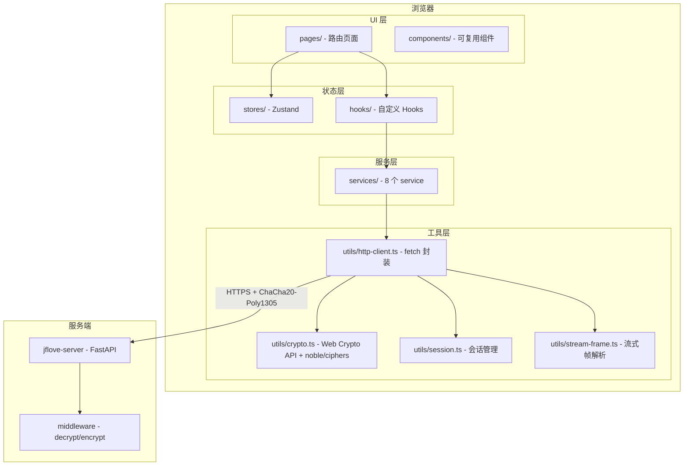

# JFLove v1.3.0 设计文档

> 需求文档：[`文档记录/需求文档/v1.3.0.md`](../需求文档/v1.3.0.md)

---

## 0. 版本对齐

- **需求文档**：`文档记录/需求文档/v1.3.0.md`
- **基线**：桌面端 v1.1.6（功能对标）、移动端 v1.2.0（架构参考）
- **后端变更**：仅添加 CORS 中间件（`CORSMiddleware`，约 7 行代码）。不涉及 API 接口、数据库、加密协议改动。所有 36 个已有 API 接口保持不变。

### 0.1 已有后端 API 全集（Web 端需调用的接口）

> 以下接口均已在 v1.0~v1.1.6 中实现，Web 端直接调用，无需后端改动。

| 路径 | 方法 | 说明 | 明文 | 路径参数 | 鉴权 |
|------|------|------|------|---------|------|
| `GET /health` | GET | 健康检查 | ✅ | 无 | 无 |
| `POST /api/v1/auth/key-exchange` | POST | X25519 密钥交换 | ✅ | 无 | 无 |
| `GET /api/v1/auth/admin-exists` | GET | 检查管理员是否存在 | ✅ | 无 | 无 |
| `POST /api/v1/auth/init-admin` | POST | 初始化管理员 | ❌ | 无 | 无（首次） |
| `POST /api/v1/auth/login` | POST | 用户登录 | ❌ | 无 | 无 |
| `POST /api/v1/auth/logout` | POST | 登出 | ❌ | 无 | JWT |
| `GET /api/v1/files/disks` | GET | 获取用户可访问的磁盘列表 | ❌ | 无 | JWT |
| `POST /api/v1/files/list` | POST | 列出磁盘内文件/目录 | ❌ | 无 | JWT |
| `POST /api/v1/files/mkdir` | POST | 创建目录 | ❌ | 无 | JWT |
| `POST /api/v1/files/rename` | POST | 重命名 | ❌ | 无 | JWT |
| `POST /api/v1/files/move` | POST | 移动 | ❌ | 无 | JWT |
| `POST /api/v1/files/delete` | POST | 删除 | ❌ | 无 | JWT |
| `POST /api/v1/files/upload/init` | POST | 初始化分片上传 | ❌ | 无 | JWT |
| `POST /api/v1/files/upload/chunk` | POST | 上传分片（加密 body 内含 base64 chunk） | ❌ | 无 | JWT |
| `POST /api/v1/files/upload/complete` | POST | 完成上传 | ❌ | 无 | JWT |
| `GET /api/v1/files/stream` | GET | 流式下载/预览文件 | ❌ | 无 | JWT |
| `POST /api/v1/files/preview` | POST | 获取小文件预览内容（文本/图片/Markdown） | ❌ | 无 | JWT |
| `GET /api/v1/notes/list` | GET | 获取笔记列表 | ❌ | 无 | JWT |
| `POST /api/v1/notes/get` | POST | 获取笔记内容 | ❌ | 无 | JWT |
| `POST /api/v1/notes/save` | POST | 保存笔记 | ❌ | 无 | JWT |
| `POST /api/v1/notes/create` | POST | 创建笔记 | ❌ | 无 | JWT |
| `POST /api/v1/notes/rename` | POST | 重命名笔记 | ❌ | 无 | JWT |
| `POST /api/v1/notes/delete` | POST | 删除笔记 | ❌ | 无 | JWT |
| `POST /api/v1/sync/snapshot` | POST | 获取远端目录快照 | ❌ | 无 | JWT |
| `GET /api/v1/users/list` | GET | 用户列表（admin） | ❌ | 无 | JWT+admin |
| `POST /api/v1/users/create` | POST | 创建用户（admin） | ❌ | 无 | JWT+admin |
| `POST /api/v1/users/change-password` | POST | 修改密码（admin） | ❌ | 无 | JWT+admin |
| `POST /api/v1/users/delete` | POST | 删除用户（admin） | ❌ | 无 | JWT+admin |
| `POST /api/v1/users/set-enabled` | POST | 启用/禁用用户（admin） | ❌ | 无 | JWT+admin |
| `GET /api/v1/disks/list` | GET | 磁盘列表（admin） | ❌ | 无 | JWT+admin |
| `POST /api/v1/disks/create` | POST | 创建磁盘（admin） | ❌ | 无 | JWT+admin |
| `POST /api/v1/disks/update` | POST | 更新磁盘（admin） | ❌ | 无 | JWT+admin |
| `POST /api/v1/disks/delete` | POST | 删除磁盘（admin） | ❌ | 无 | JWT+admin |
| `POST /api/v1/disks/browse-dirs` | POST | 浏览磁盘内子目录（admin+用户） | ❌ | 无 | JWT |
| `GET /api/v1/permissions/list` | GET | 权限列表（admin） | ❌ | 无 | JWT+admin |
| `POST /api/v1/permissions/set` | POST | 设置权限（admin） | ❌ | 无 | JWT+admin |
| `POST /api/v1/permissions/delete` | POST | 删除权限（admin） | ❌ | 无 | JWT+admin |
| `GET /api/v1/config` | GET | 获取服务端配置 | ❌ | 无 | JWT |

### 0.2 后端变更：CORS 中间件

> 浏览器同源策略要求后端响应必须包含 `Access-Control-Allow-Origin` 头，否则浏览器会拦截跨域请求（CORS 错误）。

**变更文件**：`jflove-server/src/main.py`

```python
from fastapi.middleware.cors import CORSMiddleware

# 在 app = FastAPI(...) 之后、include_router 之前添加：
app.add_middleware(
    CORSMiddleware,
    allow_origins=["*"],       # 允许任意来源（Web 端可部署在任意域名）
    allow_credentials=True,    # 允许携带凭证
    allow_methods=["*"],       # 允许所有 HTTP 方法
    allow_headers=["*"],       # 允许所有请求头（含 X-Session-ID）
)
```

| 属性 | 值 | 理由 |
|------|-----|------|
| `allow_origins` | `["*"]` | Web 端可部署在任意域名/端口，无法预知来源 |
| `allow_credentials` | `true` | — |
| `allow_methods` | `["*"]` | 已有 GET/POST/PUT/DELETE 全部方法 |
| `allow_headers` | `["*"]` | 需要 `X-Session-ID`、`Content-Type` 等自定义头 |

**安全影响评估**：
- CORS 仅控制浏览器是否允许跨域读取响应，不替代鉴权
- 所有受保护接口仍需 JWT（走加密 body 的 `token` 字段），不受 CORS 影响
- 明文白名单接口（`/health`、`/auth/key-exchange`、`/auth/admin-exists`）本就不含敏感数据
- 不违反 §9 安全宪法任何条款

---

## 1. 系统架构



### 1.1 分层职责

| 层 | 目录 | 对标桌面端 | 职责 |
|----|------|-----------|------|
| UI 页面 | `src/pages/` | `ui/pages/` | 路由对应页面，只负责渲染 + 事件绑定 |
| UI 组件 | `src/components/` | `components/` | 可复用 UI 组件（文件列表项、笔记卡片等） |
| 布局 | `src/layouts/` | `ui/main_window.py` | PC/移动端双布局切换 |
| 状态管理 | `src/stores/` | Redux 信号槽 | Zustand store，全局状态 |
| 自定义 Hook | `src/hooks/` | — | 封装业务逻辑，调 services |
| 服务层 | `src/services/` | `services/` | API 调用封装，统一走 http-client |
| 工具层 | `src/utils/` | `utils/` | 加密、HTTP、会话、帧解析 |

### 1.2 与桌面端架构对标

| 桌面端 (PySide6) | Web 端 (React) |
|------------------|---------------|
| `QWidget` 页面 | React 函数式组件 |
| Redux 信号槽 | Zustand store |
| `Worker(QThread)` | `async/await` + `AbortController` |
| `http_client.py` | `http-client.ts`（fetch 封装） |
| `session_manager` 单例 | `session.ts` 模块 + Zustand auth store |
| `transfer_manager` 单例 | Zustand transfer store |
| `sync_engine` | 降级为展示页面 |

---

## 2. 路由设计（React Router v7）

### 2.1 完整路由表

| 路径 | 页面组件 | 鉴权 | 布局 | 说明 |
|------|---------|------|------|------|
| `/login` | LoginPage | 无 | AuthLayout | 登录/管理员初始化 |
| `/` | HomePage | JWT | AppLayout | 首页仪表盘 |
| `/files` | FileListPage | JWT | AppLayout | 虚拟磁盘列表 |
| `/files/:diskId` | DiskBrowserPage | JWT | AppLayout | 磁盘内文件浏览 |
| `/files/:diskId/preview` | FilePreviewPage | JWT | AppLayout | 全屏文件预览 |
| `/notes` | NoteListPage | JWT | AppLayout | 笔记列表 |
| `/notes/:noteId` | NoteEditPage | JWT | AppLayout | 笔记编辑/预览 |
| `/sync` | SyncPage | JWT | AppLayout | 同步说明+引导 |
| `/transfer` | TransferPage | JWT | AppLayout | 传输任务列表 |
| `/security` | SecurityPage | JWT | AppLayout | 安全状态（PC端独立页） |
| `/settings` | SettingsPage | JWT | AppLayout | 设置页 |
| `/admin/users` | AdminUsersPage | JWT+admin | AppLayout | 用户管理 |
| `/admin/disks` | AdminDisksPage | JWT+admin | AppLayout | 磁盘管理 |
| `/admin/permissions` | AdminPermissionsPage | JWT+admin | AppLayout | 权限配置 |

### 2.2 路由守卫

```typescript
// 路由守卫逻辑
function RequireAuth({ children }: { children: ReactNode }) {
  const { isLoggedIn, tokenExpired } = useAuthStore();
  const location = useLocation();

  if (!isLoggedIn || tokenExpired) {
    return <Navigate to="/login" state={{ from: location }} replace />;
  }
  return <>{children}</>;
}

function RequireAdmin({ children }: { children: ReactNode }) {
  const { role } = useAuthStore();
  if (role !== 'admin') {
    return <Navigate to="/" replace />;
  }
  return <>{children}</>;
}
```

### 2.3 与桌面端导航对标

| 桌面端侧边栏 | Web 端 PC 侧边栏 | Web 端移动端 Tab |
|-------------|-----------------|-----------------|
| 文档管理 | `/files` → `/files/:diskId` | Tab「文件」 |
| 笔记管理 | `/notes` → `/notes/:noteId` | Tab「笔记」 |
| 同步目录 | `/sync` | Tab「同步」 |
| 传输任务 | `/transfer` | Tab「传输」 |
| 安全状态 | `/security` | 合并到设置页 |
| 设置 | `/settings` | Tab「设置」 |
| 用户管理 | `/admin/users` | 设置页内入口 |
| 磁盘管理 | `/admin/disks` | 设置页内入口 |
| 权限配置 | `/admin/permissions` | 设置页内入口 |

---

## 3. 布局设计

### 3.1 PC 端布局（≥1024px）

```
┌──────────────────────────────────────────────────┐
│  ┌──────────┐  ┌────────────────────────────────┐ │
│  │          │  │                                │ │
│  │  侧边栏   │  │       主内容区                  │ │
│  │          │  │    <Outlet />                   │ │
│  │  📁 文件  │  │                                │ │
│  │  📝 笔记  │  │                                │ │
│  │  🔄 同步  │  │                                │ │
│  │  📊 传输  │  │                                │ │
│  │  🔒 安全  │  │                                │ │
│  │  ⚙️ 设置  │  │                                │ │
│  │  ─────── │  │                                │ │
│  │  👑 管理  │  │                                │ │
│  │          │  │                                │ │
│  └──────────┘  └────────────────────────────────┘ │
└──────────────────────────────────────────────────┘
```

- 侧边栏常驻宽度 240px，包含导航项列表 + 用户信息底栏
- 管理面板入口仅 admin 角色可见
- 当前路由高亮

### 3.2 移动端布局（<1024px）

```
┌──────────────────────┐
│                      │
│     主内容区          │
│     <Outlet />       │
│                      │
│                      │
├──────────────────────┤
│  📁   📝   🔄   📊   ⚙️  │
│ 文件  笔记  同步  传输  设置 │
└──────────────────────┘
```

- 底部固定 TabBar，5 个 Tab
- 安全状态合并到设置页内
- 管理面板通过设置页内入口进入

### 3.3 布局组件实现

```typescript
// AppLayout.tsx
function AppLayout() {
  const isPC = useMediaQuery('(min-width: 1024px)');

  if (isPC) {
    return <DesktopLayout />;
  }
  return <MobileLayout />;
}

// DesktopLayout.tsx
function DesktopLayout() {
  return (
    <div className="flex h-screen">
      <Sidebar />        {/* w-60，常驻 */}
      <main className="flex-1 overflow-auto">
        <Outlet />
      </main>
    </div>
  );
}

// MobileLayout.tsx
function MobileLayout() {
  return (
    <div className="flex flex-col h-screen">
      <main className="flex-1 overflow-auto">
        <Outlet />
      </main>
      <BottomTabBar />   {/* h-14，固定底部 */}
    </div>
  );
}
```

---

## 4. 加密通信设计

### 4.1 加密栈

| 环节 | 桌面端 (Python) | Web 端 (TypeScript) |
|------|----------------|---------------------|
| 密钥交换 | `cryptography` X25519 | `Web Crypto API` (`SubtleCrypto.generateKey({name: 'X25519'})`) |
| 公钥导出 | `.public_bytes(Raw)` | `SubtleCrypto.exportKey('raw', key)` |
| ECDH | `private_key.exchange(peer_pub)` | `SubtleCrypto.deriveBits({name: 'X25519'})` |
| HKDF-SHA256 | `cryptography.hazmat` HKDF | `SubtleCrypto.deriveBits({name: 'HKDF', hash: 'SHA-256'})` |
| 对称加密 | `cryptography` ChaCha20Poly1305 | `@noble/ciphers` `xchacha20poly1305` |
| 加密信封 | `{"nonce":"<B64>","ciphertext":"<B64>"}` | 完全一致 |

### 4.2 crypto.ts API

```typescript
// src/utils/crypto.ts

/** 生成 X25519 临时密钥对 */
function generateKeyPair(): Promise<{ publicKeyB64: string; privateKey: CryptoKey }>;

/** ECDH + HKDF-SHA256 派生 32 字节 session_key */
function deriveSessionKey(privateKey: CryptoKey, peerPublicKeyB64: string): Promise<Uint8Array>;

/** ChaCha20-Poly1305 加密 */
function encryptEnvelope(sessionKey: Uint8Array, plaintext: Uint8Array): { nonce: string; ciphertext: string };

/** ChaCha20-Poly1305 解密 */
function decryptEnvelope(sessionKey: Uint8Array, nonceB64: string, ciphertextB64: string): Uint8Array;

/** 加密流式帧（64KB 分片） */
function encryptStreamChunk(sessionKey: Uint8Array, plaintext: Uint8Array): Uint8Array;

/** 解密流式帧 */
function decryptStreamChunk(sessionKey: Uint8Array, frameBody: Uint8Array): Uint8Array;
```

### 4.3 互操作性验证点

Web 端 `@noble/ciphers` 的 ChaCha20-Poly1305 输出必须与 Python `cryptography` 逐字节一致：
- 同一个 `(session_key, nonce, plaintext)` 必须产出一致的 `ciphertext + tag`
- `@noble/ciphers` 使用 `xchacha20poly1305` 变体（IETF variant，96-bit nonce）

---

## 5. HTTP 通信层

### 5.1 http-client.ts 接口

```typescript
// src/utils/http-client.ts

class HttpClient {
  /** 加密 POST */
  async post<T>(path: string, body: Record<string, unknown>): Promise<T>;

  /** 加密 GET（body 通过 JSON 传递） */
  async get<T>(path: string, body: Record<string, unknown>): Promise<T>;

  /** 加密 PUT */
  async put<T>(path: string, body: Record<string, unknown>): Promise<T>;

  /** 加密 DELETE */
  async delete<T>(path: string, body: Record<string, unknown>): Promise<T>;

  /** 明文 POST（key-exchange / init-admin） */
  async postPlain<T>(path: string, body: Record<string, unknown>): Promise<T>;

  /** 明文 GET（admin-exists / health） */
  async getPlain<T>(path: string): Promise<T>;

  /** 流式下载（ReadableStream，逐帧解密） */
  async downloadStream(path: string, body: Record<string, unknown>): Promise<ReadableStream<Uint8Array>>;
}
```

### 5.2 请求/响应流程

```
请求：
1. 注入 token 到 body.token
2. 生成随机 12B nonce
3. JSON.stringify(body) → Uint8Array
4. ChaCha20-Poly1305 加密
5. 构造 { nonce: Base64, ciphertext: Base64 }
6. fetch(url, { method, headers: { 'X-Session-ID': sessionId }, body: JSON })

响应：
1. 读取 JSON { nonce, ciphertext }
2. ChaCha20-Poly1305 解密
3. JSON.parse → 返回业务数据
```

### 5.3 明文白名单

```typescript
const PLAIN_PATHS = [
  '/health',
  '/api/v1/auth/key-exchange',
  '/api/v1/auth/admin-exists',
];
```

### 5.4 ECDH 静默续约

401 响应时检测 detail 是否为会话过期类错误：
- 是 → 自动重新密钥交换 → 重放请求
- 否 → 抛出 `ApiError`，UI 层处理

```typescript
const ECDH_401_PATTERNS = [
  '会话不存在或已过期',
  '会话已失效',
  '缺少 X-Session-ID',
];

async function handle401(response: Response): Promise<Response> {
  const detail = await extractErrorDetail(response);
  if (ECDH_401_PATTERNS.some(p => detail.includes(p))) {
    // 单飞续约：多个并发 401 只触发一次 key-exchange
    await resyncSession();
    return retry();
  }
  throw new ApiError(401, detail);
}
```

单飞续约使用 Promise 链实现：第一个 401 触发续约，后续 401 等待同一 Promise。

### 5.5 流式帧解析（stream-frame.ts）

```typescript
// src/utils/stream-frame.ts

/**
 * 解析加密流式帧。
 * 帧格式：[4B 大端长度][12B nonce][密文+16B Poly1305 tag]
 */
async function* parseStreamFrames(
  stream: ReadableStream<Uint8Array>,
  sessionKey: Uint8Array,
): AsyncGenerator<Uint8Array> {
  // 1. 读取 4 字节长度（大端）
  // 2. 读取 12 字节 nonce
  // 3. 读取 (长度 - 12) 字节的密文+tag
  // 4. ChaCha20-Poly1305 解密
  // 5. yield 明文
}
```

---

## 6. 会话管理

### 6.1 SessionManager

```typescript
// src/utils/session.ts

interface SessionState {
  serverUrl: string;
  sessionId: string;
  sessionKey: Uint8Array | null;  // 仅内存
  token: string;
  userId: number;
  username: string;
  role: 'admin' | 'user';
  keyExchangeTime: number;
  tokenExpiresAt: number;
  localSessionMaxSeconds: number;
}

// sessionKey 仅存于闭包变量，不进入 Zustand 或 localStorage
let _sessionKey: Uint8Array | null = null;

function getSessionKey(): Uint8Array | null { return _sessionKey; }
function setSessionKey(key: Uint8Array | null): void { _sessionKey = key; }
```

### 6.2 持久化策略

| 数据 | 存储位置 | 生命周期 |
|------|---------|---------|
| `sessionKey` | 内存闭包变量 | 页面关闭即清除 |
| `token` | `localStorage` | 持久化（用于免登录恢复） |
| `serverUrl` | `localStorage` | 持久化 |
| `username` / `role` / `userId` | `localStorage` | 持久化 |
| `tokenExpiresAt` | `localStorage` | 持久化 |
| `localSessionMaxSeconds` | `localStorage` | 持久化 |
| 服务器地址历史 | `localStorage` | 持久化（最多 10 条） |

---

## 7. 状态管理（Zustand）

### 7.1 Store 划分

| Store | 对标桌面端 | 存储内容 |
|-------|-----------|---------|
| `useAuthStore` | `session_manager` + `auth_service` | 登录状态、token、用户信息、过期检测 |
| `useFileStore` | `file_page.py` 状态 | 磁盘列表、当前文件列表、当前路径、写权限 |
| `useNoteStore` | `note_page.py` 状态 | 笔记列表、当前笔记内容、编辑状态 |
| `useSyncStore` | `sync_page.py` 状态 | 同步配置列表（降级展示） |
| `useTransferStore` | `transfer_manager` | 传输任务列表、统计 |
| `useSettingsStore` | `settings_page.py` 状态 | 笔记目录偏好、登录有效期偏好 |
| `useAdminStore` | admin 页面状态 | 用户列表、磁盘列表、权限数据 |

### 7.2 示例：useAuthStore

```typescript
// src/stores/auth-store.ts
import { create } from 'zustand';

interface AuthState {
  isLoggedIn: boolean;
  token: string | null;
  userId: number | null;
  username: string | null;
  role: 'admin' | 'user' | null;
  tokenExpiresAt: number | null;
  serverUrl: string;
  localSessionMaxSeconds: number;

  login: (token: string, userId: number, username: string, role: string, expiresAt: number) => void;
  logout: () => void;
  checkTokenExpiry: () => boolean;
  setServerUrl: (url: string) => void;
}

export const useAuthStore = create<AuthState>((set, get) => ({
  isLoggedIn: false,
  // ...
  checkTokenExpiry: () => {
    const { tokenExpiresAt, logout } = get();
    if (tokenExpiresAt && Date.now() / 1000 >= tokenExpiresAt) {
      logout();
      return true;
    }
    return false;
  },
}));
```

### 7.3 与桌面端对标

| 桌面端 | Web 端 |
|--------|--------|
| `session_manager` 单例 + 信号 | `useAuthStore` + `session.ts` |
| Redux store + signal dispatch | Zustand `set()` + `subscribe()` |
| `Worker(QThread)` 异步 | `async/await` + `useEffect` |
| `Signal(type, data)` emit | Zustand `subscribe()` 或 React 重渲染 |

---

## 8. 服务层设计

### 8.1 Service 列表

| Service | 文件 | 对标桌面端 | 依赖后端接口 |
|---------|------|-----------|------------|
| `authService` | `auth-service.ts` | `auth_service.py` | key-exchange, admin-exists, init-admin, login, logout |
| `fileService` | `file-service.ts` | `file_service.py` | disks, list, mkdir, rename, move, delete, upload/*, stream, preview |
| `noteService` | `note-service.ts` | `note_service.py` | list, get, save, create, rename, delete |
| `syncService` | `sync-service.ts` | `sync_service.py` | snapshot（降级使用） |
| `userService` | `user-service.ts` | `user_service.py` | list, create, change-password, delete, set-enabled |
| `diskService` | `disk-service.ts` | `disk_service.py` | list, create, update, delete, browse-dirs |
| `permissionService` | `permission-service.ts` | `permission_service.py` | list, set, delete |
| `configService` | `config-service.ts` | `config_service.py` | config |
| `serverHistoryService` | `server-history-service.ts` | `server_history_service.py` | 纯本地 localStorage 操作 |

### 8.2 Service 示例：fileService

```typescript
// src/services/file-service.ts
import { httpClient } from '../utils/http-client';

export const fileService = {
  /** 获取用户可访问的虚拟磁盘列表 */
  async listDisks(): Promise<VirtualDisk[]> {
    return httpClient.get('/api/v1/files/disks', { token: getToken() });
  },

  /** 列出磁盘内文件/目录 */
  async listFiles(diskId: number, path: string): Promise<FileItem[]> {
    return httpClient.post('/api/v1/files/list', {
      token: getToken(),
      disk_id: diskId,
      path,
    });
  },

  /** 创建目录 */
  async createDir(diskId: number, path: string, dirName: string): Promise<void> {
    return httpClient.post('/api/v1/files/mkdir', {
      token: getToken(),
      disk_id: diskId,
      path,
      dir_name: dirName,
    });
  },

  /** 重命名文件/目录 */
  async rename(diskId: number, path: string, newName: string): Promise<void> {
    return httpClient.post('/api/v1/files/rename', {
      token: getToken(),
      disk_id: diskId,
      path,
      new_name: newName,
    });
  },

  /** 移动文件/目录 */
  async move(diskId: number, srcPath: string, dstDirPath: string): Promise<void> {
    return httpClient.post('/api/v1/files/move', {
      token: getToken(),
      disk_id: diskId,
      src_path: srcPath,
      dst_dir_path: dstDirPath,
    });
  },

  /** 删除文件/目录 */
  async delete(diskId: number, path: string): Promise<void> {
    return httpClient.post('/api/v1/files/delete', {
      token: getToken(),
      disk_id: diskId,
      path,
    });
  },

  /** 流式下载（返回 ReadableStream） */
  async downloadStream(diskId: number, path: string, filename: string): Promise<ReadableStream<Uint8Array>> {
    return httpClient.downloadStream('/api/v1/files/stream', {
      token: getToken(),
      disk_id: diskId,
      path,
      filename,
    });
  },

  /** 获取文件预览内容（文本/图片/Markdown） */
  async getPreview(diskId: number, path: string, filename: string): Promise<PreviewResult> {
    return httpClient.post('/api/v1/files/preview', {
      token: getToken(),
      disk_id: diskId,
      path,
      filename,
    });
  },
};
```

---

## 9. 类型定义

### 9.1 核心类型

```typescript
// src/types/models.ts

interface VirtualDisk {
  id: number;
  name: string;
  path: string;
  can_write: boolean;
  created_at: string;
}

interface FileItem {
  name: string;
  path: string;
  size: number;
  is_dir: boolean;
  modified_at: number;
}

interface Note {
  filename: string;
  size: number;
  modified_at: number;
}

interface User {
  id: number;
  username: string;
  role: 'admin' | 'user';
  enabled: boolean;
  created_at: string;
}

interface TransferTask {
  id: string;
  kind: 'upload' | 'download';
  filename: string;
  localPath: string;
  fileSize: number;
  transferred: number;
  percent: number;
  status: 'pending' | 'hashing' | 'running' | 'completed' | 'failed' | 'cancelled';
  error?: string;
}

interface PreviewResult {
  type: 'text' | 'image' | 'markdown' | 'unsupported';
  content_type: string;
  content?: string;     // text/markdown 的字符串内容
  base64?: string;      // image 的 base64 数据
  file_size: number;
}

interface AuthResult {
  token: string;
  user_id: number;
  username: string;
  role: 'admin' | 'user';
  expires_in: number;
}
```

---

## 10. 页面组件树（逐页设计）

### 10.1 登录页（LoginPage）

对标桌面端 [`login_window.py`](../../jflove-desktop/src/ui/login_window.py)。

```
LoginPage
├── Card (最大宽度 420px，居中)
│   ├── Icon(lock) + "JFLove" 标题
│   ├── BodyLabel("所有通信均经过加密...")
│   ├── ComboBox (服务端地址，支持手动输入 + 历史下拉)
│   │   └── 右侧删除按钮 (清除当前选中历史)
│   ├── TextField (用户名)
│   ├── TextField (密码，type="password")
│   ├── HBox
│   │   ├── BodyLabel("登录有效期")
│   │   └── ComboBox (1天 / 7天 / 30天，默认30天)
│   ├── ErrorLabel (条件渲染，红色)
│   ├── HBox
│   │   ├── Button("返回", secondary) — 仅管理员初始化页显示
│   │   └── Button("登录", primary, fullWidth)
│   └── CaptionLabel(`v${APP_VERSION}`)
```

**交互流程**：
1. 用户输入/选择服务器地址
2. 点击登录 → 密钥交换 → 管理员检测
3. 无管理员 → 弹出管理员初始化表单（用户名+密码+确认密码）
4. 有管理员 → 直接登录
5. 成功后跳转 `/`

### 10.2 首页（HomePage）

```
HomePage
├── Header (用户名 + 角色标签)
└── Grid (2×2 快捷入口卡片)
    ├── Card → 📁 文件管理
    ├── Card → 📝 笔记管理
    ├── Card → 🔄 同步管理
    └── Card → ⚙️ 设置
```

### 10.3 文件列表页（FileListPage）

```
FileListPage
├── Header ("文件管理")
└── List
    └── ListItem × N
        ├── Icon(cloud)
        ├── 磁盘名称
        ├── 磁盘路径 (subtitle)
        └── onClick → /files/:diskId
```

### 10.4 磁盘浏览页（DiskBrowserPage）

对标桌面端 `file_page.py`。

```
DiskBrowserPage
├── Header
│   ├── 返回按钮
│   ├── 磁盘名称 (title)
│   └── Actions
│       ├── IconButton (上传，仅写权限)
│       └── IconButton (新建目录，仅写权限)
├── PathBreadcrumb
│   ├── "根目录" → /files
│   └── "dir1" → "dir2" → ... (当前路径各段，可点击跳转)
├── Toolbar (排序切换: 名称/大小/时间 ↑↓)
└── Table (PC) / List (移动端)
    └── Row / ListItem × N
        ├── Icon(📁 目录 / 📄 文件)
        ├── 名称 (点击目录进入 / 点击文件预览)
        ├── 大小 (仅文件)
        ├── 修改时间
        └── ContextMenu / LongPress
            ├── 下载 (仅文件)
            ├── 预览 (仅文件)
            ├── ──────
            ├── 重命名 (写权限)
            ├── 移动到… (写权限)
            ├── ──────
            └── 删除 (写权限，红色)
```

**写权限控制**：`can_write` 为 `false` 时，隐藏重命名/移动/删除/上传/新建目录入口。

**新建目录**：弹出对话框，输入目录名 → 调用 `fileService.createDir()`

**重命名**：弹出对话框，预填当前名称 → 调用 `fileService.rename()`

**移动到…**：弹出目录树选择器（Modal），懒加载子目录，不可选当前目录及子目录 → 调用 `fileService.move()`

**删除**：确认对话框 → 调用 `fileService.delete()`

### 10.5 文件预览页（FilePreviewPage）

对标桌面端 `preview_dialog.py`。

```
FilePreviewPage (全屏 Modal / 新路由)
├── Header (文件名 + 关闭/返回按钮 + 下载按钮)
└── Body (按文件类型)
    ├── ImageViewer:  + 缩放控制
    ├── VideoPlayer: <video> (流式，URL.createObjectURL)
    ├── AudioPlayer: <audio> + 播放控件
    ├── MarkdownViewer: marked.js + highlight.js + Mermaid.js
    ├── TextViewer: <pre> + 代码高亮
    ├── PdfViewer: <iframe> 或 <embed>
    └── Unsupported: 提示 + 下载按钮
```

**流式播放实现**：
1. 视频/音频：通过 `fileService.downloadStream()` 获取 `ReadableStream`
2. 写入 `MediaSource` 或使用 service worker 做本地代理
3. 逐帧解密 → append 到 buffer → `<video>` 播放

### 10.6 笔记列表页（NoteListPage）

对标桌面端 `note_page.py` 列表部分。

```
NoteListPage
├── Header ("笔记管理")
├── SearchBar (实时过滤)
└── List / Grid
    └── NoteCard × N
        ├── Icon(note)
        ├── 文件名
        ├── 修改时间
        ├── onClick → /notes/:filename
        └── ContextMenu / LongPress
            ├── 重命名
            └── 删除 (红色)
├── FAB (新建笔记)
```

### 10.7 笔记编辑页（NoteEditPage）

对标桌面端 `note_page.py` 编辑器+预览。

```
NoteEditPage
├── Header
│   ├── 返回按钮 (← 笔记列表)
│   ├── 文件名 (title)
│   └── Actions
│       ├── ToggleGroup (编辑 | 预览 | 分屏)
│       └── Button (保存，有未保存修改时高亮)
├── MarkdownToolbar (编辑/分屏模式显示)
│   ├── 加粗 | 斜体 | 删除线 | H1 | H2 | H3
│   ├── 有序列表 | 无序列表 | 链接 | 图片
│   └── 代码块 | 引用 | 分割线
└── Body
    ├── TextArea (编辑/分屏模式左侧，等宽字体，全高)
    └── MarkdownPreview (预览/分屏模式右侧)
```

**工具栏**：点击按钮在当前光标位置插入/包裹对应 Markdown 语法。

**自动保存**：30 秒无编辑操作 + 内容有变更时自动触发。

**未保存提示**：`beforeunload` 事件 + 路由切换拦截。

### 10.8 同步页（SyncPage）

降级实现。

```
SyncPage
├── Header ("同步管理")
├── InfoCard
│   ├── WarningIcon
│   ├── "浏览器端不支持本地文件同步"
│   └── "请使用桌面端或移动端进行文件同步"
└── GuideCard
    ├── 桌面端下载引导
    └── 移动端下载引导
```

### 10.9 传输任务页（TransferPage）

对标桌面端 `transfer_page.py`。

```
TransferPage
├── Header
│   ├── "传输任务"
│   ├── StatsBar (共 N | 进行中 N | 已完成 N)
│   └── Button("清除已完成")
└── List
    └── TransferTaskCard × N
        ├── Icon (↑上传 / ↓下载)
        ├── 文件名
        ├── ProgressBar
        ├── StatusLabel (等待中/校验中/传输中/已完成/失败/已取消)
        ├── SizeLabel (已传输/总大小)
        └── CancelButton (仅进行中可操作)
```

### 10.10 安全状态页（SecurityPage）

对标桌面端 `security_page.py`。

```
SecurityPage (PC 端独立页 / 移动端设置页内卡片)
├── Header ("安全状态")
└── Card
    ├── StatusRow ("会话状态" | "✅ 已加密 (ChaCha20-Poly1305)")
    ├── StatusRow ("Session ID" | "a1b2c3d4…")
    ├── StatusRow ("密钥交换时间" | "2026-07-30 10:30 + 已持续 2h30m")
    ├── StatusRow ("当前用户" | "alice (管理员)")
    └── Button("刷新会话密钥")
```

### 10.11 设置页（SettingsPage）

对标桌面端 `settings_page.py`。

```
SettingsPage
├── Header ("设置")
└── List
    ├── 安全状态卡片 (移动端，同 SecurityPage)
    ├── Section "服务端"
    │   ├── ComboBox (服务端地址 + 历史)
    │   └── Button("保存并重新连接")
    ├── Section "笔记目录"
    │   ├── 当前配置展示
    │   ├── Select (选择虚拟磁盘)
    │   ├── BrowseDirButton (浏览子目录)
    │   └── Button("保存")
    ├── Section "账号"
    │   ├── 用户名 + 角色
    │   ├── 登录有效期 (剩余时间)
    │   └── Button("退出登录", red)
    ├── Section "管理面板" (仅 admin)
    │   ├── → 用户管理
    │   ├── → 磁盘管理
    │   └── → 权限配置
    └── Section "关于"
        ├── 版本号 v1.3.0
        └── 加密方案说明
```

### 10.12 管理员页面

#### 用户管理（AdminUsersPage）

```
AdminUsersPage
├── Header ("用户管理")
├── Button("添加用户")
└── Table
    ├── columns: [ID, 用户名, 角色, 状态, 创建时间, 操作]
    └── rows
        └── Actions
            ├── Switch (启用/禁用)
            ├── Button (修改密码)
            └── Button (删除, red)
```

#### 磁盘管理（AdminDisksPage）

```
AdminDisksPage
├── Header ("磁盘管理")
├── Button("添加磁盘")
└── Table
    ├── columns: [ID, 名称, 路径, 创建时间, 操作]
    └── rows
        └── Actions
            ├── Button (编辑)
            └── Button (删除, red)
```

#### 权限配置（AdminPermissionsPage）

```
AdminPermissionsPage
├── Header ("权限配置")
└── SplitPane
    ├── Left: 用户列表 (单选)
    └── Right: 权限表格 (选中用户)
        ├── columns: [磁盘, 读, 写]
        └── rows
            ├── Switch (读)
            └── Switch (写)
        └── Button("保存")
```

---

## 11. 公共组件

| 组件 | 文件 | 对标桌面端 |
|------|------|-----------|
| `Sidebar` | `components/sidebar.tsx` | `main_window.py` 侧边栏 |
| `BottomTabBar` | `components/bottom-tab-bar.tsx` | 移动端特有 |
| `PathBreadcrumb` | `components/path-breadcrumb.tsx` | `_path_label` + `_back_btn` |
| `FileTableRow` | `components/file-table-row.tsx` | `QTreeWidget` 行 |
| `NoteCard` | `components/note-card.tsx` | `QListWidgetItem` |
| `TransferTaskCard` | `components/transfer-task-card.tsx` | `TransferTaskRow` |
| `MarkdownToolbar` | `components/markdown-toolbar.tsx` | 键盘快捷键等效 |
| `MarkdownPreview` | `components/markdown-preview.tsx` | `QWebEngineView` |
| `OutlineDrawer` | `components/outline-drawer.tsx` | `_outline_tree` |
| `DirTreeModal` | `components/dir-tree-modal.tsx` | `_RemoteDirBrowserDialog` / `MoveTargetDialog` |
| `ConfirmDialog` | `components/confirm-dialog.tsx` | `MessageBox` |
| `LoadingSpinner` | `components/loading-spinner.tsx` | — |
| `EmptyState` | `components/empty-state.tsx` | — |
| `ErrorBanner` | `components/error-banner.tsx` | `InfoBar` |
| `PageHeader` | `components/page-header.tsx` | 页面标题栏 |

---

## 12. 目录结构

```
jflove-web/
├── index.html                      # Vite HTML 入口
├── package.json                    # 依赖声明
├── tsconfig.json                   # TypeScript 严格模式
├── vite.config.ts                  # Vite 配置
├── tailwind.config.ts              # Tailwind CSS 4 配置
├── eslint.config.ts                # ESLint 配置
├── Dockerfile                      # 多阶段 Docker 构建
├── nginx.conf                      # Nginx SPA 配置
├── README.md
├── src/
│   ├── main.tsx                    # 入口，ReactDOM.createRoot + 全局 Provider
│   ├── App.tsx                     # 根组件，RouterProvider + 响应式布局
│   ├── config/
│   │   ├── constants.ts            # APP_VERSION, DEFAULT_SERVER_URL, CHUNK_SIZE, SESSION_KEY_SALT
│   │   └── routes.tsx              # 路由配置（React Router v7）
│   ├── layouts/
│   │   ├── AppLayout.tsx           # 响应式切换（PC/Mobile）
│   │   ├── DesktopLayout.tsx       # PC 端布局（侧边栏 + 主内容）
│   │   ├── MobileLayout.tsx        # 移动端布局（主内容 + 底部 TabBar）
│   │   └── AuthLayout.tsx          # 登录页布局（居中卡片）
│   ├── pages/
│   │   ├── LoginPage.tsx           # 登录/管理员初始化
│   │   ├── HomePage.tsx            # 首页仪表盘
│   │   ├── FileListPage.tsx        # 虚拟磁盘列表
│   │   ├── DiskBrowserPage.tsx     # 磁盘文件浏览
│   │   ├── FilePreviewPage.tsx     # 全屏文件预览
│   │   ├── NoteListPage.tsx        # 笔记列表 + 搜索
│   │   ├── NoteEditPage.tsx        # 笔记编辑/预览
│   │   ├── SyncPage.tsx            # 同步说明+引导
│   │   ├── TransferPage.tsx        # 传输任务列表
│   │   ├── SecurityPage.tsx        # 安全状态
│   │   ├── SettingsPage.tsx        # 设置
│   │   └── admin/
│   │       ├── AdminUsersPage.tsx       # 用户管理
│   │       ├── AdminDisksPage.tsx       # 磁盘管理
│   │       └── AdminPermissionsPage.tsx # 权限配置
│   ├── components/
│   │   ├── Sidebar.tsx             # PC 端侧边栏导航
│   │   ├── BottomTabBar.tsx        # 移动端底部导航
│   │   ├── PathBreadcrumb.tsx      # 路径面包屑
│   │   ├── FileTableRow.tsx        # 文件/目录表格行
│   │   ├── NoteCard.tsx            # 笔记卡片
│   │   ├── TransferTaskCard.tsx    # 传输任务卡片
│   │   ├── MarkdownToolbar.tsx     # Markdown 工具栏
│   │   ├── MarkdownPreview.tsx     # Markdown 渲染预览
│   │   ├── OutlineDrawer.tsx       # 大纲抽屉
│   │   ├── DirTreeModal.tsx        # 目录树选择弹窗
│   │   ├── ConfirmDialog.tsx       # 确认对话框
│   │   ├── LoadingSpinner.tsx      # 加载指示器
│   │   ├── EmptyState.tsx          # 空状态
│   │   ├── ErrorBanner.tsx         # 错误提示
│   │   └── PageHeader.tsx          # 页面标题栏
│   ├── hooks/
│   │   ├── useAuth.ts              # 认证状态 + 操作
│   │   ├── useFiles.ts             # 文件列表 + 操作
│   │   ├── useNotes.ts             # 笔记列表 + 编辑
│   │   ├── useTransfer.ts          # 传输任务
│   │   ├── useResponsive.ts        # 响应式断点检测
│   │   └── useRouteGuard.ts        # 路由守卫
│   ├── services/
│   │   ├── auth-service.ts         # 认证（key-exchange / login / logout）
│   │   ├── file-service.ts         # 文件管理
│   │   ├── note-service.ts         # 笔记管理
│   │   ├── sync-service.ts         # 同步（降级）
│   │   ├── user-service.ts         # 用户管理（admin）
│   │   ├── disk-service.ts         # 磁盘管理（admin）
│   │   ├── permission-service.ts   # 权限管理（admin）
│   │   ├── config-service.ts       # 服务端配置
│   │   └── server-history-service.ts # 地址历史（localStorage）
│   ├── stores/
│   │   ├── auth-store.ts           # 认证状态
│   │   ├── file-store.ts           # 文件浏览状态
│   │   ├── note-store.ts           # 笔记状态
│   │   ├── transfer-store.ts       # 传输任务状态
│   │   └── settings-store.ts       # 设置状态
│   ├── utils/
│   │   ├── crypto.ts               # Web Crypto API + @noble/ciphers
│   │   ├── http-client.ts          # fetch 封装（加密/解密/续约）
│   │   ├── session.ts              # 会话管理（sessionKey 闭包）
│   │   ├── stream-frame.ts         # 流式帧解析
│   │   └── responsive.ts           # 响应式工具（useMediaQuery）
│   └── types/
│       ├── models.ts               # 数据模型类型定义
│       └── api.ts                  # API 请求/响应类型
├── tests/
│   ├── setup.ts                    # Vitest 配置
│   ├── utils/
│   │   ├── crypto.test.ts          # 加密互操作性测试
│   │   ├── http-client.test.ts     # HTTP 客户端测试
│   │   └── stream-frame.test.ts    # 流式帧解析测试
│   ├── services/
│   │   ├── auth-service.test.ts
│   │   └── file-service.test.ts
│   └── components/
│       ├── PathBreadcrumb.test.tsx
│       └── Sidebar.test.tsx
└── public/
    └── favicon.svg
```

---

## 13. 依赖清单

### 13.1 package.json 核心依赖

```json
{
  "dependencies": {
    "react": "^18.3.0",
    "react-dom": "^18.3.0",
    "react-router": "^7.0.0",
    "zustand": "^5.0.0",
    "@noble/ciphers": "^1.0.0",
    "marked": "^14.0.0",
    "highlight.js": "^11.10.0",
    "mermaid": "^11.0.0"
  },
  "devDependencies": {
    "typescript": "^5.5.0",
    "vite": "^6.0.0",
    "@vitejs/plugin-react": "^4.3.0",
    "tailwindcss": "^4.0.0",
    "@tailwindcss/vite": "^4.0.0",
    "vitest": "^2.0.0",
    "@testing-library/react": "^16.0.0",
    "@testing-library/jest-dom": "^6.5.0",
    "jsdom": "^25.0.0",
    "eslint": "^9.0.0",
    "@eslint/js": "^9.0.0",
    "typescript-eslint": "^8.0.0",
    "eslint-plugin-react-hooks": "^5.0.0",
    "prettier": "^3.3.0"
  }
}
```

---

## 14. 安全宪法合规自查

新接口调用对照 `AGENTS.md §9.7` 清单：

| # | 检查项 | 结果 |
|---|--------|------|
| 1 | 路径上是否有可被枚举的 ID？如有，是否做了归属/角色校验？ | ✅ `/files/:diskId` 由后端 `check_disk_permission` 校验；`/notes/:noteId` 由后端归属校验。Web 端额外做路由守卫 |
| 2 | 请求 body 是否走 `decrypt_request_body`？ | ✅ 所有加密接口通过 `http-client.ts` 加密信封 |
| 3 | 成功响应是否走 `encrypt_response`？ | ✅ |
| 4 | 错误是否通过 `HTTPException` 抛出？ | ✅ 服务端全局异常处理器统一加密 |
| 5 | 是否需要返回文件流？如是，必须用 `StreamingResponse + encrypt_stream_chunk` | ✅ 文件下载通过 `stream-frame.ts` 逐帧解密 |
| 6 | 响应头是否含敏感元数据？ | ✅ 不读取/展示服务端响应头中的元数据 |
| 7 | 是否在日志中明文记录用户内容？ | ✅ 生产环境禁止 `console.log` 敏感字段 |
| 8 | 是否新增长期密钥/静态盐？ | ✅ 无。复用已有加密原语 |

---

## 15. 构建与部署

### 15.1 Dockerfile（多阶段）

```dockerfile
# Stage 1: Build
FROM node:22-alpine AS builder
WORKDIR /app
COPY package.json package-lock.json ./
RUN npm ci
COPY . .
RUN npm run build

# Stage 2: Serve
FROM nginx:1.27-alpine
COPY nginx.conf /etc/nginx/conf.d/default.conf
COPY --from=builder /app/dist /usr/share/nginx/html
EXPOSE 80
CMD ["nginx", "-g", "daemon off;"]
```

### 15.2 nginx.conf

```nginx
server {
    listen 80;
    root /usr/share/nginx/html;
    index index.html;

    # SPA fallback
    location / {
        try_files $uri $uri/ /index.html;
    }

    # 静态资源长期缓存
    location /assets/ {
        expires 1y;
        add_header Cache-Control "public, immutable";
    }
}
```

---

## 16. 与桌面端差异汇总

| 桌面端功能 | Web 端 | 差异说明 |
|-----------|--------|---------|
| 登录/认证 | ✅ 完整 | Web Crypto API 替代 cryptography |
| 服务端地址历史 | ✅ 完整 | localStorage 替代 JSON 文件 |
| 密钥交换 | ✅ 完整 | ECDH X25519 完全对齐 |
| 加密信封 | ✅ 完整 | `@noble/ciphers` 替代 cryptography |
| ECDH 静默续约 | ✅ 完整 | Promise 链替代 threading.Condition |
| 文件管理（浏览/上传/下载/预览） | ✅ 完整 | 浏览器原生 `<video>`/`<audio>`/`` 替代 QMediaPlayer/QWebEngineView |
| 重命名/移动/删除/新建目录 | ✅ 完整 | 完全对齐 |
| 写权限控制 | ✅ 完整 | 完全对齐 |
| 拖拽上传 | ✅ 完整 | PC 端支持 |
| 笔记管理（列表/搜索/编辑/预览） | ✅ 完整 | CodeMirror 或 TextArea 替代；marked.js 替代 QWebEngineView |
| Markdown 工具栏 | ✅ 完整 | 按钮替代键盘快捷键 |
| 自动保存 | ✅ 完整 | 30 秒防抖完全对齐 |
| 未保存提示 | ✅ 完整 | beforeunload + 路由拦截 |
| 大纲导航 | ✅ 完整 | 侧边抽屉 |
| 传输任务 | ✅ 完整 | Zustand store 替代 transfer_manager |
| 同步管理（本地↔远端双向） | ⚠️ 降级 | 浏览器沙箱限制，仅展示说明+引导 |
| 安全状态 | ✅ 完整 | 独立页（PC）/ 设置页卡片（移动端） |
| 设置 | ✅ 完整 | 完全对齐 |
| 管理员面板 | ✅ 完整 | 用户/磁盘/权限管理完全对齐 |
| 响应式布局（PC+移动端） | ✅ 新增 | Tailwind CSS lg: 断点 |

---

## 17. 遗留与风险

| 编号 | 类型 | 说明 |
|------|------|------|
| R-1 | 风险 | `@noble/ciphers` ChaCha20-Poly1305 与 Python `cryptography` 互操作性需加密测试验证 |
| R-2 | 风险 | Web Crypto API X25519 支持需 Chrome 90+ / Firefox 90+ / Safari 15+ |
| R-3 | 降级 | 视频流式播放（MediaSource + 逐帧解密）实现复杂度较高，可能需要 service worker |
| R-4 | 降级 | 同步管理页面做完整降级，后续版本如有需求可重新评估 IndexedDB + File System Access API 方案 |
