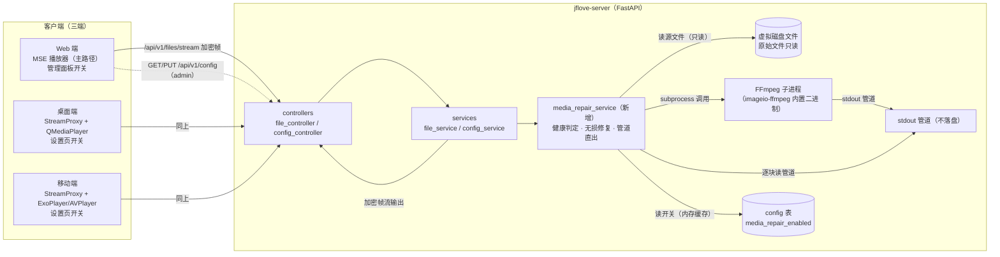

# JFLove v1.4.0 设计文档

> 需求文档：[`文档记录/需求文档/v1.4.0.md`](../需求文档/v1.4.0.md)

---

## 0. 版本对齐

- **需求文档**：`文档记录/需求文档/v1.4.0.md`
- **基线**：v1.3.0（Web 端首个版本）+ v1.3.1（快速修复）
- **模块范围**：jflove-server（后端）、jflove-web（Web 端）、jflove-desktop（桌面端）、jflove-app（移动端）
- **核心设计约束**：
  1. 加密协议不变：X25519 + ChaCha20-Poly1305，媒体流仍为加密帧，**不新增明文白名单**
  2. 原始文件永不改写：修复仅用于在线播放，实时计算、不落盘持久化缓存
  3. Web 端边下边播统一 MSE 主路径，HTTP/HTTPS、内网/公网均可用，不依赖 Service Worker
  4. 修复开关为服务端配置（`config` 表），三端共享，管理员可配置，立即生效无需重启

---

## 1. 系统架构

### 1.1 架构总览（Mermaid）



### 1.2 播放管线（修复开启时）

```
浏览器/客户端发起 /stream 加密流请求（健康文件：字节 range；需修复文件：时间 range）
   │
   ▼
file_service.get_stream_range + media_repair_service.ensure_playable（开关开启时）
   ├─ 健康文件（MSE 友好格式 + ffprobe 正常）→ 原文件 + 字节 range 直接流式（零处理）
   └─ 需修复文件 → ffmpeg -ss T -c copy 重封装 fMP4 → stdout 管道（不落盘）
         └─ 逐块读取 → encrypt_stream_chunk 加密帧（永不覆盖原文件，零磁盘占用）
   │
   ▼
encrypt_stream_chunk 加密帧 → StreamingResponse
```

---

## 2. 模块划分

### 2.1 后端（jflove-server）

| 文件 | 变更 | 说明 |
|------|------|------|
| `src/services/media_repair_service.py` | **新增** | 健康判定、无损修复（stdout 管道直出）、重编码降级 |
| `src/utils/media_probe.py` | **新增**（或并入 repair_service） | ffprobe 探测、容器结构检查（moov 位置） |
| `src/services/file_service.py` | 修改 | `get_stream_range` 接入修复层（字节/时间双模式） |
| `src/config/settings.py` | 修改 | 新增 `MEDIA_REPAIR_MAX_CONCURRENT` 等配置 |
| `src/models/database.py` | 修改 | 启动时幂等初始化 `config` 键 `media_repair_enabled=0` |
| `src/repositories/config_repository.py` | 修改（可选） | 增加内存缓存 + 写时失效（立即生效） |
| `requirements.txt` | 修改 | 增加 `imageio-ffmpeg` |
| `src/utils/logger.py` / 日志策略 | 修改（可选） | ffmpeg 日志不落盘、不记录明文路径 |

> **无新增 API 接口**：复用现有 `GET/PUT /api/v1/config`（admin + 加密）作为开关读写通道；媒体修复集成在现有 `/api/v1/files/stream` 管线内。

### 2.2 Web 端（jflove-web）

| 文件 | 变更 | 说明 |
|------|------|------|
| `src/utils/media-source-player.ts` | 修改 | 增强为 MSE 主路径：Range 按需拉取、buffer 管理、seek |
| `src/pages/FilePreviewPage.tsx` | 修改 | 回退链简化：MSE 主路径 → 完整下载兜底 |
| `src/utils/stream-frame.ts` | 修改 | 与 MSE 播放器协同（range 拉取复用） |
| `src/utils/stream-proxy.ts` / `src/sw/index.ts` | 删除/停用 | 移除 SW 媒体代理依赖（MSE 为主路径） |
| 管理面板新增"媒体修复"开关 UI | 新增 | 读/写 `media_repair_enabled`（admin） |

### 2.3 桌面端（jflove-desktop）

| 文件 | 变更 | 说明 |
|------|------|------|
| 设置页新增"媒体修复"开关 | 新增 | 调用 `GET/PUT /api/v1/config`（admin），播放管线不变 |

### 2.4 移动端（jflove-app）

| 文件 | 变更 | 说明 |
|------|------|------|
| 设置页新增"媒体修复"开关 | 新增 | 调用 `GET/PUT /api/v1/config`（admin），播放管线不变 |

---

## 3. 数据库变更

**无表结构变更**。新增 `config` 表配置键（启动时幂等初始化，值类型为 TEXT 字符串）：

| key | 默认值 | 说明 |
|-----|--------|------|
| `media_repair_enabled` | `"0"` | 媒体修复总开关：`"0"` 关闭（默认） / `"1"` 开启 |
| `media_repair_allow_transcode` | `"0"` | 重编码子开关：`"0"` 关闭（默认，仅 `-c copy`）/ `"1"` 开启（极端兜底） |
| `media_repair_max_concurrent` | 空（未设置） | 修复并发数上限：未设置时按 CPU 核数自动推导，管理员可覆盖 |

> 复用现有 `config` 表（`id/key/value/created_at/updated_at/deleted_at`），无需 DDL 变更。
> 开关为服务端配置，三端共享；`config_repository` 增加内存缓存，`update` 时写后失效，保证"立即生效、无需重启"。

---

## 4. 配置项（settings.py）

| 配置 | 默认值 | 说明 |
|------|--------|------|
| `MEDIA_REPAIR_AUTO_CONCURRENT_BASE` | `max(1, os.cpu_count()-1)` | 并发数自动基线（启动时按 CPU 核数推导，留一核给系统） |
| `MEDIA_REPAIR_CONCURRENT_HARD_MAX` | `8` | 并发数硬上限，防止误配过高 |
| config 键 `media_repair_max_concurrent` | 空（未设置） | 管理员可覆盖自动基线；设置后立即生效，无需重启 |

> 修复采用 **ffmpeg 输出到 stdout 管道（不落盘）**：无临时产物目录、零磁盘占用。原始文件永不写入。

---

## 5. 媒体修复服务设计（核心）

### 5.1 健康判定（`ensure_playable`）

```
开关关闭 → 直接返回原文件（零开销，不做任何探测）
开关开启 →
  1. ffprobe 探测源文件（时长/流信息/错误）
  2. 容器结构检查（MP4 是否 fMP4 / moov 前置；扩展名是否 MSE 友好）
  3. 决策：
     - 健康（如 fMP4/WebM/MP3/FLAC/OGG 且 probe 正常）→ 返回原文件，零处理
     - 非流式容器（MKV/AVI/MOV/FLV/普通 MP4 moov 在尾部…）→ 需修复
     - 损坏（probe 失败 / 解码报错）→ 需修复
```

- ffprobe 探测结果按"文件 mtime + 大小"缓存于进程内存（短 TTL），避免同一预览多次 range 请求重复探测。

### 5.2 无损修复（`-c copy` 重封装）

- 目标统一输出 **fMP4（fragmented MP4，H.264/AAC 或复制原 codec）**——MSE（含 Safari）兼容性最佳，且支持 stdout 管道输出。
- 典型命令（参数列表形式，**禁止 `shell=True`**，防注入；输出到 stdout，不落盘）：

```
ffmpeg -hide_banner -loglevel error -y \
  -err_detect ignore_err -fflags +genpts \
  -ss <T> -i <src> -c copy \
  -movflags frag_keyframe+empty_moov+default_base_moof \
  -f mp4 pipe:1
```

- 容错参数 `-err_detect ignore_err` / `-fflags +genpts`：跳过损坏片段、重建时间戳，使"损坏但可容错"的文件整体可播。
- **重编码降级**：`-c copy` 失败时，若 `media_repair_allow_transcode="1"` 才降级重编码（`-c:v libx264 -preset veryfast -c:a copy`，**不限制分辨率**）；否则返回"无法在线预览"提示（对应 AC-6）。

### 5.3 修复输出：ffmpeg stdout 管道（不落盘）

- 修复文件采用 **ffmpeg 输出到 stdout 管道**：`subprocess.Popen(..., stdout=PIPE)`，服务端逐块读取（如 64KB）→ `encrypt_stream_chunk` 加密 → yield 给 `StreamingResponse`。
- **内存占用**：管道流式，仅占管道缓冲 + 加密帧缓冲，与文件大小无关。
- **时间 range 语义**：需修复文件走时间 range，ffmpeg 以 `-ss T` 从目标时间起重封装输出 fMP4；每次 seek 重新启动一次 ffmpeg（符合"每次重新计算、不落盘"的约束）。
- **并发（动态可调）**：使用「并发计数 + `asyncio.Condition`」实现动态并发控制（`asyncio.Semaphore` 创建后值不可改，故用可变的并发计数）：
  - 上限 = `media_repair_max_concurrent`（config 键，管理员可配）或自动基线 `max(1, cpu_count-1)`；硬上限 `MEDIA_REPAIR_CONCURRENT_HARD_MAX=8`
  - 配置变更写后内存缓存失效 → 后续 ffmpeg 启动立即按新上限执行，无需重启
  - 说明：`-c copy` 为 IO 主导，并发收益主要受磁盘 IO 限制；重编码才吃 CPU，自动基线对重编码场景更有意义
- **客户端中断处理**：生成器被取消时终止 ffmpeg 子进程（`proc.kill()`）并关闭管道，避免僵尸进程。

### 5.4 接入 `get_stream_range`

- `get_stream_range` 在权限校验后调用 `ensure_playable`，返回播放模式：
  - **字节模式**（健康文件）：返回原文件路径 + 字节 range + content_type，沿用现有 `_build_range_stream_generator`。
  - **时间模式**（需修复文件）：返回 ffmpeg 管道输出流（`-ss T`），由修复层逐块加密输出。
- meta 帧新增 `stream_mode: "byte" | "time"`，客户端据此决定后续请求参数。

---

## 6. API 设计

**无新增接口**。复用现有接口并明确字段名（多端一致，避免歧义）：

### 6.1 读取开关状态

- **路径**：`GET /api/v1/config`（现有）
- **方法**：GET（请求体为加密 JSON，含 `token`）
- **鉴权**：JWT + 管理员（`config_controller._require_admin`）
- **响应（加密信封内）**：

| 字段 | 类型 | 说明 |
|------|------|------|
| `config` | object | 键值对集合，如 `{"media_repair_enabled": "0", "media_repair_allow_transcode": "0", ...}` |

### 6.2 写入开关状态

- **路径**：`PUT /api/v1/config`（现有）
- **方法**：PUT（请求体为加密 JSON）
- **鉴权**：JWT + 管理员
- **请求（加密信封内）**：

| 字段 | 类型 | 说明 |
|------|------|------|
| `key` | string | `"media_repair_enabled"` 或 `"media_repair_allow_transcode"` |
| `value` | string | `"0"` / `"1"` |

- **响应（加密信封内）**：`{"message": "配置已更新"}`
- **立即生效**：写入后内存缓存失效，下一次 `/stream` 请求按新开关执行，无需重启任何端。

### 6.3 媒体流接口（`/stream`，小幅扩展）

- `GET /api/v1/files/stream`：加密帧流（`X-Encrypted-Stream: v2`）。
  - **健康文件**：参数与行为不变（`range_start`/`range_end` 字节 range），meta 帧 `stream_mode="byte"`。
  - **需修复文件**：新增时间 range 参数 `range_start_seconds`（秒，float，`-ss` 起点）；meta 帧 `stream_mode="time"`、`content_type="video/mp4"`。
- 请求体（加密后）新增可选字段：`range_start_seconds`（修复流专用，单位秒）。
- 响应 meta 帧新增字段：`stream_mode`（`"byte" | "time"`）。

> 三端开关 UI 统一使用上述 `key`/`value` 字段名，杜绝多端字段歧义。

---

## 7. Web 端 MSE 播放器设计

### 7.1 主路径：MSE（取代 SW 媒体代理）

- `media-source-player.ts` 从"SW 不可用回退"升级为**主路径**：
  - 打开 `/api/v1/files/stream` 加密 Range 流 → `openEncryptedStream` 逐帧解密 → append 到 `SourceBuffer`
  - **seek**：监听 `video.seeked`，按目标时间换算字节偏移 → 通过 `openEncryptedStream` 拉取对应 range → 清空/重建 SourceBuffer 后 append
  - **buffer 管理**：`SourceBuffer.remove()` 回收已播放区段，控制内存
  - **codec 探测**：复用现有 `probeMseCodec`；修复层保证输出 fMP4（H.264/AAC），Safari/Chrome/Edge/Firefox 均可用
- `FilePreviewPage.tsx` 回退链简化为：**MSE 主路径 → 完整下载 Blob 兜底**（仅 MSE 彻底失败时）。
- **移除 SW 依赖**：`stream-proxy.ts` / `src/sw/index.ts` 及其注册逻辑从媒体路径移除（vite 插件同步调整），彻底摆脱安全上下文限制。

### 7.2 与桌面/移动端一致性

- 桌面/移动端播放管线**不变**（本地解密代理 + 原生播放器）；本次仅新增开关 UI。
- 服务端修复层对三端透明：三端 `/stream` 请求自动获得"健康文件直连 / 损坏文件修复后直连"的效果。

---

## 8. 三端开关 UI 设计

| 端 | 位置 | 交互 |
|----|------|------|
| Web | 管理面板（PC 侧边栏入口 / 移动端设置页内入口） | 管理员可见"媒体修复"开关；打开时二次确认提示（说明影响：开启后损坏文件可在线播放，弱 CPU 设备建议保持关闭） |
| 桌面 | 设置页（管理员可见区域） | 开关 + 说明文案 |
| 移动 | 设置页（管理员可见区域） | 开关 + 说明文案 |

- 三端均调用 §6 的 `GET/PUT /api/v1/config`，字段名统一。
- 三端开关 UI 额外提供"修复并发数"输入（1~8，写入 `media_repair_max_concurrent`）；留空则使用自动基线（按 CPU 核数推导）。
- 非管理员：三端均隐藏该入口；调用接口本身返回 403。

---

## 9. 技术选型

| 依赖 | 用途 | 理由 |
|------|------|------|
| `imageio-ffmpeg`（pip） | 内置静态 FFmpeg/ffprobe 二进制 | 无需在服务器/开发机安装系统 FFmpeg；`imageio_ffmpeg.get_ffmpeg_exe()` 取路径；Docker 镜像内置 |
| Web Crypto API / `@noble/ciphers` | 加密（不变） | 保持现有栈 |
| MSE（MediaSource） | Web 端边下边播主路径 | 标准 W3C API，不要求安全上下文，HTTP/HTTPS 均可用 |

> 备注：FFmpeg 采用 LGPL 构建（`imageio-ffmpeg` 默认），商用/开源前确认 license 合规（已与用户确认可接受）。

---

## 10. 安全方案（对照 §9 安全宪法）

### 10.1 合规性对照

| §9 条款 | 本方案落实情况 |
|---------|---------------|
| §9.1 通信加密 | 无新增明文白名单；`/stream` 仍为加密帧；`/config` 走加密 body |
| §9.1.3 文件流 | 仍为 `StreamingResponse + encrypt_stream_chunk`，禁止裸 `FileResponse` |
| §9.3 鉴权 | 开关接口复用 `_require_admin`（JWT 在加密 body 的 `token` 字段）；`/stream` 权限校验不变 |
| §9.4 不暴露内容 | 临时文件不产生响应头元数据；ffmpeg 日志不记录明文路径；修复过程不引入文件名到 URL |
| §9.5 加密原语 | 不新增算法/模式/KDF，完全复用现有原语 |
| §9.6 designer | 新机制显式标注：无路径参数新增、无明文新增、归属校验沿用 `/stream` |

### 10.2 新增风险与缓解

| 风险 | 缓解 |
|------|------|
| FFmpeg 命令注入 | subprocess 参数列表（`shell=False`）；路径已由 `_safe_join` 校验，不拼接 shell 字符串 |
| 弱 CPU 被并发修复拖垮 | `MEDIA_REPAIR_MAX_CONCURRENT=2` 信号量限流 |
| ffmpeg 日志泄露内容 | `-loglevel error`，不写日志文件；不记录明文路径 |
| 修复 BUG 破坏原文件 | 修复只读源文件、ffmpeg 输出到 stdout 管道（不落盘），原始文件永不写回 |
| 客户端中断残留进程 | 生成器取消时终止 ffmpeg 子进程并关闭管道，避免僵尸进程 |

### 10.3 §9.7 自查清单

- [x] 路径上是否有可被枚举的 ID？——**无新增路径参数路由**（复用 `/stream`、`/config`）
- [x] 请求 body 是否走 `decrypt_request_body`？——复用现有
- [x] 成功响应是否走 `encrypt_response`？——复用现有
- [x] 错误是否通过 `HTTPException` 抛出？——复用现有全局处理器
- [x] 是否需要返回文件流？——`/stream` 沿用 `StreamingResponse + encrypt_stream_chunk`
- [x] 响应头是否含敏感元数据？——无
- [x] 是否在日志中明文记录用户内容？——无（ffmpeg 静默、路径不落日志）
- [x] 是否新增长期密钥/静态盐？——无

---

## 11. 与上一版本设计差异

| 维度 | v1.3.x | v1.4.0 |
|------|--------|--------|
| Web 边下边播主路径 | Service Worker 流式代理 | **MSE 主路径**（HTTP/HTTPS 均可用，移除 SW 依赖） |
| 损坏/非流式文件 | 无法播放 | 服务端 `-c copy` 无损修复后播放（开关控制） |
| 修复产物 | 无 | ffmpeg stdout 管道直出（不落盘、零磁盘占用），永不覆盖原文件 |
| 服务端配置 | `config` 表（notes_disk_id 等） | 新增 `media_repair_enabled` / `media_repair_allow_transcode` |
| 管理员配置入口 | Web 管理面板已有 | 三端（Web/桌面/移动）均新增"媒体修复"开关 |
| 新依赖 | 无 | `imageio-ffmpeg`（内置 FFmpeg 二进制） |
| API 接口 | 36 个 | **不增不减**，复用 `/config`、`/stream` |
| 数据库 | 现有表 | **无 DDL 变更**，仅新增配置键 |

---

## 12. 已确认的设计决策

1. **不写盘管道直出**：需修复文件采用 ffmpeg stdout 管道（`-ss T -c copy` 输出 fMP4），零磁盘占用；修复流走**时间 range**（`range_start_seconds`），健康文件仍走字节 range；`/stream` meta 帧新增 `stream_mode: "byte" | "time"`。
2. **删除 SW**：移除 `stream-proxy.ts` / `src/sw/index.ts`，Web 端 MSE 主路径，摆脱安全上下文限制。
3. **无临时目录**：`MEDIA_REPAIR_TMP_DIR` 等临时产物配置移除，不占用磁盘。
4. **重编码子开关一并实现**：`media_repair_allow_transcode` 默认关闭；开启后 `-c copy` 失败时降级重编码（libx264 veryfast），**不限制分辨率**（N2850 仅临时过渡）。
5. **并发数配置化**：`media_repair_max_concurrent`（config 键）默认按 CPU 核数自动推导（`max(1, cpu_count-1)`），管理员可在 C 端覆盖（1~8），立即生效、无需重启。
