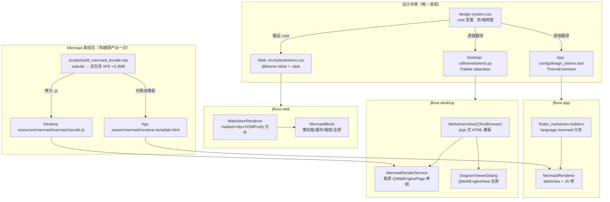
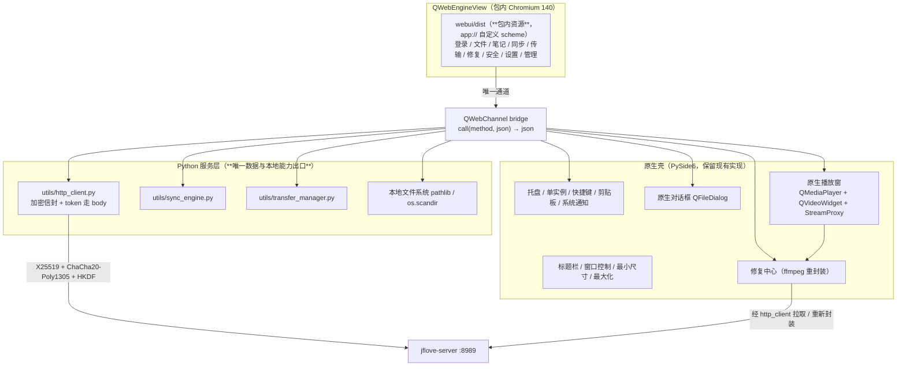
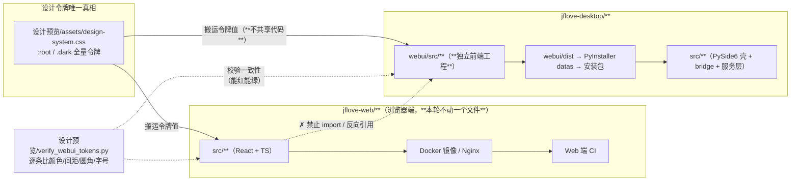

# JFLove v1.5.0 设计文档

> 需求文档：[`文档记录/需求文档/v1.5.0.md`](../需求文档/v1.5.0.md)（已定稿）
> 基线：v1.4.2 设计（三端 UI 现状 + 无 Mermaid 能力）
> 类型：**跨端体验改版 + 图表能力补齐**；**不涉及 jflove-server**
> 设计令牌唯一真相：`设计预览/assets/design-system.css`；视觉验收基准：`设计预览/out/*.png`

---

## 0. 版本对齐与范围

### 0.1 范围

| 模块 | 是否涉及 | 说明 |
| --- | --- | --- |
| jflove-server | **否** | 不新增接口、不改加密策略、不改业务逻辑（需求文档 §7 已确认） |
| jflove-web | 是 | 设计令牌层从零建立 + 组件层 + 布局层 + Markdown/图表渲染链路 |
| jflove-desktop | 是 | 新建主题层（当前 0 QSS）+ 定制列表 + Markdown 重构 + 图表渲染（QWebEnginePage） |
| jflove-app | 是 | 主题层重写 + 组件统一 + 导航 6→5 + 图表渲染（WebView） |

### 0.2 设计约束（不可违反）

1. **不新增接口、不变更加密策略、不扩大明文白名单**（`AGENTS.md §9.1`）。
2. **业务语义零改动**：修复/同步/权限/加密流程行为与 v1.4.2 完全一致（需求 §1.2）。
3. **令牌是唯一真相**：三端源码不得出现硬编码颜色值（AC-3）。
4. **图表渲染纯本地**：不发起网络请求、不执行图表源码中的脚本（`securityLevel: 'strict'`，`AGENTS.md §9.4/§9.6`）。
5. **图表失败局部降级**：单图异常不影响文档其余内容（AC-12/AC-14/AC-24）。
6. **桌面端不引入 WebEngine 到主窗口布局**：仅在离屏渲染与全屏查看器中使用（理由见 §4.3）。

### 0.3 需求 → 设计映射

| 需求条目 | 设计章节 |
| --- | --- |
| AC-1 ~ AC-3（令牌统一） | §2、§3.1、§3.2、§3.3 |
| AC-4 ~ AC-7（组件与布局） | §5（组件契约）、§3.x（各端布局） |
| AC-8 ~ AC-15（图表能力） | §4（图表渲染链路，核心章节） |
| AC-16 ~ AC-17（代码/排版） | §4.6、§5.6 |
| AC-18 ~ AC-19（移动导航） | §3.3.5 |
| AC-20（Web 双布局） | §3.1.5 |
| AC-21 ~ AC-24（性能/降级/安全） | §4.7、§4.8、§6 |
| AC-25（语义不变） | §6.4（回归范围） |

---

## 1. 架构

### 1.1 总览



### 1.2 关键架构决策

| # | 决策 | 备选方案 | 决策理由（含实测证据） |
| --- | --- | --- | --- |
| D1 | **三端各自客户端渲染** | 服务端统一渲染 SVG | 用户确认不碰后端；且三端各自渲染能力均已实测可行 |
| D2 | **Mermaid 版本锁 11.16.0，三端共用同一份离线 bundle** | 各端各自引依赖 | 保证 AC-9「三端渲染结构与配色一致」；桌面端与移动端无 npm 环境，必须预打包 |
| D3 | **桌面端用离屏 `QWebEnginePage` 渲染、`runJavaScript` 取回 SVG** | ① `QSvgRenderer` 直接渲染 mermaid SVG ② 整页换成 `QWebEngineView` | ① 已实测失败：mermaid v11 + `securityLevel:'strict'` 下 flowchart 节点标签仍在 `<foreignObject>` 内，Qt 直接丢弃 → 空框（§4.3.1 有实测记录）② 会把 WebEngine 放进主窗口布局，命中 PYSIDE-2700 风险面 |
| D4 | **桌面端图表以 `` 内嵌进 QTextBrowser**（而非内嵌 WebEngine 控件） | 用子控件覆盖文档 | QTextBrowser 支持图片显示；顺带修掉「图片完全不显示」的既有缺陷（AC-16）；无需处理滚动同步 |
| D5 | **桌面端文档内是位图、全屏查看器是矢量** | 全程位图 / 全程矢量 | 内嵌位图按 2× 渲染保证清晰度且零布局风险；全屏用 WebEngine 看原始 SVG，缩放不失真（AC-10） |
| D6 | **Web 端 Mermaid 走自包含 IIFE bundle 而非 npm ESM 动态 import** | `import('mermaid')` 动态分包 | 动态 import 仍会进主 bundle 的 chunk 图，且桌面/移动端必须要预打包产物；三端共用一份 bundle 才能真正一致（D2）。Web 端额外收益：主 bundle 不含 mermaid |
| D7 | **移动端 WebView 渲染 + SVG 字符串回传缓存** | 纯 Dart 渲染 | 见 §3.3.4 验证结论（待补：移动端 WebView 包选型验证） |
| D8 | **亮暗主题切换时图表必须重新渲染** | CSS 反色 / filter | 颜色编译进 SVG，非 CSS 可控（效果图阶段已实测：亮暗两图由两套 themeVariables 渲染而来） |

---

## 2. 设计令牌系统

### 2.1 令牌总表（三端唯一真相）

来源：`设计预览/assets/design-system.css`。语义层令牌在亮/暗两套下取不同值，组件层只引用语义令牌。

#### 2.1.1 品牌与语义色（亮暗相同）

| 令牌 | 值 | 用途 |
| --- | --- | --- |
| `brand-50` … `brand-900` | `#EEF2FF` `#E0E7FF` `#C7D2FE` `#A5B4FC` `#818CF8` `#6366F1` `#4F46E5` `#4338CA` `#3730A3` `#312E81` | 主色阶；`brand-500` 为主色 |
| `accent-50/100/300/500/600` | `#FFF1F2` `#FFE4E6` `#FDA4AF` `#F43F5E` `#E11D48` | 品牌点缀、危险态 |
| `success-50/500/700` | `#ECFDF5` `#10B981` `#047857` | 成功、已同步 |
| `warning-50/500/700` | `#FFFBEB` `#F59E0B` `#B45309` | 警告、未保存 |
| `danger-50/500/700` | `#FEF2F2` `#EF4444` `#B91C1C` | 错误、破坏性操作 |
| `info-50/500/700` | `#F0F9FF` `#0EA5E9` `#0369A1` | 信息提示 |
| `n-0 … n-950` | `#FFFFFF` `#FCFCFD` `#F8FAFC` `#F1F5F9` `#E2E8F0` `#CBD5E1` `#94A3B8` `#64748B` `#475569` `#334155` `#1E293B` `#172033` `#0F172A` `#080D18` | 中性色阶（14 级） |

#### 2.1.2 语义表面层（亮/暗切换只改这一层）

| 语义令牌 | 亮色值 | 暗色值 | 用途 |
| --- | --- | --- | --- |
| `bg-canvas` | `#F6F7FB` | `#080D18` | 应用底色 |
| `bg-surface` | `#FFFFFF` | `#0F172A` | 卡片 / 面板 |
| `bg-sunken` | `#F1F5F9` | `#0B1220` | 内嵌区（代码底、输入底） |
| `bg-hover` | `rgba(15,23,42,.04)` | `rgba(255,255,255,.05)` | 悬停 |
| `bg-active` | `#EEF2FF` | `rgba(99,102,241,.14)` | 激活/选中 |
| `bg-glass` | `rgba(255,255,255,.72)` | `rgba(15,23,42,.72)` | 毛玻璃栏 |
| `fg-default` | `#0F172A` | `#E8EDF7` | 正文 |
| `fg-muted` | `#64748B` | `#94A3B8` | 次要文字 |
| `fg-subtle` | `#94A3B8` | `#64748B` | 弱化文字 |
| `fg-brand` | `#4F46E5` | `#A5B4FC` | 品牌文字/激活 |
| `border-subtle` | `#EDF0F6` | `rgba(255,255,255,.06)` | 弱分隔 |
| `border-default` | `#E2E8F0` | `rgba(255,255,255,.10)` | 常规边框 |
| `border-strong` | `#CBD5E1` | `rgba(255,255,255,.18)` | 强调边框 |

> **暗色边框用半透明白而非实色**：实色边框在深底上会显脏。

#### 2.1.3 渐变

| 令牌 | 值 |
| --- | --- |
| `grad-brand` | `linear-gradient(135deg, #6366F1 0%, #8B5CF6 55%, #A855F7 100%)` |
| `grad-brand-hover` | `linear-gradient(135deg, #4F46E5 0%, #7C3AED 55%, #9333EA 100%)` |
| `grad-brand-soft` | `linear-gradient(135deg, #EEF2FF 0%, #F5F3FF 60%, #FAF5FF 100%)` / 暗色 `rgba(99,102,241,.18) → rgba(168,85,247,.12)` |

**使用约束**：渐变仅用于 Logo、主按钮、激活指示条、进度填充、统计卡图标底 —— 属"品牌时刻"。正文与大面积底色禁用渐变。

#### 2.1.4 圆角 / 阴影 / 间距 / 动效 / 字体

| 类别 | 令牌 | 值 | 取值规则 |
| --- | --- | --- | --- |
| 圆角 | `r-xs/sm/md/lg/xl/2xl/full` | 4 / 6 / 8 / 12 / 16 / 20 / 9999 | 徽标·小标签 4–6；输入框·小按钮 8；卡片·图块 12；弹层·模态 16；徽标胶囊·头像 full |
| 阴影 | `e1…e5` | 见下 | e1 卡片静置；e2 卡片悬停；e3 卡片抬升/下拉；e4 浮层；e5 模态 |
| 间距 | `s-1…s-16` | 4/8/12/16/20/24/32/40/48/64 | 4pt 栅格；页面内边距 24；卡片内边距 20 |
| 动效 | `dur-fast/base/slow` | 120/180/280ms | 悬停 120；展开·主题切换 180；弹层 280 |
| 缓动 | `ease-out` / `ease-spring` | `cubic-bezier(.16,1,.3,1)` / `cubic-bezier(.34,1.56,.64,1)` | 进入·悬停用 out；开关·弹层用 spring |
| 字体 | `font-sans` / `font-mono` | `Inter, "Segoe UI Variable Text", "PingFang SC", "Microsoft YaHei UI", sans-serif` / `JetBrains Mono, "Cascadia Code", Consolas, monospace` | 数字统一 `tabular-nums` |
| 阴影值 | `e1` | `0 1px 2px rgba(15,23,42,.05), 0 1px 1px rgba(15,23,42,.03)` | |
| | `e2` | `0 1px 2px rgba(15,23,42,.04), 0 2px 6px rgba(15,23,42,.05)` | |
| | `e3` | `0 2px 4px rgba(15,23,42,.04), 0 8px 20px rgba(15,23,42,.07)` | |
| | `e4` | `0 4px 8px rgba(15,23,42,.05), 0 16px 36px rgba(15,23,42,.10)` | |
| | `e5` | `0 8px 16px rgba(15,23,42,.08), 0 28px 60px rgba(15,23,42,.14)` | |
| 焦点环 | `ring-brand` | `0 0 0 3px rgba(99,102,241,.18)` | 输入框聚焦、按钮键盘聚焦 |
| 布局 | `sidebar-w` / `sidebar-w-rail` / `header-h` / `tabbar-h` | 248 / 68 / 56 / 60 | |

### 2.2 三端令牌映射

| 令牌 | Web (Tailwind v4) | Desktop (PySide6) | App (Flutter) |
| --- | --- | --- | --- |
| `brand-500` | `--color-brand-500` → `bg-brand-500` | `Palette.brand_500` | `AppTokens.brand500` |
| `bg-canvas` | `bg-canvas` | `Palette.bg_canvas` | `tokens.bgCanvas` |
| `r-lg` | `rounded-lg`（覆盖默认） | `Palette.r_lg`（QSS 生成） | `tokens.rLg`（`BorderRadius.circular`） |
| `e2` | `shadow-e2` | `Palette.e2`（仅支持 `QGraphicsDropShadowEffect`，见 §3.2.4） | `tokens.e2`（`BoxShadow`） |
| `dur-base` | `duration-180` | `Palette.dur_base`（`QPropertyAnimation`） | `tokens.durBase`（`Duration`） |
| `font-sans` | `font-sans` | `QApplication.setFont` | `ThemeData.fontFamily` |

**命名规范**：令牌名在三端保持同一语义（`bg-canvas` 在 Dart 里是 `bgCanvas`，在 Python 里是 `bg_canvas`），便于对照维护。

### 2.3 主题切换机制（三端）

| 端 | 状态存储 | 应用方式 | 防闪烁 |
| --- | --- | --- | --- |
| Web | `settings-store.ts`（zustand + localStorage） | `document.documentElement.classList.toggle('dark')` | `index.html` 内联同步脚本，在 React 挂载前设置 class |
| Desktop | `qfluentwidgets.qconfig` + 自建 `ThemeManager` | 重新生成并 `setStyleSheet`；广播 `theme_changed` 信号 | 无需（同步应用） |
| App | Riverpod `themeModeProvider` + `flutter_secure_storage` | `MaterialApp.themeMode` | 无需（同步应用） |

**三态语义**：`system` / `light` / `dark`。`system` 跟随系统并在系统变化时实时更新（三端均需监听系统变化事件）。

---

## 3. 三端设计

### 3.1 Web 端（jflove-web）

#### 3.1.1 现状基线（勘察结论）

| 事实 | 证据 |
| --- | --- |
| 无 `@theme`、无 `tailwind.config.*`、无 `postcss.config.*` —— 主题层**零基础** | `src/index.css` 仅 66 行；glob 无配置文件 |
| 仅 3 个自定义 CSS 变量且**全部零引用**（`--sidebar-width`/`--bottombar-height`/`--header-height`） | `src/index.css:4-8`；`DesktopLayout.tsx:42` 实际用 `w-16`/`w-60` |
| 颜色硬编码 **119 命中 / 26 文件**（`indigo-*` 为主） | grep `indigo-\|violet-\|blue-\|emerald-\|amber-\|red-\|green-` |
| `mermaid`、`highlight.js` **已装但零引用**（死依赖） | grep 全 `src/`+`tests/` 0 命中 |
| 无图标库（`lucide-react` 未安装未声明）；导航图标在两处重复维护 | `DesktopLayout.tsx:13-33`、`MobileLayout.tsx:9-15` |
| Markdown 渲染是**两处复制粘贴的私有函数**，无 memo 无缓存，容器类名不一致 | `NoteEditPage.tsx:286-298`（`.markdown-body`）/ `FilePreviewPage.tsx:269-276`（`.markdown-body max-w-3xl mx-auto`） |
| 全站**无暗色模式** | grep `dark:` 0 命中 |
| `safe-area-bottom` 类**无任何定义**（当前空效果） | `MobileLayout.tsx:40`；全项目仅此 1 命中 |
| 无 UI 原子组件层，按钮/输入框 className 逐处手写 | 10+ 处重复 `focus:ring-2 focus:ring-indigo-500` |
| PC/移动分叉在 **JS 层**（matchMedia 1024px 整树替换），Tailwind 响应式前缀不参与布局分叉 | `use-responsive.ts:10,14`、`AppLayout.tsx:7-8` |
| 服务端未加 `Content-Security-Policy` | 无 CSP 头（本次不引入，见 §6.3） |

#### 3.1.2 文件结构（新增/改动）

```
jflove-web/src/
├── styles/
│   ├── tokens.css          【新增】:root + .dark 语义令牌（从 design-system.css 搬运）
│   ├── theme.css           【新增】@theme inline 映射，产出 bg-canvas/text-fg-muted 等工具类
│   └── components.css      【新增】@layer components：btn/card/input/badge/图块 等复用类
├── index.css               【改】仅保留 @import 三个样式文件 + 全局 reset + 滚动条
├── components/
│   ├── ui/                 【新增】原子组件
│   │   ├── Button.tsx  Card.tsx  Input.tsx  Switch.tsx  Badge.tsx
│   │   ├── Progress.tsx  Skeleton.tsx  Tabs.tsx  IconButton.tsx
│   │   ├── EmptyState.tsx  ErrorState.tsx  Toast.tsx  Modal.tsx  Segmented.tsx
│   │   └── Icon.tsx        【新增】lucide-react 薄包装（统一尺寸/线宽）
│   ├── markdown/           【新增】Markdown 渲染链路
│   │   ├── MarkdownRenderer.tsx   分片渲染容器
│   │   ├── MermaidBlock.tsx       图块（懒加载/缩放/全屏/导出/错误）
│   │   ├── MermaidViewer.tsx      全屏查看器
│   │   └── CodeBlock.tsx          代码块（高亮+复制+全屏）
│   └── EmptyState.tsx / LoadingSpinner.tsx  【改】改用 ui/ 下的统一实现（对外签名兼容）
├── utils/
│   ├── markdown.ts         【新增】marked 配置 + hljs 高亮 + DOMPurify + mermaid 块切分
│   ├── mermaid/
│   │   ├── bundle.ts       【新增】加载离线 IIFE bundle（三端共用同一产物）
│   │   ├── theme.ts        【新增】由设计令牌生成 mermaid themeVariables（亮/暗）
│   │   ├── cache.ts        【新增】SVG 缓存（内存 LRU + sessionStorage）
│   │   └── renderer.ts     【新增】渲染调度（并发闸门 + 懒加载队列 + 错误映射）
├── stores/
│   ├── settings-store.ts   【改】新增 themeMode（system/light/dark）+ 持久化
│   └── note-store.ts       【改】新增渲染缓存字段（可选，见 §3.1.4）
├── layouts/DesktopLayout.tsx / MobileLayout.tsx  【改】视觉重做 + 导航收敛
└── pages/**/*.tsx          【改】15 个页面套用令牌与组件
```

#### 3.1.3 令牌落地方式（Tailwind v4 CSS-first）

```css
/* src/styles/tokens.css —— 从 design-system.css 搬运，是唯一改色点 */
:root {
  --bg-canvas:#F6F7FB; --bg-surface:#FFFFFF; /* … 见 §2.1 全表 … */
  --brand-500:#6366F1; --grad-brand:linear-gradient(135deg,#6366F1 0%,#8B5CF6 55%,#A855F7 100%);
}
.dark {
  --bg-canvas:#080D18; --bg-surface:#0F172A; /* … 暗色覆盖 … */
}

/* src/styles/theme.css —— 语义变量 → Tailwind 工具类 */
@theme inline {
  --color-canvas:  var(--bg-canvas);
  --color-surface: var(--bg-surface);
  --color-sunken:  var(--bg-sunken);
  --color-brand-50: var(--brand-50);   /* … 全色阶 … */
  --color-fg:      var(--fg-default);
  --color-muted:   var(--fg-muted);
  --color-line:    var(--border-default);
  --radius-lg: 12px; --radius-xl: 16px;
  --shadow-e1: 0 1px 2px rgba(15,23,42,.05), 0 1px 1px rgba(15,23,42,.03);  /* … e2..e5 … */
  --font-sans: "Inter","Segoe UI Variable Text","PingFang SC","Microsoft YaHei UI",sans-serif;
}
```

**为什么用 `@theme inline`**：`inline` 让生成的工具类直接引用 `var(--bg-canvas)` 而不是把值拷贝进 `@theme`。这样切到 `.dark` 只需覆盖 `:root` 变量，**所有 bg/text/border 工具类自动跟随，无需写 `dark:` 前缀**（消除 119 处硬编码 + 避免双份类名）。

**暗色变体注册**（Tailwind v4 类策略）：

```css
@custom-variant dark (&:where(.dark, .dark *));
```

**防闪烁**：`index.html` 的 `<head>` 内联同步脚本，在 React 挂载前读取 localStorage 并按需给 `<html>` 加 `.dark`：

```html
<script>try{var m=localStorage.getItem('jflove.theme')||'system';
var d=m==='dark'||(m==='system'&&matchMedia('(prefers-color-scheme:dark)').matches);
document.documentElement.classList.toggle('dark',d);}catch(e){}</script>
```

#### 3.1.4 Markdown 渲染链路重构

**现状问题**：两处复制粘贴的私有函数（`renderMarkdown` / `simpleMarkdownRender`），每次 React 重渲染都重跑 `marked.parse + DOMPurify.sanitize`（无 memo），且不支持图表。

**新链路**：

```
笔记正文 (string)
   │
   ├─ md.parse()：marked GFM + 自定义 renderer（代码高亮）
   │     └─ 产出 token 序列：{kind:'md', html} | {kind:'mermaid', code, index}
   │        （mermaid 块在 parse 阶段被摘出，不参与 HTML 化）
   │
   ├─ 普通片段 → DOMPurify.sanitize → <div dangerouslySetInnerHTML>
   │
   └─ mermaid 片段 → <MermaidBlock code={code} index={index} onJumpToSource={...}/>
                       │
                       ├─ IntersectionObserver（rootMargin 200px）进入视口才渲染
                       ├─ cache.get(hash(code|theme)) 命中 → 直接插 SVG
                       ├─ 未命中 → 入渲染队列（并发闸门 = 2）→ renderer.render()
                       ├─ 渲染中 → 固定 aspect-ratio 骨架（防布局跳动）
                       ├─ 失败 → <MermaidError>（行号 + 原因 + 源码 + 跳到源码）
                       └─ 成功 → 插 SVG + 工具栏（复制/导出/全屏/缩放）
```

**关键实现约束**：

| 约束 | 做法 | 理由 |
| --- | --- | --- |
| 图表块不能走 HTML 字符串 | token 分片后由 React 组件渲染 | Mermaid 需要真实 DOM 节点与生命周期，`dangerouslySetInnerHTML` 无法承载 |
| 防布局跳动 | 渲染前用 `aspect-ratio` 或固定 `min-height` 占位 | 效果图阶段实测过图表插入导致文档跳动 |
| 必须有 memo | `useMemo` 缓存 parse+sanitize 结果，依赖仅 `content` | 现状每次按键都重跑解析 |
| SVG 尺寸硬化 | `.mmd-canvas svg{width:100%!important;height:auto!important;max-width:100%}` | **效果图阶段实测：mermaid 输出 `width="100%"` 会把父容器撑宽**（`.md-doc` 从 551px 被撑到 653px，导致内容裁切） |
| 主题切换重渲染 | 监听 `theme` 变化 → 清缓存 → 用新 themeVariables 重渲染 | 颜色编译进 SVG，CSS 无法改变 |
| 大纲联动兼容 | 保留 `.markdown-body` 容器类名与标题层级结构 | `NoteEditPage.tsx:145` 依赖 `querySelector('.markdown-body')` 查标题 |

#### 3.1.5 布局层改动

| 改动 | 内容 |
| --- | --- |
| `DesktopLayout` | 侧栏分区（主导航 5 项 / 管理 4 项 / 底部固定 2 项）+ 激活态指示条 + 折叠 rail（rail 宽度用 `--sidebar-w-rail`）+ 底部存储卡与用户卡；修复 `isActive('/admin')` 永远不命中的缺陷（`DesktopLayout.tsx:38`） |
| `MobileLayout` | TabBar **6 → 5 项**（文件/笔记/同步/传输/设置），图标矢量化 + 选中指示器；`h-14` → `var(--tabbar-h)`（60px）；**补齐 `safe-area-bottom` 定义**（当前该类无定义，空效果） |
| 断点 | 保持 1024px 不变（`use-responsive.ts`），不改分叉机制；仅统一两侧视觉 |
| 安全区 | 在 `styles/components.css` 定义 `.safe-area-bottom{padding-bottom:env(safe-area-inset-bottom)}` |

#### 3.1.6 依赖变更

| 包 | 动作 | 说明 |
| --- | --- | --- |
| `lucide-react` | **新增** | 唯一新增运行时依赖；统一矢量图标 |
| `mermaid` | **移除 npm 依赖**，改用离线 bundle | 避免 3.4MB 进入主 bundle；与桌面/移动端共用同一产物（D2/D6） |
| `highlight.js` | 启用（已在依赖） | 接入代码高亮（AC-16） |
| `marked` / `dompurify` | 保持 | 继续用于解析与清洗 |

### 3.2 桌面端（jflove-desktop）

> ⚠ **2026-09-17 换轨**：桌面端底层实现改为 **B1「混合外壳」**（PySide6 原生壳 + `QWebEngineView`
> 加载**桌面端自带**的 Web 界面 + `QWebChannel` bridge）。本节及 §4.3 描述的是**仍在原生层**的部分，
> **仍然有效但不再是界面的全部**；界面侧的新设计见 **§10「桌面端混合外壳」**。
> 依据：`plans/desktop-hybrid-shell-v1.5.0.md`、`文档记录/桌面端开发记录/v1.5.0.md` §十六。

#### 3.2.1 现状基线（勘察结论）

| 事实 | 证据 |
| --- | --- |
| **无样式中心**：0 个 `.qss` 文件、`setStyleSheet` **0 处命中** | 全项目 grep |
| 唯一颜色定义在 Markdown 内联 CSS（12 个十六进制值，硬编码浅色，无暗色变体） | `markdown_view.py:50-158`（`_CSS`），`body` 背景写死 `#ffffff`（L55） |
| Markdown 渲染：`markdown` + `pygments` → `QTextBrowser` 子类（刻意不用 QWebEngineView） | `markdown_view.py:273` `class MarkdownView(QTextBrowser)`；docstring L4-9 记录 PYSIDE-2700 |
| mermaid 块**降级为源码框**：占位符 `@@JFLOVE_MERMAID_n@@` → `.mermaid-label` 提示 + `.mermaid-block` `<pre>` | `markdown_view.py:185-195`（摘取）、`227-236`（还原） |
| pygments 用 `noclasses=True`（内联 style），因 QTextBrowser 不支持 class 选择器 | `markdown_view.py:262-264` |
| **图片完全不显示**：解析出 `` 但无 `setSearchPaths`/`loadResource`/资源 provider | 全项目 0 命中；`MarkdownView.__init__` 仅设 3 项（L286-291） |
| 0 阴影 / 0 动效 / 0 圆角声明 | grep `QGraphicsDropShadowEffect`/`QPropertyAnimation`/`border-radius` 全 0 |
| 数据层是裸 Qt 控件（`QTreeWidget`/`QTableWidget`/`QListWidget`） | `file_page.py:223`、`note_page.py:183,200` 等 |
| 笔记预览防抖 400ms 单次定时器；内容进入 UI 层**已是明文** | `note_page.py:53-56,292`；`note_service.read_note` → `http_client`（信封解密） |
| 大纲锚点 id 用 `h{index}`（headings 列表下标），与标题正则口径不一致（`^#{1,6} (.+)` vs `^#{1,6}\s+\S`），Tab 分隔标题会错位 | `note_page.py:324` vs `markdown_view.py:215` |
| `MarkdownView._last_text` 是死字段（只写不读） | `markdown_view.py:292,296`，全项目无读取点 |
| 过时注释 2 处（声称用 QWebEngineView） | `note_page.py:94`、`preview_dialog.py:194` |

#### 3.2.2 文件结构（新增/改动）

```
jflove-desktop/src/
├── ui/theme/                        【新增】样式中心
│   ├── __init__.py                  ThemeManager：亮/暗/跟随系统 + theme_changed 信号
│   ├── tokens.py                    Palette dataclass（与 Web 令牌同名同值）
│   ├── qss.py                       build_app_qss(palette) / build_markdown_css(palette)
│   └── mermaid_vars.py              由 Palette 生成 mermaid themeVariables 的 JSON
├── components/
│   ├── markdown_view.py             【改】接入主题 CSS + 资源加载 + 图表块
│   ├── markdown_resources.py        【新增】QTextDocument.loadResource 覆盖（图片 + 图表）
│   ├── mermaid_render_service.py    【新增】离屏 QWebEnginePage 单例渲染 + 缓存 + 降级
│   ├── diagram_viewer.py            【新增】全屏查看器（QWebEngineView + 缩放/平移/导出）
│   └── preview_dialog.py            【改】预览容器支持图表查看器；修正过时 docstring
├── ui/widgets/                      【新增】定制列表与通用组件
│   ├── file_row_widget.py          文件行（图标色块 + 名称 + 大小 + 时间 + 状态徽标）
│   ├── stat_card.py                统计卡
│   ├── empty_state.py / error_state.py / skeleton.py
│   └── toast.py
├── ui/pages/*.py                    【改】12 个页面套用令牌与组件
├── ui/main_window.py                【改】导航激活态 + 命令栏
├── main.py                          【改】QApplication.setFont + ThemeManager 装配
├── resources/mermaid/               【新增】离线渲染资源（构建期产出）
│   ├── mermaid.bundle.js            自包含 IIFE ≈3.3MB
│   └── renderer.html                渲染模板（内联 code/theme，postMessage 回传）
└── build.py                         【改】PyInstaller 补齐 QtWebEngine 资源收集
```

#### 3.2.3 令牌落地方式（PySide6）

`tokens.py` 用 `dataclass(frozen=True)` 定义 `Palette`，字段名与 Web 令牌一一对应（`bg_canvas` ↔ `--bg-canvas`），并提供 `LIGHT` / `DARK` 两个实例。`qss.py` 用 `.format`/f-string 把 Palette 注入 QSS 模板：

```python
def build_app_qss(p: Palette) -> str:
    return f"""
    QWidget#PageRoot {{ background: {p.bg_canvas}; }}
    QPushButton#Primary {{ background: {p.brand_500}; color: {p.fg_invert};
                           border-radius: {p.r_md}px; padding: 6px 14px; }}
    /* … */
    """
```

**QSS 能力边界（必须在实现时遵守）**：

| 能力 | QSS 支持 | 应对 |
| --- | --- | --- |
| 背景/前景/边框/圆角/padding | ✅ | 直接用 |
| 盒阴影 | ❌ | 用 `QGraphicsDropShadowEffect`（AC-4 的"层次"靠它实现） |
| 过渡/动画 | ❌ | 用 `QPropertyAnimation` + 自定义 `QWidget` 属性 |
| 渐变 | ✅ `qlineargradient(...)` | 主按钮/进度条用 |
| CSS 变量 | ❌ | 由生成器在编译期代入字面值 |
| `transform` | ❌ | 悬停位移用 `move()` 动画替代 |

**QTextDocument 能力边界**（Markdown 预览必须遵守）：

| 能力 | 支持 | 应对 |
| --- | --- | --- |
| CSS 2.1 子集 | ✅ | 现有 `_CSS` 的写法可延续 |
| `border-radius` / `flex` / 媒体查询 | ❌ | 用 padding + 背景色模拟圆角卡片（现有代码注释 L46-49 已记录） |
| `class` 选择器 | ❌ | pygments 已用 `noclasses=True` 内联样式，延续该策略 |
| 外部/本地图片 | ⚠️ 需 provider | **本次新增**（修 AC-16） |
| `<svg>` 内联 | ❌ | 图表走位图，见 §4.3 |

#### 3.2.3a 图片与图表资源加载（修既有缺陷 + 支撑图表）

现状 `` 完全不显示。新增 `MarkdownResourceDocument(QTextDocument)` 覆盖 `loadResource`：

```python
class MarkdownResourceDocument(QTextDocument):
    """把 jflove-img://<key> 映射到内存中的 QImage（笔记图片与图表位图共用）"""
    def __init__(self, parent=None):
        super().__init__(parent)
        self._images: dict[str, QImage] = {}

    def put_image(self, key: str, img: QImage) -> None:
        self._images[key] = img

    def loadResource(self, rtype, url):          # noqa: N802 (Qt 命名)
        if rtype == QTextDocument.ResourceType.ImageResource:
            key = url.toString().removeprefix("jflove-img://")
            img = self._images.get(key)
            if img is not None:
                return img
        return super().loadResource(rtype, url)
```

- 图表位图 key 用 `mermaid/<sha256(code|theme)[:16]>`，与渲染缓存键一致。
- 笔记内普通图片仍需经加密流下载后放入同一 map（本次范围内一并修好，见 AC-16）。

#### 3.2.4 布局与组件改动

| 改动 | 内容 |
| --- | --- |
| 主题装配 | `main.py` 先 `QApplication.setFont(...)`，再 `ThemeManager.apply()` 注入 QSS；`Theme.AUTO` 由 `ThemeManager` 接管（保留跟随系统，新增应用内切换） |
| 文件列表 | `QTreeWidget` → 定制行组件（图标色块 + 状态徽标 + 悬停高亮）；表头用 QSS 定制 |
| 表格类页面 | 用户/磁盘/同步/修复中心的 `QTableWidget` 统一 QSS（行高、隔行底色、选中色、表头） |
| 命令栏 | 文件页与笔记页顶部统一命令栏（图标按钮 + 主按钮 + 搜索框） |
| 统计概览 | 文件管理页新增 4 张统计卡 |
| 空/加载/错误态 | 统一组件替换各页面手写文案 |

#### 3.2.5 打包（PyInstaller）

**现状参数基线**（`build.py:103-120`）：`--onefile --windowed`（L107-108）、`--name`、`--distpath build/dist`、`--workpath build/pyinstaller_work`、`--specpath build/spec`、`--add-data images;images`（L113）、`--icon`（L114）、`--collect-submodules PySide6`（L116）、`--collect-submodules/--collect-data qfluentwidgets`（L117-118）。
**明确不存在**：`--hidden-import`、`--exclude-module`、`--add-binary`、`--collect-data PySide6`；仓库**无已提交的 `.spec`**（spec 由 PyInstaller 生成到 `build/spec`）。

新增 QtWebEngine 后需改动：

| 改动 | 内容 |
| --- | --- |
| 补渲染资源 | 新增 `--add-data "resources/mermaid;resources/mermaid"`（离线 bundle + 模板） |
| 补 WebEngine 运行时 | 确认 `QtWebEngineProcess.exe`、`resources/`（含 `qtwebengine_resources.pak`、`icudtl.dat`）、`translations/qtwebengine_locales/` 被 `--onefile` 解包后可用；优先依赖 PyInstaller 的 PySide6 hook，不够则显式 `--collect-data PySide6` / `--add-binary` |
| 路径兼容 | 读取 `resources/mermaid/` 必须同时兼容源码运行与 `sys._MEIPASS` 解压目录（沿用 `src/config/settings.py:66-69` 的 `BASE_DIR` 判定模式） |
| 验收 | **打包后必须实测图表渲染**（dev 环境可用不等于打包可用） |

#### 3.2.6 主题持久化

桌面端当前 `qconfig` **零使用**、无主题持久化机制。新增 `ThemeManager`：

| 项 | 做法 |
| --- | --- |
| 存储 | 复用现有用户目录 JSON 机制（与 `auth_service._read_session_file/_write_session_file` 同款模式），存 `{"mode":"system"|"light"|"dark"}` |
| 系统跟随 | `system` 模式下监听系统配色变化并实时应用 |
| 与 qfluentwidgets 协同 | 保留其 `setTheme(...)`（`main.py:133`）维持内置控件外观；自有 QSS 在其之后应用，避免被覆盖 |
| 广播 | 提供 `theme_changed` 信号，供 `MarkdownView` 重渲染图表（§4.3.7） |

#### 3.2.7 顺带修复的既有缺陷（本次范围内，低成本）

| 缺陷 | 位置 | 处理 |
| --- | --- | --- |
| 大纲锚点与标题判据口径不一致（Tab 分隔标题会错位） | `note_page.py:324` 用 `^(#{1,6}) (.+)`（字面空格）vs `markdown_view.py:215` 用 `^#{1,6}\s+\S`（任意空白） | 统一为一处共用正则（由 `markdown_view` 导出），消除错位 |
| 图片完全不显示 | `MarkdownView` 无资源 provider（全项目 `setSearchPaths`/`loadResource` 0 命中） | §3.2.3a 新增 provider（支撑 AC-16） |
| `_last_text` 死字段（只写不读） | `markdown_view.py:292,296` | 复用于主题切换重渲染（§4.3.7） |
| 2 处过时/错误注释声称用 QWebEngineView | `note_page.py:94`、`preview_dialog.py:194` | 改为与实现一致的描述 |
| 无全局字体设置 | `main.py:127`（`QApplication` 创建）之后无 `setFont`；全项目仅 4 处逐控件 `setFont` | 新增 `QApplication.setFont`（令牌字体栈） |

### 3.3 移动端（jflove-app）

#### 3.3.1 现状基线（勘察结论）

| 事实 | 证据 |
| --- | --- |
| 主题仅 20 行，只设 `useMaterial3` + `colorSchemeSeed: 0xFF1565C0` + brightness | `lib/config/theme.dart:8-19` |
| 无 `ThemeExtension`；无 `appBarTheme`/`cardTheme`/`navigationBarTheme`/`inputDecorationTheme` | 全 lib grep 0 命中 |
| 圆角 ad-hoc（`circular(12)`/`circular(8)`/`circular(2)` 共 8 处），theme 内 0 配置 | `note_list_page.dart:165`、`settings_page.dart:321` 等 |
| 硬编码 `Colors.*.shadeN` **20+ 处** | `file_list_page.dart:36-37,61`、`settings_page.dart:199,206,322,368,394,403,563,572` 等 |
| 无渐变、无自定义动效 | grep `LinearGradient\|Gradient` 0；`AnimatedContainer\|AnimatedSwitcher` 0 |
| 组件使用不一致：`EmptyState` 仅 4 处（另 2 处手写居中文字）；`LoadingIndicator` 9 处（另 **12 处裸 `CircularProgressIndicator`**） | 逐文件清点 |
| 无统一卡片组件；无骨架屏；无统一错误态（一律 `Center(child: Text('加载失败: $e'))`） | 逐文件清点 |
| `TransferFloatingCard`（99 行）**0 处引用**（死代码） | grep 仅命中自身定义 |
| Markdown 用 `flutter_markdown`，两处调用均**只传 `data/selectable/padding`**，未定制 `builders`/`styleSheet`/`syntaxHighlighter`/`imageBuilder` | `note_edit_page.dart:174-180`、`file_preview_page.dart:777-781` |
| 代码块**无高亮**（无 `syntaxHighlighter` 时回退纯文本） | `flutter_markdown` `widget.dart:456-459` |
| 图片走 `Image.network` 默认实现，无相对路径解析、无失败占位 | `flutter_markdown` `builder.dart:579-588` |
| **Mermaid 全仓库 0 命中** | grep `mermaid` 于 `lib/`、`pubspec.yaml`、`pubspec.lock` |
| 底部导航 6 项，index 用硬编码 if 链映射路由 | `app.dart:128-134,138-180` |
| emoji 仅 3 处（均为 `⚠` 文本修饰） | `file_preview_page.dart:772,793`、`repair_center_page.dart:147` |

#### 3.3.2 文件结构（新增/改动）

```
jflove-app/lib/
├── config/
│   ├── theme.dart                   【重写】ColorScheme 显式 + 全组件主题 + 字体 + 圆角
│   └── design_tokens.dart           【新增】AppTokens ThemeExtension（品牌渐变/间距/圆角/阴影/动效）
├── utils/markdown/
│   ├── markdown_builder.dart        【新增】自定义 builders（mermaid 分支 + 代码高亮）
│   ├── mermaid_block.dart           【新增】图块 Widget（骨架/图表/错误卡/工具栏）
│   ├── mermaid_viewer_page.dart     【新增】全屏查看器（双指缩放）
│   └── mermaid_theme.dart           【新增】由 AppTokens 生成 mermaid themeVariables（亮/暗）
├── services/mermaid/
│   ├── mermaid_renderer.dart        【新增】WebView 渲染 + JS 桥 + 队列 + 超时
│   └── mermaid_cache.dart           【新增】SVG 字符串缓存（内存 LRU + 文件）
├── widgets/
│   ├── app_card.dart                【新增】统一卡片（替代各页 Card）
│   ├── skeleton.dart                【新增】骨架屏
│   ├── error_state.dart             【新增】统一错误态
│   ├── app_button.dart / app_input.dart / app_badge.dart  【新增】
│   ├── empty_state.dart             【改】改图标化 + 套令牌
│   ├── loading_indicator.dart       【改】套令牌
│   └── transfer_floating_card.dart  【删除】死代码（或接入使用，二选一）
├── providers/theme_provider.dart     【新增】themeMode（system/light/dark）+ 持久化
├── app.dart                          【改】NavigationBar 6→5 + 指示器 + themeMode 接线
├── pages/**/*.dart                   【改】13 个页面套令牌与组件；清理硬编码 Colors.*
└── assets/mermaid/
    ├── renderer.template.html        本地渲染页（占位符 __MERMAID_BUNDLE__ / __CODE__ / __THEME__）
    └── mermaid.bundle.js             自包含 IIFE ≈3.3MB
```

**新增资源管线（必须）**：`jflove-app/assets/` 与 `jflove-app/android/app/src/main/assets/` **当前都不存在**，`pubspec.yaml` 的 `flutter:` 段只有 `uses-material-design: true`（L30-31），**无 `assets:` 声明** —— 即项目目前没有资源打包管线。实现时必须：

1. 新建 `assets/mermaid/` 目录并放入上述两文件；
2. `pubspec.yaml` 增加 `assets: - assets/mermaid/`；
3. 渲染页加载方式与包选型绑定（§4.4.3）。

**依赖变更**：

| 包 | 动作 | 说明 |
| --- | --- | --- |
| `webview_flutter` | **新增（^4.14.1）** | 图表渲染；官方包，Android-only 场景下不引入多余平台实现（§4.4.3） |
| `flutter_highlight` | **可选新增** | 代码高亮；若体积/维护性不可接受，改为自建轻量高亮（§4.6） |
| `flutter_svg` | **不引入** | 图块自身用 `WebViewWidget` 显示渲染结果（§4.4.3） |
| `flutter_markdown` / `markdown` | 保持 | 继续用于解析；通过 `builders` 接管 mermaid 块 |
| `shared_preferences` | **不引入** | 主题偏好复用已有 `flutter_secure_storage`（见下） |

**主题持久化**：移动端当前**零设备本地 UI 偏好**（服务器地址走 `flutter_secure_storage`；笔记目录与媒体修复参数走**服务端 config 表**三端共享）。主题选择属非敏感小配置，为不引入新依赖，**复用 `flutter_secure_storage`** 存一个 `themeMode` 键（与 `session.dart` 的 `saveToStorage` 同款模式）。若后续 UI 偏好增多，再统一引入 `shared_preferences`。

**Android 基线**（`android/app/build.gradle.kts`）：`compileSdk = 36`（硬编码 L8）、`minSdk = flutter.minSdkVersion` → **24**（L18）、`targetSdk` → **36**（L19）、`ndkVersion` → 28.2.13676358（L9）；AGP **9.0.1** / Kotlin **2.3.20** / Gradle **9.1.0**。`AndroidManifest.xml` 已有 `INTERNET`（L3）与 `usesCleartextTraffic="true"`（L8）、`hardwareAccelerated="true"`（L16）—— WebView 渲染本地内容**不需要额外权限**，现有 `INTERNET` 权限仅为后端通信所需。

**测试基线**：`test/` 6 个文件 / 27 个用例（`widget_test.dart` 4、`crypto_test.dart` 13、`stream_frame_test.dart` 3、`stream_proxy_time_test.dart` 2、`sync_config_test.dart` 4、`auth_service_test.dart` 1 个空壳）；**`integration_test/` 目录不存在**，`integration_test` 也未在 `dev_dependencies`（`pubspec.yaml:25-28`）。命令：`dart analyze lib/`、`flutter test`。

> 顺带记录两处过时文档数据（本次可一并修正，属低风险）：`settings_page.dart:194` 的版本号是硬编码字符串（应走 `version.json` 同步产物）；`jflove-app/README.md:115` 声称「22/22 通过」与实际 27 个用例不符。

#### 3.3.3 令牌落地方式（Flutter）

```dart
@immutable
class AppTokens extends ThemeExtension<AppTokens> {
  final Color bgCanvas, bgSurface, bgSunken, fgDefault, fgMuted, fgSubtle, fgBrand;
  final LinearGradient gradBrand, gradBrandHover, gradBrandSoft;
  final double rXs, rSm, rMd, rLg, rXl, r2xl;
  final List<BoxShadow> e1, e2, e3, e4, e5;
  final double s1, s2, s3, s4, s5, s6, s8;
  final Duration durFast, durBase, durSlow;
  // copyWith / lerp 必须实现
}

ThemeData buildTheme(Brightness b) {
  final t = b == Brightness.light ? AppTokens.light : AppTokens.dark;
  return ThemeData(
    useMaterial3: true,
    colorScheme: ColorScheme.fromSeed(seedColor: const Color(0xFF6366F1), brightness: b),
    fontFamily: 'Inter',                       // 需在 pubspec 声明字体或回落系统
    scaffoldBackgroundColor: t.bgCanvas,
    cardTheme: CardThemeData(elevation: 0, color: t.bgSurface,
        shape: RoundedRectangleBorder(borderRadius: BorderRadius.circular(t.rLg),
            side: BorderSide(color: t.borderSubtle))),
    appBarTheme: AppBarTheme(backgroundColor: t.bgSurface, elevation: 0, ...),
    navigationBarTheme: NavigationBarThemeData(...),   // 指示器 + 图标双态
    inputDecorationTheme: InputDecorationTheme(...),
    extensions: <ThemeExtension<dynamic>>[t],
  );
}
```

**关键约束**：
- Material 3 保留（`useMaterial3: true`），但**显式给出 `ColorScheme` 关键角色**（primary/surface/surfaceContainer/outline/error），不再纯靠 seed 派生 —— 否则无法与 Web/桌面对齐。
- 卡片**不用 `Card` 默认 elevation**，改为 `elevation:0 + 1px 描边 + 极浅阴影`（与效果图一致）。
- 硬编码颜色清零（AC-3）：一律 `Theme.of(context).extension<AppTokens>()!` 或 `colorScheme.*`。
- 字体：若 `Inter` 不打包进 assets，则 `fontFamily` 留空走系统字体（Android Roboto），但**字号阶梯必须与令牌一致**。

#### 3.3.4 图表渲染（移动端）

**渲染链路**：

```
Markdown 原文
  └─ flutter_markdown MarkdownBody(builders:[MermaidBuilder()])
        └─ MermaidBuilder.build(): 命中 language-mermaid → 返回 MermaidBlock(code)
              └─ MermaidBlock（StatefulWidget）
                    ├─ initState → MermaidCache.get(hash(code|theme))
                    │     命中 → 直接显示 SVG（SvgPicture.string）
                    │     未命中 → MermaidRenderer.render(code, theme)（入队，并发 1）
                    ├─ 渲染中 → 固定高度的骨架占位
                    ├─ 失败/引擎不可用 → 源码卡（复制 + 全屏 + 错误原因）
                    └─ 成功 → 图表 + 工具行（全屏 / 复制 / 导出）
```

**WebView 渲染桥协议**（与桌面端对齐，便于统一维护）：

| 步骤 | 内容 |
| --- | --- |
| 1 | 读 `assets/mermaid/renderer.template.html`，把 `__MERMAID_BUNDLE__` 替换为 bundle 内联、`__CODE__` / `__THEME__` 替换为 JSON 化入参 |
| 2 | 用 WebView 加载该 HTML（**不联网**：无外部资源引用、无网络权限依赖） |
| 3 | 页面 `DOMContentLoaded` → `mermaid.initialize(...)` → `mermaid.render()` |
| 4 | 结果经 JS 通道回传 Dart：`{ok:true, svg, w, h}` 或 `{ok:false, error:{line, reason}}` |
| 5 | Dart 侧缓存 SVG 字符串 + 宽高，销毁或复用 WebView |

**安全要求**：
- WebView **禁用网络请求**（Android `shouldInterceptRequest` 或等价机制拦截并拒绝所有非本地请求）。
- `securityLevel: 'strict'`；不使用 `dangerouslyAllowJavaScript` 之类的宽松开关。
- SVG 字符串在显示前过滤：移除 `<script>`、`on*` 属性、`<foreignObject>`、外部 `href`。

**性能要求**（对应 AC-13/AC-22）：
- WebView 实例**复用**（一个渲染器实例串行处理队列），不是每图一个；
- 渲染完的图块销毁 WebView 引用或退回池中，避免多实例内存；
- 缓存命中路径完全不创建 WebView；
- 渲染并发 = 1（移动端单线程 WebView 更稳），并设 3s 超时 → 超时降级源码卡。

> **移动端 WebView 包选型与风险**：见 §4.4.3（含 `webview_flutter` vs `flutter_inappwebview` 的对比与最终选择）。

#### 3.3.5 导航收敛（信息架构变更）

| 项 | 现状 | 目标 |
| --- | --- | --- |
| 底部导航项数 | 6（文件/笔记/同步/传输/修复/设置） | **5**（文件/笔记/同步/传输/设置） |
| 修复中心 | 独立 Tab（`/repair`） | 并入传输页：页内 `TabBar`/`SegmentedButton` 切换「传输任务」/「修复任务」 |
| 路由 | `/repair` 存在 | `/repair` **路由保留**（深链与 Web 端兼容），但不再出现在底部导航；页面内容复用为传输页的一个视图 |
| 图标 | 系统图标 + 双态 | 统一图标 + 选中指示器（`NavigationBarThemeData`） |
| index→route 映射 | 硬编码 if 链（`app.dart:128-134`） | 改为数据驱动的 `List<NavDestination>` 映射，避免新增/删除项时索引错位 |

**功能无缺失验证**（AC-18）：修复中心的全部操作（取消/验证播放/覆盖原文件/删除产物/重试/删除记录、自动轮询、共享任务列表、只读账号禁用操作）必须能从传输页访问到，Phase 6 逐项验证。

---

## 4. Mermaid 图表渲染链路（核心章节）

### 4.1 统一约定（三端强制）

| 约定项 | 值 | 理由 |
| --- | --- | --- |
| Mermaid 版本 | **11.16.0**（锁定，三端同一份 bundle） | AC-9 三端一致性；任何一端单独升级即视为破坏一致性 |
| `securityLevel` | `'strict'` | `AGENTS.md §9.4/§9.6`：禁 HTML 标签、禁 `javascript:` 链接 |
| 主题 | `theme: 'base'` + 显式 `themeVariables` | 必须与设计令牌同色系；用内置主题无法对齐品牌色 |
| 字体 | `"Inter","Segoe UI","PingFang SC","Microsoft YaHei",sans-serif` | 与 `--font-sans` 一致，避免回退到 trebuchet/verdana |
| 字号 | `14px`（正文）；移动端 13px | 与令牌字号阶梯对齐 |
| 图表 ID | `mmd-{会话内自增}`，禁止重复 | mermaid 用 id 生成 `<style>#id{…}</style>` 与 marker 引用，重复 id 会串样式 |
| 缓存键 | `sha256(code + "\n" + theme + "\n" + MERMAID_VERSION)[:16]` | 源码或主题变化即失效；版本升级自动失效 |
| themeVariables 取值 | **必须是颜色字面量，不能是 `var(--x)`** | **实现期实测修正**：mermaid v11 会对 themeVariables 的颜色做运算（生成 `<style>` 规则、处理透明度、推导对比色），传 CSS 变量会直接抛 `Unsupported color format: "var(--brand-50)"`，整图渲染失败。因此亮/暗各维护一套字面量色值表（`utils/mermaid/tokens.ts`），并与 `styles/tokens.css` 保持同步 |
| 主题切换 | **必须重新渲染图表** | 由上一条推导而来：颜色是字面量、编译进 SVG，CSS 无法改变它 |
| 渲染并发 | Web 2 / 桌面 1（单页串行）/ 移动 1 | 移动端单 WebView 必须串行；Web 限并发防卡顿 |
| 超时 | 3s（桌面/移动）、5s（Web 首次含引擎初始化） | 超时即降级源码卡，避免无限骨架（AC-14） |

### 4.2 离线渲染资源与构建（三端共用一份产物）

**为什么必须预打包**：桌面端（Python）与移动端（Flutter）都没有 npm 运行时；同时 `mermaid` v11 只发布 ESM（`dist/mermaid.esm.min.mjs`），而 `file://` 与 `setHtml` 场景下 ESM 的模块解析/CORS 不可靠。**实测结论**：用 esbuild 打成自包含 IIFE 后，单文件即可离线渲染（见 §4.3.2 PoC）。

**新增构建脚本**：`scripts/build_mermaid_bundle.mjs`

```
输入：jflove-web/node_modules/mermaid（版本须为 11.16.0，脚本内校验）
处理：esbuild --bundle --format=iife --minify --target=es2020
入口：import mermaid from "mermaid"; window.mermaid = mermaid;
产物：
  ① jflove-desktop/resources/mermaid/mermaid.bundle.js      （WebEngine 用，约 3.29MB）
  ② jflove-app/assets/mermaid/mermaid.bundle.js            （WebView 用，同一份拷贝）
  ③ jflove-web/public/vendor/mermaid.bundle.js             （Web 用，走静态资源）
校验：产物内含 window.mermaid 赋值；输出 sha256 与版本号写入 mermaid/version.json
```

**实测数据**（本机 PoC）：

| 项 | 结果 |
| --- | --- |
| esbuild 打包 | ✅ 成功，`--minify` 后 **3,373 KB（3.29 MB）** |
| 离线 IIFE 渲染 flowchart | ✅ `chunk 名 = OK <svg id="t1" …>`，真渲染出 SVG |
| 离线 IIFE 渲染 sequence（中文标签） | ✅ `ok:true, len:22767, w:350, h:289, textCount:7, foreignObject:0, hasChinese:true` |
| 是否需要网络 | ❌ 不需要（单文件、无外部引用） |

> 该脚本位于仓库 `scripts/`（跨模块构建工具，与 `sync_version.py` 同级）。它是三端构建的前置步骤，因此需要接入根 `build.py` 的构建流程。

**版本一致性校验**：脚本在打包前读取 `jflove-web/node_modules/mermaid/package.json` 的 `version`，与设计文档锁定的 `11.16.0` 比对，不一致即失败（防止误升级导致三端不一致）。

### 4.3 桌面端图表渲染（PySide6）

#### 4.3.1 排除的方案与实测依据

| 方案 | 结论 | 实测证据 |
| --- | --- | --- |
| **A. `QSvgRenderer` 直接渲染 mermaid 产出的 SVG** | ❌ **不可行** | 生成 4 份 SVG（sequence / flowchart × `htmlLabels` 真/假）后用 `QSvgRenderer` 实测：`isValid()=True`、`defaultSize` 正常（如 450×326）、能渲染出像素（ink≈32–36%），**但节点标签是空的**——把节点标签区裁剪降采样成 ASCII 后只看到矩形边框与箭头，**没有文字笔画**。逐项统计：`seq-hltrue` foreignObject=0 / `<text>`=7；`seq-hlfalse` foreignObject=0 / `<text>`=7；`flow-hltrue` foreignObject=7 / `<text>`=0；`flow-hlfalse` foreignObject=**4** / `<text>`=3。结论：sequence 是纯 `<text>`（Qt 可渲染），而 **flowchart 即使 `htmlLabels:false` 也只是把「节点标签」转为 `<text>`，「边标签」仍留在 `foreignObject` 内**，而 Qt 的 SVG 模块**直接丢弃 `foreignObject` 内容** → 图会缺字，一致性不可接受 |
| **B. 截图整页 `QWebEngineView`** | ❌ 不采用 | 需要把 WebEngine 放进主窗口布局（或做大尺寸离屏 widget），命中 PYSIDE-2700 风险面；且图表数量多时内存开销大 |
| **C. 离屏 `QWebEnginePage` + `runJavaScript` 取回 SVG** | ✅ **采用** | 已实测通过，见 §4.3.2 |

#### 4.3.2 采用方案的实测结果

```
QWebEnginePage()                        → PAGE_CREATED
setHtml(离线模板, base=resources/mermaid/)  → LOAD_FINISHED=True
页面内 mermaid.render()                  → TITLE=OK 350x289
runJavaScript 取回 SVG                    → {"ok":true,"len":22767,"w":350,"h":289,
                                            "textCount":7,"foCount":0,"hasChinese":true}
进程退出                                  → EXIT=0（干净退出，无崩溃）
```

**关键实现要点**：

1. **渲染器不需要 QWidget**：`QWebEnginePage` 单独即可加载页面、执行 JS、取回结果。这不是普通用法，但正好规避了"把 WebEngine 放进窗口布局"的风险面。
2. **不需要 widget 截图**：用 `runJavaScript` 直接把 SVG 字符串取回 Python（`QWebEnginePage` 在 PySide6 6.11 上**没有** `printToImage` 方法，实测 `AttributeError`；`QWebEngineView` 有，但那需要 widget → 不用）。
3. **`QWebEnginePage` 单例 + 串行队列**：整个进程只建 1 个渲染 page，按队列串行处理图表，避免多实例内存与并发问题。
4. **`setHtml` 的 baseUrl 必须指到资源目录**：模板用相对路径引用 `mermaid.bundle.js`，同时需开启 `LocalContentCanAccessFileUrls`。

#### 4.3.3 渲染模板 `resources/mermaid/renderer.html`

> **实现期修正（重要，三条约束都来自真实踩坑，详见本节末尾「注入契约」）**：
> 1. 模板必须**纯 ASCII**（中文注释会在页面落盘重开时被按系统 ANSI 解码而破坏脚本）；
> 2. 占位符由 Python 替换为**可直接使用的 JS 字面量**，页面侧**不做 `JSON.parse`**
>    （实测 QtWebEngine 下 `JSON.parse(<字符串>)` 出现过「脚本解析成功但顶层赋值未生效」）；
> 3. 占位符必须**恰好出现一次且不被引号包裹**，也不得出现在注释里
>    （纯文本替换会把注释里的占位符一起换掉）。

```html
<!doctype html><html lang="en"><head><meta charset="utf-8">
<style>html,body{margin:0;padding:0;background:transparent}
#stage{display:inline-block;padding:0}</style></head>
<body><div id="stage"></div>
<script src="mermaid.bundle.js"></script>
<script>
var MM_CODE = @@JF_CODE@@;    // Python 注入：已带引号的字符串字面量
var MM_THEME = @@JF_THEME@@;  // Python 注入：对象字面量
var MM_ID = @@JF_ID@@;

function mmFinish(payload) {
  payload.id = MM_ID;         // 带上本次 id：渲染页复用，结果会残留
  window.__JF_RESULT__ = JSON.stringify(payload);
}

function mmRun() {
  var m = window.mermaid;
  if (!m) { mmFinish({ ok:false, error:{ line:0, reason:'renderer not loaded' } }); return; }
  m.initialize({
    startOnLoad: false, securityLevel: 'strict', theme: 'base',
    fontFamily: MM_THEME.fontFamily, themeVariables: MM_THEME.vars,
    flowchart: { curve:'basis', useMaxWidth:true, padding:12, htmlLabels:false },
    /* … sequence / gantt / er / pie / state / class 同 §4.4 的配置 … */
  });
  m.render('jf-mmd-' + MM_ID, MM_CODE).then(function (out) {
    document.getElementById('stage').innerHTML = out.svg;
    var svg = document.querySelector('#stage svg');
    var box = svg.getBBox();
    mmFinish({ ok:true, svg:out.svg,
               width: Math.ceil(box.width) + 2, height: Math.ceil(box.height) + 2 });
  }).catch(function (e) {
    var line = 0;
    if (e && e.hash && e.hash.loc && typeof e.hash.loc.first_line === 'number') {
      line = e.hash.loc.first_line + 1;   // mermaid 行号是 0-based
    }
    mmFinish({ ok:false, error:{ line:line,
      reason:String((e && e.message) || e).split('\n')[0].slice(0,200) } });
  });
}
mmRun();
</script></body></html>
```

**注入契约（`build_renderer_html` 强制校验）**：

| 规则 | 违反后果 |
| --- | --- |
| 占位符恰好出现 1 次 | 出现 0 次 → 页面拿到未替换的哨兵串；出现多次 → 替换错位 |
| 占位符不被 `"` / `'` 包裹 | 生成 `""…""`，整段脚本解析失败（页面里连函数都没定义） |
| 占位符不出现在注释/字符串里 | 注释被塞入含引号与换行的 JSON，脚本失效 |
| 字符串形态转义 `<` 为 `\u003c` | 内容含 `</script>` 时提前闭合标签 |
| 对象形态转义 `</` 为 `<\/` | 同上（对象字面量里 `\/` 是合法转义） |

#### 4.3.4 `MermaidRenderService`（新增，`src/components/mermaid_render_service.py`）

| 成员 | 职责 |
| --- | --- |
| `_page: QWebEnginePage \| None` | 惰性创建的单例渲染页 |
| `_template: str` | 启动时读取 `resources/mermaid/renderer.html`（支持 PyInstaller `sys._MEIPASS` 路径） |
| `render(code: str, dark: bool) -> MermaidResult` | 同步接口（内部用 `QEventLoop` 等回调），带 3s 超时 |
| `_queue` / `_busy` | 串行队列：一次只跑一个 page load |
| `_mem_cache: dict[str, MermaidResult]` | key = `sha256(code|theme|version)[:16]` |
| `_disk_cache_dir` | 用户目录下 `mermaid-cache/`，跨会话复用（AC-22 二次显示即时） |
| `is_available() -> bool` | 引擎可用性探测；不可用则全端降级源码卡（AC-14） |
| `theme_variables(dark: bool) -> dict` | 由 `ui/theme/mermaid_vars.py` 从 `Palette` 生成 |

**降级策略（必须实现）**：模板读取失败 / `QWebEnginePage` 创建抛异常 / 渲染超时 / JS 返回 `ok:false` → 一律返回 `MermaidResult.failed(...)`，`markdown_view` 渲染为**源码卡**（保留原 `.mermaid-block` 样式并加"复制"按钮），而不是抛异常。

#### 4.3.5 嵌入文档：位图 + 点击放大

`markdown_view.py` 的 mermaid 分支改造（替换现有 L227-236 的降级逻辑）：

```
_md_to_html 的 mermaid 还原步骤：
  for i, src in enumerate(mermaid_blocks):
      result = mermaid_service.render(src, dark=theme_manager.is_dark())
      if result.ok:
          img = rasterize(result.svg, scale=2)          # QSvgRenderer → QImage(2×)
          key = cache_key(src, theme)
          doc.put_image(f"mermaid/{key}", img)          # 供 loadResource 取用
          html_block = figure_html(src, key, result.w, result.h)   # 卡片外壳 + 
      else:
          html_block = source_card_html(src, result.error)         # 源码卡降级
      html = html.replace(f"<p>@@JFLOVE_MERMAID_{i}@@</p>", html_block)
```

- **HTML 外壳**用 QTextDocument 支持的子集实现（表格或 div + 背景色 + padding 模拟卡片，避开 `border-radius`）：
  - 头部："Mermaid · Sequence" 标签行
  - 主体：``
  - 底部：尺寸与"点击放大"提示
- **为什么用位图而非 `<svg>`**：QTextDocument 不支持内联 SVG。位图按 **2× 分辨率**渲染（`QSvgRenderer` → `QImage`），保证高分屏清晰。
- **自适应宽度**：按预览控件宽度与图表原始宽度计算缩放，`` 取 `min(容器宽, 原宽)`，保证窄窗不出现横向滚动。
- **点击放大**：`<a href="jflove-diagram://{key}">` 包裹图片，`MarkdownView` 重写 `setSource`/捕获 anchor 点击 → 打开 `DiagramViewerDialog(key, src)`。

#### 4.3.6 `DiagramViewerDialog`（全屏查看器）

| 项 | 设计 |
| --- | --- |
| 承载 | `QDialog` + `QWebEngineView`（真正显示 SVG，矢量缩放不失真 → AC-10） |
| 内容 | 极简 HTML：`<div id="stage">` + 注入 SVG + 工具栏（缩放 −/＋/重置、导出 SVG、复制源码、关闭） |
| 缩放 | 由 HTML 内 CSS transform 实现；滚轮缩放 + 拖拽平移 |
| 导出 | 页面内 `Blob` + `a.download`，或由 Python 直接写文件（优先 Python，避免下载权限问题） |
| 生命周期 | 关闭时 `page.deleteLater()` + 断开引用；不复用（避免长期驻留） |
| 风险控制 | 这是唯一"可见的 WebEngine 窗口"；若打开失败，捕获异常并回退为"复制源码"提示，不让应用崩溃（AC-24） |

#### 4.3.7 主题切换

- `ThemeManager.theme_changed` 信号 → `note_page` / `preview_dialog` 重新 `set_markdown(_last_text)`（**利用现有 `_last_text` 死字段，本次正好复活它**）。
- 重渲染使用新的 `themeVariables`，**新缓存键**（`theme` 参与 hash），旧主题的缓存保留供切回时秒开。
- `markdown_view._CSS` 由硬编码改为 `qss.build_markdown_css(palette)`，暗色下 `body` 背景改为 `Palette.bg_surface`。
- pygments 主题：亮色用 `default`，暗色改用 `monokai`（或自定义）。

### 4.4 移动端图表渲染（Flutter）

#### 4.4.1 `MermaidBuilder`（`flutter_markdown` 定制点）

依据实测的 `flutter_markdown` 0.7.7+1 API（`widget.dart:110-157`）：

```dart
class MermaidBuilder extends MarkdownElementBuilder {
  @override
  bool isBlockElement() => true;                    // 块级元素必须返回 true（widget.dart:114）

  @override
  Widget? visitElementAfterWithContext(
    BuildContext context, md.Element element, TextStyle? preferredStyle, TextStyle? parentStyle,
  ) {
    // 命中 <code class="language-mermaid"> 时才接管，其余交回默认渲染
    final cls = element.attributes['class'] ?? '';
    if (!cls.contains('language-mermaid')) return null;
    return MermaidBlock(code: element.textContent.trim());
  }
}

// 调用点（两处：note_edit_page.dart:174-180、file_preview_page.dart:777-781）
Markdown(
  data: content,
  selectable: true,
  padding: const EdgeInsets.all(16),
  builders: {'code': MermaidBuilder()},             // builders 键是 HTML 标签名（widget.dart:320）
  styleSheet: buildMarkdownStyleSheet(tokens),      // 新增：套设计令牌
  syntaxHighlighter: buildDartSyntaxHighlighter(),  // 新增：代码高亮（AC-16）
  sizedImageBuilder: buildSizedImageBuilder(),      // 新增：图片圆角 + 失败占位（AC-16）
  onTapLink: handleLink,
)
```

**注意**：`builders` 的键是 HTML 标签名，mermaid 块的标签是 `code`。**必须校验 `class` 属性**，否则所有行内代码与代码块都会被误接管。`visitElementAfterWithContext` 返回 `null` 表示"不接管，走默认渲染"。

#### 4.4.2 渲染器与缓存

```dart
class MermaidRenderer {
  static final MermaidRenderer instance = MermaidRenderer._();
  Future<MermaidResult> render(String code, Brightness brightness) async { … }  // 3s 超时
}
class MermaidCache {
  Future<MermaidResult?> get(String key);        // 内存 LRU(64) + 文件缓存
  Future<void> put(String key, MermaidResult r);
}
```

- 渲染前先查缓存（key 同 §4.1）；命中则不创建 WebView（AC-22）。
- `MermaidBlock` 在 `initState` 触发渲染，渲染中显示固定高度骨架，`aspectRatio` 由结果回填，避免跳动。
- 渲染完成后释放 WebView 引用（串行队列，同一时刻最多 1 个实例）。

#### 4.4.3 WebView 包选型

**结论：采用 `webview_flutter`（官方包），不用 `flutter_inappwebview`。**

| 对比项 | `webview_flutter` | `flutter_inappwebview` | 本项目取舍 |
| --- | --- | --- | --- |
| 最新稳定版 | **4.14.1**（2 个月前发布） | 6.1.5（**23 个月前**发布，另有 6.2.0-beta.3 预发布） | 官方包更新更活跃 |
| 发布者 | `flutter.dev`（官方） | `inappwebview.dev`（个人维护） | 官方包优先 |
| Android 要求 | **SDK 24+** | minSdk ≥ 19、compileSdk ≥ 34、AGP ≥ 7.3.0 | 两者都满足本项目（minSdk 24 / compileSdk 36 / AGP 9.0.1）；`webview_flutter` 与项目 minSdk **恰好**对齐 |
| Dart / Flutter 要求 | Flutter SDK 包，跟随 Flutter 版本 | Dart ^3.5.0 / Flutter ≥3.24.0 | 两者都满足（本项目 Dart ^3.12.2 / Flutter 3.44.6） |
| 包体积（Android 依赖） | 仅 `webview_flutter_android`（系统 WebView 包装） | 引入 android/ios/macos/web/windows **五个平台实现**；Android 端还要拉 `androidx.webkit` 等 | 本项目 **Android-only 首版**，引入五平台实现属浪费 |
| pub points | 160 | 130 | 官方包分值更高 |
| 本地 assets 加载 | `WebViewController.loadFlutterAsset('assets/...')` | 支持 `loadFile` / `InAppWebViewInitialData` 等更多方式 | 两者均可；本项目只需最简单的 assets 加载 |
| JS ↔ Dart 通道 | `addJavaScriptChannel(name, onMessageReceived:)` | `addJavaScriptHandler` | 两者均可 |
| 取回 JS 结果 | `runJavaScriptReturningResult()` | `evaluateJavascript()` | 两者均可 |
| 拦截网络请求 | `NavigationDelegate.onNavigationRequest`（可 `NavigationDecision.prevent`） | `shouldInterceptRequest`（更强，能改写响应） | 本项目**只需"全部拒绝"**，`onNavigationRequest` 足够 |

**采用理由汇总**：官方维护、更新活跃（2 个月 vs 23 个月）、与项目 `minSdk 24` 精确对齐、Android-only 场景下没有多余平台实现、且渲染只需"加载本地 HTML + JS 回传"，官方包能力完全够用。

**实现要点**（基于 4.14.1 的 API）：

```dart
// 1) 控制器：允许执行 JS，但用导航委托拒绝一切非本地请求
final controller = WebViewController()
  ..setJavaScriptMode(JavaScriptMode.unrestricted)
  ..setBackgroundColor(Colors.transparent)
  ..setNavigationDelegate(NavigationDelegate(
    onNavigationRequest: (req) =>
        req.url.startsWith('file://') ? NavigationDecision.navigate
                                      : NavigationDecision.prevent,   // 拒绝联网
  ))
  ..addJavaScriptChannel('JFLoveBridge', onMessageReceived: _onBridgeMessage)
  ..loadFlutterAsset('assets/mermaid/renderer.html');
```

| 关注点 | 处理 |
| --- | --- |
| 渲染页与 bundle 的关系 | 为规避 `file://` 下 ESM 与外链加载限制，**构建期把 bundle 内联进 `renderer.template.html`**（替换 `__MERMAID_BUNDLE__` 占位符）；`code`/`theme` 用 `loadFlutterAsset` + `runJavaScript` 注入，或每次用替换后的 HTML 走 `loadHtmlString` |
| 大字符串回传 | `addJavaScriptChannel` 在 Android 上底层是 `evaluateJavascript` + 平台通道，**无文档化的消息大小硬限制**，但为稳妥：① 回传的 SVG 会落磁盘缓存，同一图表不重复回传；② 布局所需的宽高单独以极短 JSON 回传；③ 单图 SVG 实测约 16–24KB（sequence 22.7KB、flowchart 15.7KB），远低于风险阈值 |
| 是否内联显示图表 | 图块自身用 `WebViewWidget` 直接显示渲染页（已含 SVG），避免把 SVG 再交给另一个渲染库；`flutter_svg` **不引入**（少一个依赖） |
| 实例管理 | 渲染器控制器单例 + 串行队列；文档中多个图块**共享**该渲染器（图块只负责请求渲染与展示结果），避免每图一个 WebView |
| 离线保证 | 页面不引用任何外部 URL；`onNavigationRequest` 拒绝所有非 `file://` 请求 → **离线可用，且不需要额外权限** |

**备选方案评估（不采用）**：

| 备选 | 结论 |
| --- | --- |
| `flutter_inappwebview` | 能力更强但引入五平台实现、更新停滞 23 个月；本项目用不到其高级能力 |
| 纯 Dart 渲染 mermaid | **无可用方案**：Flutter/Dart 生态没有能解析 mermaid 语法的成熟渲染库（mermaid 的布局引擎 dagre/cytoscape 生态只在 JS 侧）；自研渲染器工作量不可接受 → 走 WebView |

#### 4.4.4 安全（移动端）

- WebView **不需要也不应获得联网能力**用于渲染；所有请求拦截拒绝。
- `securityLevel: 'strict'`；不开启 `javaScriptCanOpenWindows`、不允许文件访问外部路径。
- 回传的 SVG 字符串在 `SvgPicture.string` 渲染前做白名单过滤：移除 `<script>`、`on*` 属性、`<foreignObject>`、外部 `href`/`xlink:href`。
- 渲染器页面不含任何用户可控的 HTML 注入点：`code` 与 `theme` 经 **JSON 序列化**注入（不是字符串拼接），且模板内 `__CODE__` 只出现在 `<script>` 内。

### 4.5 错误降级设计（三端一致）

| 失败场景 | 表现 |
| --- | --- |
| 语法错误 | 图块变为错误卡：类型标签改为"语法错误"（红色）+ 行号 + 原因 + 源码 + 「跳到源码」按钮；文档其余部分正常（AC-12） |
| 引擎不可用（资源缺失/加载失败） | 图块变为源码卡：提示"渲染引擎不可用"+ 复制源码按钮；不报错、不白屏（AC-14） |
| 渲染超时 | 同上（源码卡 + "渲染超时"提示） |
| 引擎异常/进程崩溃（桌面端） | 捕获异常 → 源码卡；**应用不崩溃**（AC-24）；桌面端渲染 page 崩溃后需可重建 |
| 缓存损坏 | 删除该条缓存并重渲染一次；仍失败则源码卡 |

**统一要求**：任何降级都**只影响单个图块**，不冒泡到文档级，不出现整页错误。

### 4.6 代码块与 Markdown 排版

| 项 | Web | 桌面 | 移动 |
| --- | --- | --- | --- |
| 语法高亮 | `marked` 自定义 renderer + `highlight.js`（语言按需注册，用 `common` 子集控制体积） | 沿用 pygments（`noclasses=True`），暗色换主题 | `SyntaxHighlighter` 实现（`flutter_highlight`，或自建基于正则的轻量实现） |
| 代码块外壳 | 语言标签 + 复制 + 全屏 + 行号（可选） | 语言标签 + 复制（QTextBrowser 内用表格模拟头部） | 语言标签 + 复制 |
| 表格 | 圆角边框 + 表头底色 + 隔行悬停（`marked` 输出后由 CSS 处理） | QTextDocument 表格样式（无圆角，用底色区分） | `MarkdownStyleSheet.tableBorder/tableHead/tableCellsDecoration` |
| 任务清单 | GFM 任务列表 → 自定义 checkbox 样式 | `markdown` 库需启用扩展或后处理 `[x]` | GFM 默认支持 + `checkboxBuilder` |
| 图片 | `` + 圆角 + 阴影 | **新增资源 provider**（§3.2.3a） | `sizedImageBuilder`（圆角 + 失败占位 + 相对路径解析） |

### 4.7 性能设计

| 指标 | 设计手段 |
| --- | --- |
| 主题切换不卡 | 只切类名/重生成 QSS；图表按需重渲染（可见区域优先），非可见图表在滚动到时才渲染 |
| 图表首次渲染 < 1.5s | 桌面端引擎在**应用启动后台预热**（提前创建 page 并加载模板）；移动端按需创建但复用实例；Web 端 bundle 走静态资源 + `preload` |
| 缓存命中即时 | 内存 LRU 优先；桌面端额外落磁盘缓存跨会话复用 |
| 一页 10 图不卡 | `IntersectionObserver`（Web）/ 可见性判断（桌面按控件滚动位置分批、移动按 `ListView` 可见项）+ 并发闸门 |
| 无布局跳动 | 渲染前固定占位高度（Web 用 `aspect-ratio`；桌面用图表缓存元数据预估；移动用骨架固定高度，回填后 `AnimatedSize`） |
| 桌面预览不阻塞 UI | 现有 `Worker`（QThread）机制照用；渲染服务内部用 `QEventLoop` 等回调，但**批量渲染时按需分批**并在文档渲染完成后异步补齐（避免长文档卡住预览） |

### 4.8 安全设计（对照 `AGENTS.md §9.7` 清单）

| 清单项 | 本次回答 |
| --- | --- |
| 路径上是否有可被枚举的 ID？ | **无新增接口**。桌面端 `jflove-img://` 与 `jflove-diagram://` 是**进程内文档资源 URL**，不经过 HTTP/网络，key 为内容哈希（不可用于探测他人数据） |
| 请求 body 是否走 `decrypt_request_body`？ | 本次无新增路由，不涉及 |
| 成功响应是否走 `encrypt_response`？ | 同上 |
| 错误是否通过 `HTTPException` 抛出？ | 同上 |
| 是否需要返回文件流？ | 否；图表位图只在客户端内存/本地缓存中流转 |
| 响应头是否含敏感元数据？ | 否；未新增响应头 |
| 是否在日志中明文记录用户内容？ | **图表源码属于笔记正文 → 严禁入日志**。日志只允许记录 `cache_key` 前缀（8 位）、图表类型、耗时、成功/失败 |
| 是否新增长期密钥 / 静态盐 / 写死对称密钥？ | 否 |
| **新增**：渲染引擎是否引入执行用户代码的能力？ | 图表源码**只作为数据**交给 mermaid；模板内 `code`/`theme` 经 JSON 注入而非字符串拼接；`securityLevel:'strict'` 禁 HTML 标签与脚本链接；渲染页不加载任何远程资源 |
| **新增**：渲染引擎是否可被用于网络回连？ | 桌面端渲染页 `setHtml` 后不加载远程资源、无外链；WebView 侧拦截并拒绝所有非本地请求 |
| **新增**：SVG 是否成为注入面？ | 桌面端 SVG 在**离屏页内**渲染为位图后再进文档，不把原始 SVG 注入主文档；移动端回传 SVG 做白名单过滤后再渲染；Web 端 SVG 由 mermaid 在受控页内生成并插入同一文档，需在插入前过滤 `script`/`on*`/`foreignObject` |

---

## 5. 组件契约（三端对照）

统一组件清单与语义。三端实现同一套契约，仅 API 形态不同。

| 组件 | Web (React) | Desktop (PySide6) | App (Flutter) | 视觉规格 |
| --- | --- | --- | --- | --- |
| 按钮·主 | `<Button variant="primary">` | `PrimaryPushButton` + QSS | `FilledButton` | `grad-brand` 底、白字、`r-md`、高 36（sm 30 / lg 44）、`e1` + 品牌色阴影 |
| 按钮·次 | `variant="secondary"` | `PushButton` + QSS | `OutlinedButton` | `bg-surface` + `border-default` + `e1` |
| 按钮·幽灵 | `variant="ghost"` | `ToolButton` | `TextButton` | 透明底，悬停 `bg-hover` |
| 按钮·危险 | `variant="danger"` | `PushButton` + 危险 QSS | `FilledButton(style: error)` | `danger-500` 底白字 |
| 图标按钮 | `<IconButton size>` | `ToolButton` | `IconButton` | 34×34（sm 28），圆角 `r-md` |
| 卡片 | `<Card hover>` | `CardWidget` + QSS | `AppCard` | `bg-surface` + `border-subtle` + `r-lg` + `e1`；悬停 `e3` + 上移 2px |
| 输入框 | `<Input>` | `LineEdit` / `SearchLineEdit` | `TextField` | 高 38、`r-md`、聚焦 `border-brand-500` + `ring-brand` |
| 开关 | `<Switch>` | `SwitchButton` | `Switch` | 38×22、`r-full`、开启用 `grad-brand` |
| 徽标 | `<Badge tone>` | `BodyLabel` + QSS / 自绘 | `AppBadge` | 高 22、`r-full`、5 种 tone（brand/success/warning/danger/neutral） |
| 进度条 | `<Progress value>` | `ProgressBar` | `LinearProgressIndicator` | 高 6、`r-full`、填充 `grad-brand` |
| 骨架屏 | `<Skeleton>` | `Skeleton` widget | `Skeleton` | shimmer 1.4s 循环；`n-100↔n-200` 渐变 |
| 空状态 | `<EmptyState>` | `EmptyState` widget | `EmptyState`（改） | 104×104 圆角图标底 + 标题 + 说明 + 可选行动按钮 |
| 错误态 | `<ErrorState>` | `ErrorState` widget | `ErrorState` | 图标 + 说明 + 重试按钮 |
| Toast | `useToast()` | `InfoBar` | `SnackBar`（floating + 8 圆角） | 图标块 + 标题 + 说明，`e5` |
| 模态 | `<Modal>` | `MessageBox` / `QDialog` | `AlertDialog` / `showModalBottomSheet` | `r-xl`、`e5`、遮罩 `rgba(15,23,42,.42)` + 3px blur |
| 分段控件 | `<Segmented>` | `SegmentedWidget` | `SegmentedButton` | 容器 `bg-sunken` + 选中项 `bg-surface` + `e1` |
| 标签页 | `<Tabs>` | `SegmentedWidget` / 自绘 | `TabBar` | 下划线指示 `grad-brand`，激活色 `fg-brand` |
| 文件行 | `<FileRow>` | `FileRowWidget` | `FileListTile`（改） | 36×36 类型色块图标 + 名称 + 次要信息 + 状态徽标 + 右侧操作 |
| 统计卡 | `<StatCard>` | `StatCard` | `StatCard` | 图标块（tone 底 38×38）+ 数值 26px/680 + 标签 12.5px |
| **图块** | `<MermaidBlock>` | 文档内 figure + `DiagramViewerDialog` | `MermaidBlock` | 头部（类型标签+操作）+ 画布（点阵底）+ 底部（缩放/信息），`r-lg` + `e2` |

---

## 6. 安全与回归

### 6.1 安全宪法对齐（`AGENTS.md §9`）

| 条款 | 本次是否受影响 | 说明 |
| --- | --- | --- |
| §9.1 通信加密 | **不受影响** | 无新增接口、无新增明文白名单；HTTP 仍只走既有客户端封装 |
| §9.2 密钥交换 | **不受影响** | 未触碰加密原语 |
| §9.3 鉴权与权限 | **不受影响** | 无新增路由 |
| §9.4 不暴露内容 | **需注意** | 图表源码属笔记正文 → 日志禁止记录（只记缓存哈希前缀）；渲染资源 URL 为进程内私有 URL，不暴露文件名 |
| §9.5 加密原语清单 | **不受影响** | 客户端仍只通过既有 `http_client` / `http-client.ts` / `http_service.dart` 通信；无新增加密代码 |
| §9.7 新功能安全清单 | **已逐条回答** | 见 §4.8 |

### 6.2 硬编码清零核查方式（AC-3）

| 端 | 核查命令 | 通过标准 |
| --- | --- | --- |
| Web | `grep -rnE "#[0-9a-fA-F]{6}\|(indigo\|violet\|blue\|emerald\|amber\|red\|green\|gray\|slate)-[0-9]" src/` | 0 命中（令牌文件除外） |
| Desktop | `grep -rnE "#[0-9a-fA-F]{6}" src/ --include=*.py` | 仅 `ui/theme/tokens.py` 命中 |
| App | `grep -rnE "Colors\.[a-z]+(\.shade[0-9]+)?\|Color\(0x" lib/` | 仅 `config/design_tokens.dart` 命中 |

### 6.3 本次明确不引入的东西

| 项 | 理由 |
| --- | --- |
| 服务端 `Content-Security-Policy` | 属后端改动，超出本次范围；图表渲染不依赖远程资源，CSP 缺失不构成新增风险（桌面/移动端渲染页自身无远程引用） |
| 服务端统一渲染接口 | 用户已确认不碰后端（需求 §7） |
| Web 端路由级 404 / ErrorBoundary | 与本次目标无关，避免夹带（`AGENTS.md §8`） |
| 富文本编辑器 / 图表可视化编辑 | 需求 §7 范围外 |

### 6.4 回归范围（AC-25：业务语义不变）

| 模块 | 必须验证行为与 v1.4.2 一致 |
| --- | --- |
| 加密链路 | 密钥交换、信封加解密、流式帧解析（`stream-frame` / `parse_stream_frame` / `stream_frame.dart`）行为不变 |
| 笔记 | 列表/读取/保存/新建/重命名/删除、自动保存间隔、未保存拦截、大纲跳转 |
| 文件 | 列表/上传/下载/预览/重命名/移动/删除、`/stream` 播放与 seek、`.jflove-repair` 过滤 |
| 修复中心 | 任务列表/取消/验证播放/覆盖/删除产物/重试/删除记录、权限门槛（写+删）、全平台共享 |
| 同步 | 配置增删改、同步执行、冲突处理 |
| 权限与管理 | 用户/磁盘/权限配置、admin 门控 |
| 移动导航 | 修复中心功能**全部可从传输页访问**（AC-18） |

---

## 7. 与上一版本的设计差异

| 设计项 | v1.4.2 | v1.5.0 |
| --- | --- | --- |
| 设计令牌层 | 三端均无（Web 无 `@theme`、桌面 0 QSS、移动主题 20 行） | **三端建立令牌层**，Web `@theme inline`、桌面 `Palette`+QSS 生成、移动 `ThemeExtension` |
| 主题切换 | Web 无；桌面仅 `Theme.AUTO`；移动仅跟随系统 | 三端「跟随系统/亮/暗」+ 应用内切换 + 防闪烁 |
| 图标 | Web emoji 字面量；桌面 FluentIcon；移动系统图标 | 三端统一矢量图标；Web 引入 `lucide-react` |
| 硬编码颜色 | Web 119 处 / 桌面 12 个色值内联 / 移动 20+ 处 | **全部清零**（AC-3） |
| Markdown 渲染位置 | Web 两处复制粘贴私有函数；桌面 `_md_to_html`；移动裸 `Markdown(...)` | Web 统一 `MarkdownRenderer`；桌面接入主题 CSS + 资源 provider；移动接入 `builders`/`styleSheet`/`syntaxHighlighter` |
| Markdown 图片 | 桌面**完全不显示**；移动走 `Image.network` | 桌面新增资源 provider；移动自定义 `sizedImageBuilder` |
| 代码高亮 | Web 有库未接入；桌面 pygments；移动无 | 三端均有，且暗色主题适配 |
| **Mermaid** | Web 死依赖；桌面降级源码框；移动无 | **三端真图渲染**：桌面离屏 WebEngine→SVG→位图内嵌 + 全屏查看器；Web/移动 web 侧渲染 + 缓存；三端共用 11.16.0 离线 bundle |
| 图表交互 | 无 | 缩放 50–400%、全屏、导出 SVG、复制源码、跳到源码、懒加载、错误降级 |
| 桌面端 WebEngine | 0 行代码（仅注释记录弃用） | 离屏 `QWebEnginePage` 渲染 + `DiagramViewerDialog`；**不进主窗口布局** |
| 移动端底部导航 | 6 项 | 5 项（修复中心并入传输页，路由保留） |
| Markdown 防抖 | 桌面 400ms；Web 无缓存；移动每次分片重解析 | 保留桌面 400ms；Web 加 `useMemo`；移动按分片节流 |
| 后端接口 | — | **无任何变更** |

---

## 8. 待确认与实现期风险

### 8.1 需在实现期实测确认的点

| # | 事项 | 影响 | 应对 | 当前状态 |
| --- | --- | --- | --- | --- |
| 1 | 桌面端 `QWebEnginePage` 在**真实窗口会话**中的稳定性 | 高 | 本次验证环境无桌面窗口站（`QWidget().show()` 与 `QWebEngineView()` 构造均崩在同一地址 `0xC0000409`），**故 widget 路径无法在此覆盖**；但 `QWebEnginePage` 单独路径已实测通过。实现后由用户在本机跑 dev 版确认；保留引擎异常降级兜底（AC-24） | 部分验证 |
| 2 | PyInstaller `--onefile` 下 QtWebEngine 资源（`QtWebEngineProcess.exe`、`resources/`、`qtwebengine_locales/`）是否完整 | 高 | 打包后**必须实测**打包产物中的图表渲染；必要时补 `--collect-data PySide6` / `--add-binary` | 待实现期验证 |
| 3 | `mermaid.parse()` 抛错的 `hash.loc.first_line` 在 11.16.0 的实际形态 | 中 | 不存在则降级为"无行号"，仍展示原因与源码 | 待实现期验证 |
| 4 | 移动端 `loadFlutterAsset` 后页面的实际 origin，以及 `addJavaScriptChannel` 回传大字符串的表现 | 中 | 已验证包选型（§4.4.3）；实现时若 `loadFlutterAsset` 受限，改用**内联 bundle 的 `loadHtmlString`** 方案（bundle 已在构建期内联，两条路都可用） | 待实现期验证 |
| 5 | `flutter_highlight` 的体积与维护状态 | 低 | 若不可接受，改自建轻量高亮（仅覆盖项目常见语言） | 待评估 |
| 6 | 桌面端长文档中多图表的渲染耗时（离屏页串行） | 中 | 分批补齐 + 骨架占位；必要时改为"仅渲染视口附近图表" | 待实现期验证 |
| 7 | Web 端 `@theme inline` + `@custom-variant dark` 在 Tailwind **4.3.3** 的具体支持度 | 中 | 已确认项目用的是 Tailwind 4.3.3（CSS-first）。若 `@theme inline` 行为有差异，降级为「语义变量 + `@layer utilities` 手写少量工具类」，令牌层不变 | 待实现期验证 |

### 8.2 用户已确认的决策

| 决策 | 结论 |
| --- | --- |
| 后端范围 | 完全不碰 `jflove-server` |
| 桌面端渲染 | 全平台启用 WebEngine（用户接受 Linux/Wayland 风险），并保留降级兜底 |
| 移动端导航 | 6 → 5 项，修复中心并入传输页 |
| 版本号 | `1.4.2` → `1.5.0` |

---

## 9. 后续阶段

设计确认后进入 **Phase 4（三端开发）**：Phase 4a 桌面端 / Phase 4b 移动端 / Phase 4c Web 端，三端可并行。每端自测要求：
- 桌面端：`flake8 src/ tests/ --max-line-length=99` 0 警告 + `pytest tests/ -v` 全通过
- Web 端：`npm run lint` 0 警告 + `npm run test` 全通过
- 移动端：`dart analyze lib/` 零错误 + `flutter test` 全通过

> ⚠ 桌面端自 2026-09-17 起**另有一条更细的阶段线**（混合外壳 P0–P6），见 **§10.6**；
> Phase 4a 的在研内容以 §10 为准。

---

## 10. 桌面端混合外壳（B1，2026-09-17 决策定稿）

> **决策与依据**：用户 2026-09-17 拍板 —— 底层实现换成混合外壳（方案 **B**：桌面端自带前端，
> 与 `jflove-web` 独立）+ 会话方案 **乙**（页面不发请求、全部经 bridge）。
> 实测证据与换轨理由见 `文档记录/桌面端开发记录/v1.5.0.md` §16.1–§16.6（**不要重新测**）；
> 执行计划与阶段判据见 `plans/desktop-hybrid-shell-v1.5.0.md`。
> **本节取代**"用 Qt Widgets 逐像素复刻 Web 观感"这条实现路线（旧计划 `desktop-ui-align-web-v1.5.0.md`
> 的 S0–S5-c 成果保留复用；其后续 Qt 像素对齐步骤作废）。

### 10.1 架构总览



**一句话**：界面在 Web 视图里，**数据与本地能力全部在 Python**；Web 视图**不走网络、不碰磁盘**。

### 10.2 两套前端的边界（B 方案，**写死**）



**独立性纪律（四条，违反即视为缺陷）**：

1. `jflove-desktop/webui/` **不得 import `jflove-web/src/**`** 任何文件，不共享组件与构建配置；
2. `jflove-web` 也**不得**引用桌面端任何东西；Web 端的发布流程 / Docker 构建 / CI **完全不受影响**；
3. 观感对齐靠**校验脚本**（`设计预览/verify_webui_tokens.py`）而不是靠共享源码；
4. **本轮不改 `jflove-web` 一个文件**；将来若需要，必须重新取得用户批准。

> 为什么不复用 Web 端页面：① **功能集合不同** —— Web 端 `/sync` 是降级说明页，
> **没有**桌面端要的 8 列配置表 / 立即同步 / 间隔（需求见 `plans/desktop-hybrid-shell-v1.5.0.md` §三 C3）；
> ② 用户明确要求两个模块各自独立。

### 10.3 bridge 契约表（P2 出全表 `plans/bridge_contract.md`，此处为设计基线）

**通用形态**：JS 侧只有 `bridge.call(method, params): Promise<result>`；
成功 `{"ok":true,"data":{...}}`，失败 `{"ok":false,"code":"E_*","message":"…"}`；
错误码枚举 `E_BAD_PARAM / E_NOT_AUTH / E_FORBIDDEN / E_PATH_DENIED / E_TIMEOUT / E_BACKEND / E_NATIVE / E_INTERNAL`。

| bridge 方法 | 参数要点 | 返回要点 | 鉴权 | 通道 / 加密 | 路径校验 | 幂等 | 超时 |
| --- | --- | --- | --- | --- | --- | --- | --- |
| `desktop.app.info` | — | 版本 / 平台 / 主题 / WebEngine 版本 | 无需 | 本地 | — | ✅ | 5s |
| `desktop.theme.set` | `mode: light\|dark\|system` | 生效后的主题 | 无需 | 本地（并**下发事件**给 Web 层） | — | ✅ | 5s |
| `desktop.auth.login` | `username` / `password` / `remember` | 用户信息（**不含 token / session_key**） | 无需（登录动作本身） | **`http_client` 加密信封**（key-exchange → 登录） | — | ❌ 带 `request_id` 去重 | 30s |
| `desktop.auth.status` | — | `{logged_in, username, is_admin}` | 无需 | 内存态 | — | ✅ | 5s |
| `desktop.auth.logout` | — | `ok` | 需登录 | 本地（清 session_key / 停同步 / 停代理） | — | ✅ | 10s |
| `desktop.dir.pick` | `title?` | 用户选定的目录（**并把它登记为白名单根**） | 需登录 | 原生 `QFileDialog.getExistingDirectory` | 白名单**写入口** | ✅ | 用户交互（无超时，JS 侧不设 30s） |
| `desktop.fs.list` | `path` | 条目列表（名称 / 是否目录 / 大小 / mtime / 是否符号链接） | 需登录 | 本地 `os.scandir` | **必须落在白名单根之下**，拒绝 `..` / 符号链接逃逸 / UNC / 设备路径 | ✅ | 15s |
| `desktop.fs.reveal` | `path` | `ok` | 需登录 | 系统文件管理器 | 同上 | ✅ | 10s |
| `desktop.disk.list` | — | 磁盘列表 | 需登录 | `http_client` | — | ✅ | 30s |
| `desktop.file.list` | `disk_id` / `path` / `page` | 文件列表 | 需登录 | `http_client` | — | ✅ | 30s |
| `desktop.file.upload` | `disk_id` / `远端路径` / `本地目录`（**不动 `file_id` 枚举**） | 任务 id | 需登录 | `http_client`（分片加密） | 本地读取路径必须在白名单内 | ❌ 带 `request_id` | 起任务即返回 |
| `desktop.file.download` | `file_id` / `保存目录` | 任务 id | 需登录（**服务端仍校验归属**） | `http_client` + 流式帧解密 | 落地目录必须在白名单内 | ❌ 带 `request_id` | 起任务即返回 |
| `desktop.file.delete/move/rename/mkdir` | `file_id` / `disk_id` / `path` | `ok` | 需登录（服务端校验归属） | `http_client` | — | ✅（幂等语义明确后） | 30s |
| `desktop.transfer.list` / `.pause` / `.resume` / `.cancel` | 任务 id | 任务状态 | 需登录 | 本地 `transfer_manager` | 落地目录白名单 | 见契约 | 15s |
| `desktop.sync.list` / `.create` / `.update` / `.delete` | 8 列配置字段（名称 / 本地目录 / 远端目标 / 磁盘 / 自动同步 / 间隔 / 策略 / 状态） | 配置记录 | 需登录 | `http_client`（服务端校验 `user_id` 归属） | 本地目录必须在白名单内 | 建/改/删 ✅ | 30s |
| `desktop.sync.run` | `config_id` | 任务 id（**立即返回**） | 需登录 | 本地 `sync_engine` + `http_client` | 同上 | ❌ 带 `request_id` | 起任务即返回 |
| `desktop.sync.progress`（**事件 Python→JS**） | 任务 id / 已传字节 / 总数 / 状态 / 错误码 | — | — | 本地 | — | — | — || `desktop.repair.status` / `.run` | 文件 id | 修复任务状态 | 需登录 | 既有修复流水线（`415 MEDIA_NEEDS_REPAIR` → ffmpeg 无损重封装） | 产物目录白名单 | `.run` ❌ 带 `request_id` | 起任务即返回 |
| `desktop.media.play` | 文件 id **或** 本地路径 | `ok` / `E_NATIVE` | 需登录 | 原生窗 `preview_dialog`（`StreamProxy` 解密流） | 本地路径必须在白名单内 | ✅ | 10s |
| `desktop.note.*` | 笔记 id / 磁盘 id | 笔记内容（**已解密明文只在内存/页面渲染中出现**） | 需登录（服务端校验归属） | `http_client` | — | 写操作 ✅ | 30s |
| `desktop.settings.get` / `.set` | 键值 | 设置 | 需登录 | `http_client` + 本地配置 | — | ✅ | 15s |
| `desktop.admin.user.*` / `.disk.*` / `.permission.*` | 各自字段 | 结果 | **需管理员**（服务端 `_require_admin` 不放松） | `http_client` | — | 见契约 | 30s |
| `desktop.tray.notify` / `.open_in_folder` | 文案 / 路径 | `ok` | 需登录 | 原生 | 路径白名单 | ✅ | 5s |

**通用契约规则（P2 冻结，不允许页面侧绕过）**：

- **参数与返回一律 JSON 字符串**（避免 QWebChannel 对复杂类型的隐式转换差异）；
- ⚠ **Python → JS 的事件推送不用 QWebChannel 信号**（P1 实测 2026-09-18）：
  页面 `connect()` 会"成功"，但 Python 侧 `receivers(...)` **恒为 0** ——
  症状是"同步方法全正常、事件永远收不到"（登录后不跳转、主题不下发、异步结果不结算）。
  定稿用 **`QWebEnginePage.runJavaScript("window.__jfDispatch(name, payloadJson)")`**，
  页面侧 API 不变（业务代码只认 `bridge.on(name, cb)`）；实测记录见开发记录 §17.4；
- **超时**：JS 侧默认 30s ⇒ `E_TIMEOUT`；**长任务不占 bridge**，起后台任务后立刻返回任务 id，进度走事件；
- **幂等**：不幂等的写操作由页面带 `request_id`（UUID），Python 侧短时记忆同一 id 的结果直接回放；
- **日志脱敏**（`AGENTS.md §9.14`）：只记 `方法名 + 参数字段名 + 耗时 + 结果码`；
  **token / session_key / 密码严禁记录**，文件路径**截断或哈希**后记录；
- **路径白名单**：白名单根 = 用户显式选过的目录 + 下载目录 + 修复产物目录；
  `Path(...).resolve()` 后必须仍在某个根之下（防 `..` 穿越、防符号链接逃逸），
  拒绝 UNC / 设备路径（`\\?\`、`\\.\`）；列目录有条目数与深度上限；越界一律 `E_PATH_DENIED`
  且**不回显越界路径原文**。

### 10.4 安全标注（对照 `AGENTS.md §9.7` 清单）

| 检查项 | 本设计结论 |
| --- | --- |
| 是否新增网络通道？ | **否**。桌面端网络通道**唯一** = `http_client`（§9.6 / §9.15）；页面 JS **禁止** `fetch`/`XHR`/`WebSocket`/`EventSource`（列为缺陷） |
| 请求 body 是否走加密信封？ | ✅ 全部业务请求经 `http_client` 的 `decrypt_request_body` / `encrypt_response` 对应客户端；**明文白名单不变**（`/health`、`key-exchange`、`admin-exists`） |
| URL 是否携带业务参数？ | ❌ 不携带（§9.1.4）。bridge **参数走 JSON**，不经 URL；文件 id 等仅出现在加密 body / 路径参数 ① |
| JWT 放哪？ | **只在 Python 内存**（bridge 层持有），经加密 body 的 `token` 字段发送；**不进 JS**（§9.3.9、§9.6） |
| session_key 放哪？ | **只在 Python 内存**（现有 `_session_store`）；**不出现**在 DOM / localStorage / sessionStorage / console / URL |
| 路径参数路由的鉴权 | 沿用现状：admin 路由 `_require_admin`，用户资源路由业务层校验归属（如 sync 配置 `user_id`）；**bridge 不放松任何校验**（bridge 只是转发入口） |
| 文件下载流 | 仍用 `StreamingResponse + encrypt_stream_chunk` 逐帧加密，客户端 `parse_stream_frame` 解密；**禁止 `FileResponse` 裸流**（§9.1.2） |
| 响应头元数据 | 不变：禁止 `Content-Disposition: filename=…`（§9.4.12） |
| 错误 detail | 可含用户输入（被全局 handler 加密包裹），但**不含完整路径/文件内容片段**（§9.4.13） |
| 加密原语 | **不新增**任何算法 / 模式 / KDF（§9.5.17）；bridge 层**不得**出现加密常量或密钥 |
| 新增探针 | `audit_web_embedded_security.py`：断言 token / session_key **不出现在 DOM、localStorage、console、URL** |
| 硬件/本地能力越权 | 路径白名单 + `..` 穿越拦截 + 符号链接逃逸拦截，**均有单测**（`tests/test_desktop_bridge_contract.py`，每方法 ≥1 正向 + ≥1 异常/越权） |

① 说明：既有 `AGENTS.md §9.3.10` 允许 URL 路径参数使用**数字 ID / UUID**（须做归属校验）。
本设计**不新增**此类路由；bridge 侧的文件/磁盘操作仍走既有接口形态。

### 10.5 与既有设计的差异（本节影响面）

| 既有设计项 | 换轨后 | 处理 |
| --- | --- | --- |
| §3.2 桌面端"样式中心 + 逐页套令牌"（`ui/theme/*`、`ui/widgets/*`、12 个页面套令牌） | 界面侧改由 `webui/` 承载，令牌由 **CSS 变量**直接消费（同一份 `design-system.css`） | **保留**：`theme/tokens.py` 仍服务原生壳与 kit 组件；主题变更需经 bridge **下发给 Web 层** |
| §1.2 D3「桌面端用离屏 `QWebEnginePage` 渲染、取回 SVG」 | 原结论**仍然有效**（Mermaid 图表渲染路径不变） | 保留；P3 批次 2 时评估"预览改在 Web 视图里渲染 ⇒ 跨进程渲染服务可退役"，**退役前必须先证明新路径等价** |
| §1.2 D4「图表以 `` 内嵌进 QTextBrowser」 | 预览页面若迁进 Web 视图，图表可直接在页面内渲染 | 迁移时逐条评估，**先证明等价再动** |
| §4.3 桌面端图表渲染（离屏页 + 位图内嵌 + 全屏查看器） | **不动**（在 P3 批次 2 之前保持现状） | 保留 |
| 旧计划 `desktop-ui-align-web-v1.5.0.md` S0–S5-c（Web 基线 / kit 自绘 / 密度令牌 / 页头） | 成果**全部保留复用**（基线三件套、CDP 工具链、kit、并排对照脚本） | 其"继续 Qt 控件像素对齐"的后续步骤**作废** |
| Qt 页面（`src/ui/pages/**`、`login_window.py` 等） | **分批迁移**到 `webui/`（P3 六批），迁移完成后退役 | **P6 才删**；保留 `JFLOVE_UI=qt\|web` 回退开关；**退役逐条记账，不许静默删**（测试同理） |
| 验证体系（7 个 Qt 控件探针 + 604 条 pytest） | 部分失效，重组为 **3 个 Qt 壳探针 + 4 个 WebEngine 探针**（仍是 7 个） | Qt 页面用例按批次退役并记账；新增 bridge 契约用例；**总数不要求守恒** |

### 10.6 阶段与验证（与计划一致）

| 阶段 | 内容 | 判据（节选） |
| --- | --- | --- |
| P0 ✅ | 技能与文档先行（**不改产品代码**） | SKILL 能回答"新会话第一件事怎么做" |
| P1 ✅ | 可行性样张：壳 + 自有前端登录/文件两页 | **13/13 自检通过**：① 本地目录选/列（原生对话框 + `..`/UNC/符号链接拦截）② 同步最小闭环（建配置 → 立即同步 → 后台真跑 → 页面收 `phase=done`）③ 媒体仍由原生窗播放（H.264 MP4 与 Matroska MKV 均实测在播）；并排对照 4/4。详见开发记录 §十七 |
| P2 ✅ | 契约与安全定稿 | `plans/bridge_contract.md` **冻结 58 方法**（⚠ v1.5.0 收尾时已增至 **76 个**：W1 窗口域 9 个 + 本机偏好 2 个 + 图表查看 1 个 + 登录两方法等；**以契约 §4 标题与 `test_bridge_contract_sync.py` 为准**）+ `tests/test_desktop_bridge_contract.py`（39 条）+ `设计预览/verify_webui_tokens.py`（正向一致、**反向能红**）+ `audit_web_embedded_security.py`（10/10） |
| P3 ✅ | 页面迁移 6 批 → **10 个页面全部落地** | 逐页探针 **25/25**（导航可达 + 关键区块 + 亮暗出图 + 无 JS 报错）；交互流探针覆盖目录/文件/笔记/同步/传输/播放；并排对照 **24/24** |
| P4 ✅ | 桌面专属能力对齐（托盘/单实例/拖拽/快捷键/通知/离线/后台同步） | 单实例实测（第二个实例退出并唤起第一个）；离线态 **8/8**；关窗只隐藏（后台同步照跑） |
| P5 ✅ | 打包与交付（前端构建前置 + `datas` + 资源复验） | 安装包 175.3 MB / 便携 zip 255.8 MB / onedir 3676 文件；**对产物实跑冒烟**：默认模式首窗 **2.21s**、页面 `app://jflove/index.html`、登录页正常渲染 |
| P6 🚧 | 收尾（文档、Qt 页面退役记账、README） | 文档/README/计划已更新；**Qt 页面与相关测试退役：已盘点，未执行**（见开发记录 §18.6，属不可逆操作，等确认） |

> **验证体系改造**（本设计明确要求）：`设计预览/run_all_kit_probes.py` 的清单换新为
> `probe_shell_window.py` / `probe_native_video.py` / `audit_desktop_kit.py`（改造）
> + `probe_web_embedded_pages.py` / `probe_web_embedded_flows.py` /
> `probe_web_embedded_offline.py` / `audit_web_embedded_security.py`；
> 复用现成资产：`设计预览/shot.mjs`、`web_baseline_capture.mjs`、`web_baseline_backend.mjs`、
> `compare_web_vs_desktop.py`、`_web_baseline.json` + 59 张 Web 截图。
> **节奏纪律**：每批只跑相关探针（目标 ≤2 分钟）+ 亮暗并排图；全量门禁（7 探针 + flake8 + pytest）
> **只在阶段末跑一次**（依据：`.claude/skills/LESSONS.md` L30）。

